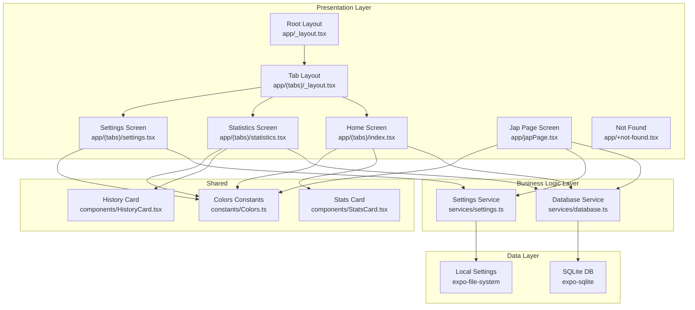
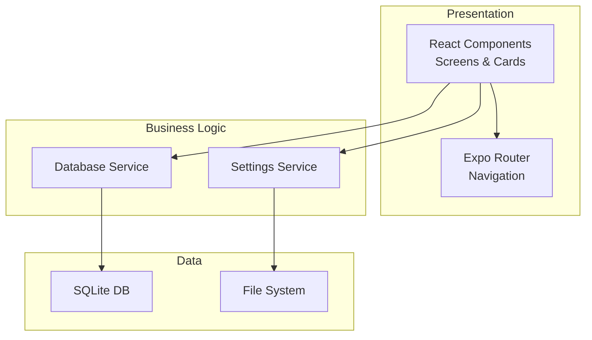
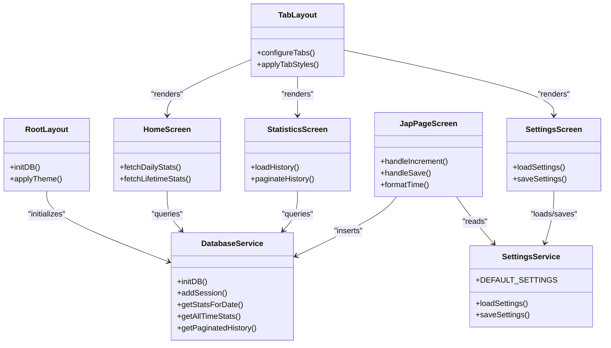
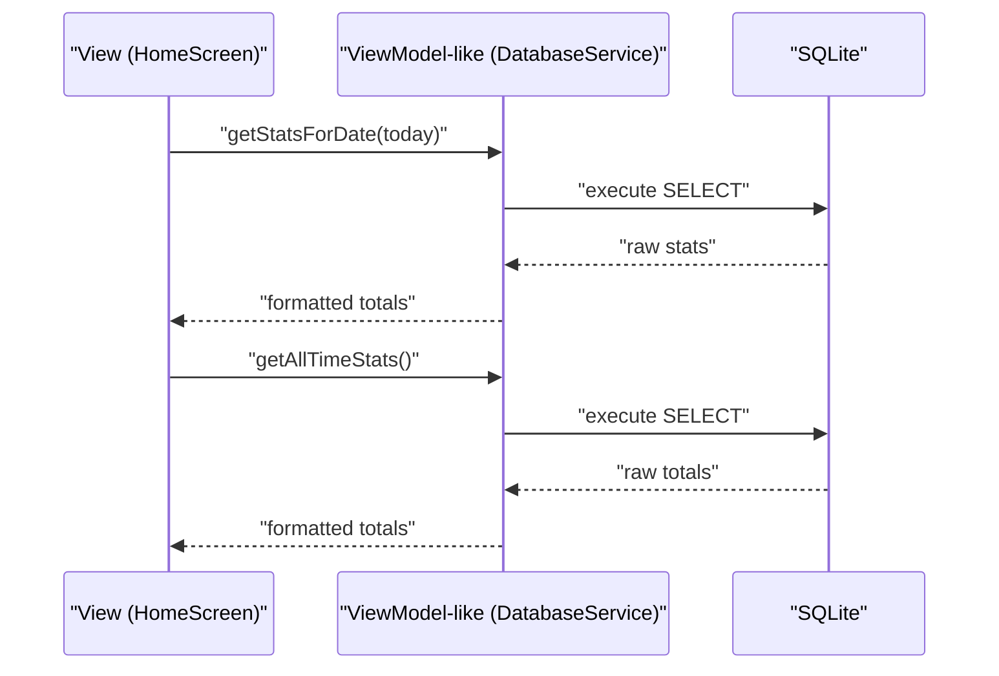
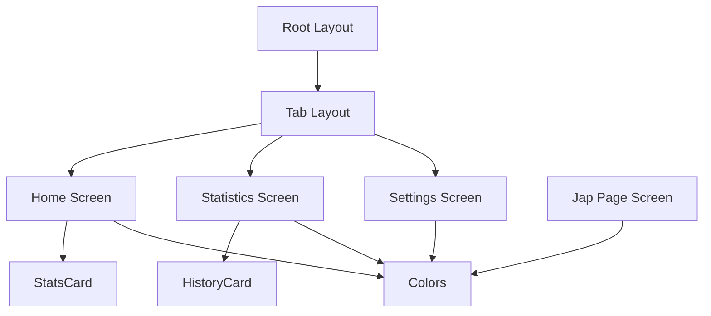
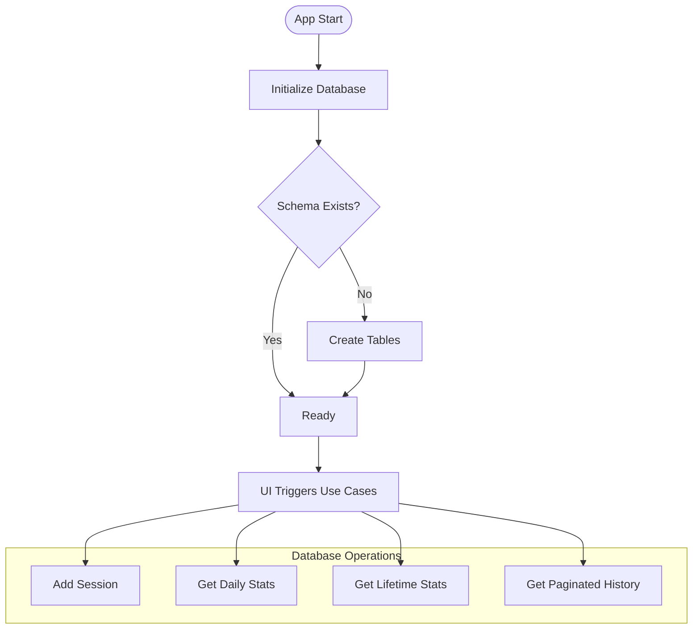
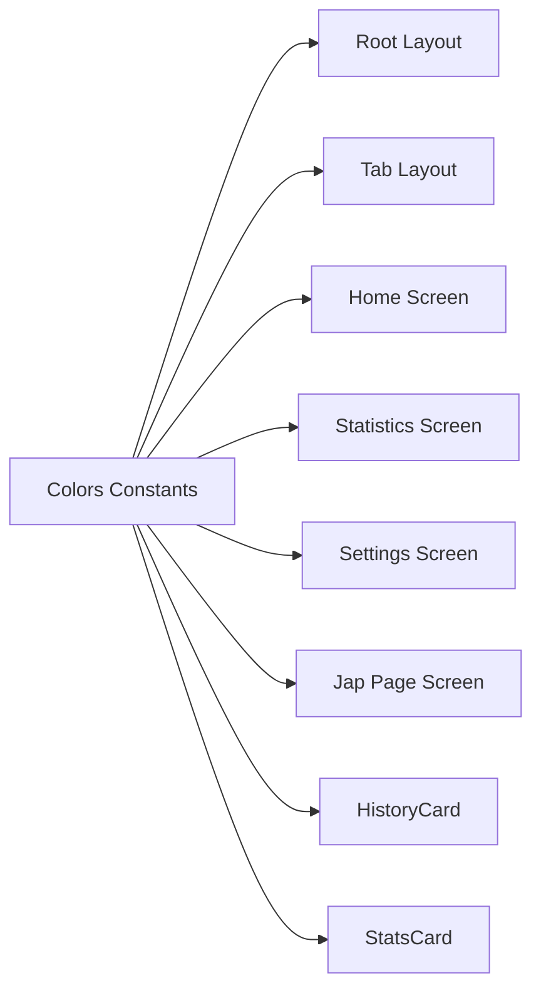
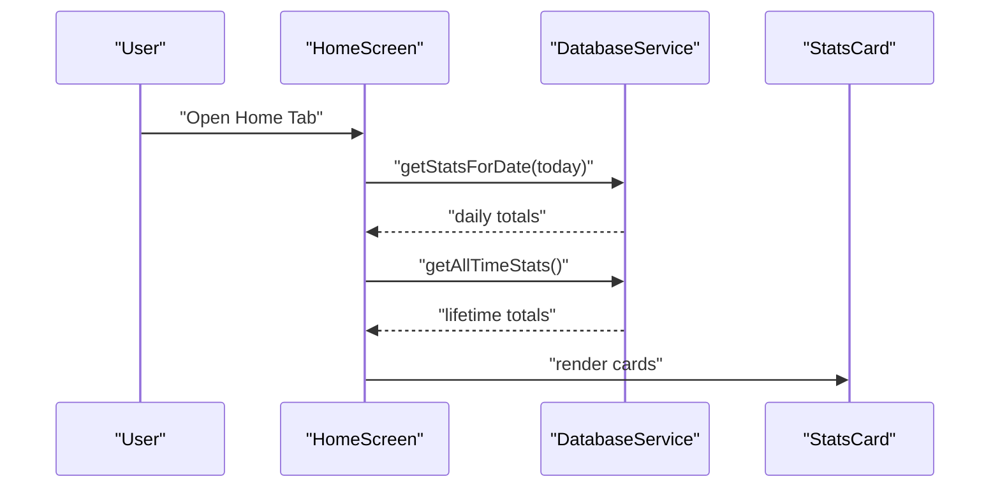
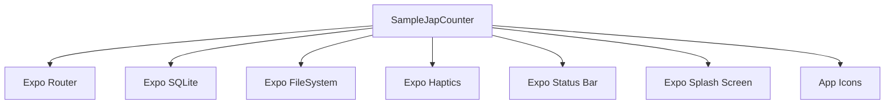
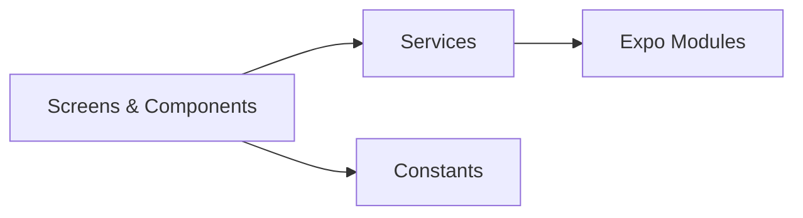

# Architecture Overview

<cite>
**Referenced Files in This Document**
- [README.md](file://README.md)
- [package.json](file://package.json)
- [app.json](file://app.json)
- [app/_layout.tsx](file://app/_layout.tsx)
- [app/(tabs)/_layout.tsx](file://app/(tabs)/_layout.tsx)
- [app/(tabs)/index.tsx](file://app/(tabs)/index.tsx)
- [app/(tabs)/statistics.tsx](file://app/(tabs)/statistics.tsx)
- [app/(tabs)/settings.tsx](file://app/(tabs)/settings.tsx)
- [app/japPage.tsx](file://app/japPage.tsx)
- [app/+not-found.tsx](file://app/+not-found.tsx)
- [services/database.ts](file://services/database.ts)
- [services/settings.ts](file://services/settings.ts)
- [components/HistoryCard.tsx](file://components/HistoryCard.tsx)
- [components/StatsCard.tsx](file://components/StatsCard.tsx)
- [constants/Colors.ts](file://constants/Colors.ts)
</cite>

## Table of Contents
1. [Introduction](#introduction)
2. [Project Structure](#project-structure)
3. [Core Components](#core-components)
4. [Architecture Overview](#architecture-overview)
5. [Detailed Component Analysis](#detailed-component-analysis)
6. [Dependency Analysis](#dependency-analysis)
7. [Performance Considerations](#performance-considerations)
8. [Troubleshooting Guide](#troubleshooting-guide)
9. [Conclusion](#conclusion)
10. [Appendices](#appendices)

## Introduction
This document describes the architecture of SampleJapCounter, an Expo-based mobile application implementing a clean architecture with presentation, business logic, and data layers. The system follows a file-based routing model with a root layout, tab navigation, and individual screens. Presentation is implemented with React Native components and Expo Router. Business logic is encapsulated in service modules for database and settings. Data persistence uses SQLite via Expo SQLite, while settings are stored locally using Expo FileSystem. The theme system centralizes color tokens for a consistent dark-mode UI.

## Project Structure
The project is organized around a clear separation of concerns:
- Presentation layer: app directory with file-based routing, tab layouts, and screens
- Business logic layer: service modules for database and settings
- Data layer: SQLite database and local file system for settings
- Shared resources: constants for colors and reusable components

**Diagram sources**
- [app/_layout.tsx](file://app/_layout.tsx#L1-L27)
- [app/(tabs)/_layout.tsx](file://app/(tabs)/_layout.tsx#L1-L58)
- [app/(tabs)/index.tsx](file://app/(tabs)/index.tsx#L1-L120)
- [app/(tabs)/statistics.tsx](file://app/(tabs)/statistics.tsx#L1-L117)
- [app/(tabs)/settings.tsx](file://app/(tabs)/settings.tsx#L1-L192)
- [app/japPage.tsx](file://app/japPage.tsx#L1-L289)
- [app/+not-found.tsx](file://app/+not-found.tsx#L1-L32)
- [services/database.ts](file://services/database.ts#L1-L132)
- [services/settings.ts](file://services/settings.ts#L1-L47)
- [constants/Colors.ts](file://constants/Colors.ts#L1-L19)
- [components/HistoryCard.tsx](file://components/HistoryCard.tsx#L1-L134)
- [components/StatsCard.tsx](file://components/StatsCard.tsx#L1-L56)

**Section sources**
- [README.md](file://README.md#L26-L26)
- [app/_layout.tsx](file://app/_layout.tsx#L1-L27)
- [app/(tabs)/_layout.tsx](file://app/(tabs)/_layout.tsx#L1-L58)

## Core Components
- Root layout configures global stack navigation and initializes the database on startup. It applies theme colors globally and sets the status bar style.
- Tab layout defines bottom navigation with three tabs: Home, Statistics, and Settings. It centralizes tab and header styling using the shared color palette.
- Home screen aggregates daily and lifetime statistics by querying the database and renders them using a reusable StatsCard component.
- Statistics screen implements paginated history retrieval and displays entries using HistoryCard components.
- Settings screen manages user preferences persisted to local storage and merges defaults for forward compatibility.
- Jap page screen implements a circular progress UI, handles timing, haptic feedback, and saves sessions to the database upon confirmation.
- Not found screen provides a fallback route with a link back to the home screen.

**Section sources**
- [app/_layout.tsx](file://app/_layout.tsx#L1-L27)
- [app/(tabs)/_layout.tsx](file://app/(tabs)/_layout.tsx#L1-L58)
- [app/(tabs)/index.tsx](file://app/(tabs)/index.tsx#L1-L120)
- [app/(tabs)/statistics.tsx](file://app/(tabs)/statistics.tsx#L1-L117)
- [app/(tabs)/settings.tsx](file://app/(tabs)/settings.tsx#L1-L192)
- [app/japPage.tsx](file://app/japPage.tsx#L1-L289)
- [app/+not-found.tsx](file://app/+not-found.tsx#L1-L32)

## Architecture Overview
The system adheres to clean architecture principles:
- Presentation layer: React components and Expo Router manage UI state, navigation, and user interactions.
- Business logic layer: Services encapsulate domain operations for database and settings.
- Data layer: SQLite stores session data; local file system persists user settings.

**Diagram sources**
- [app/_layout.tsx](file://app/_layout.tsx#L1-L27)
- [app/(tabs)/_layout.tsx](file://app/(tabs)/_layout.tsx#L1-L58)
- [services/database.ts](file://services/database.ts#L1-L132)
- [services/settings.ts](file://services/settings.ts#L1-L47)

## Detailed Component Analysis

### Clean Architecture Layers
- Presentation layer
  - Root layout initializes the database and applies global theme.
  - Tab layout centralizes navigation and styling.
  - Screens orchestrate UI state and delegate data operations to services.
  - Reusable components encapsulate presentational logic.
- Business logic layer
  - Database service abstracts SQLite operations and exposes typed queries.
  - Settings service abstracts local file storage and default merging.
- Data layer
  - SQLite database schema supports session records with migration support.
  - Local settings file provides persistent user preferences.

**Diagram sources**
- [app/_layout.tsx](file://app/_layout.tsx#L1-L27)
- [app/(tabs)/_layout.tsx](file://app/(tabs)/_layout.tsx#L1-L58)
- [app/(tabs)/index.tsx](file://app/(tabs)/index.tsx#L1-L120)
- [app/(tabs)/statistics.tsx](file://app/(tabs)/statistics.tsx#L1-L117)
- [app/(tabs)/settings.tsx](file://app/(tabs)/settings.tsx#L1-L192)
- [app/japPage.tsx](file://app/japPage.tsx#L1-L289)
- [services/database.ts](file://services/database.ts#L1-L132)
- [services/settings.ts](file://services/settings.ts#L1-L47)

### MVVM Pattern Implementation
While the codebase does not define a formal MVVM framework, the React components act as Views, orchestrating state and UI rendering. Services act as ViewModel-like delegates for data operations and persistence. The separation of concerns aligns with MVVM:
- Views: Screens and reusable components
- ViewModel-like: Services exposing typed operations
- Model: Database schema and settings data structures

**Diagram sources**
- [app/(tabs)/index.tsx](file://app/(tabs)/index.tsx#L1-L120)
- [services/database.ts](file://services/database.ts#L66-L106)

### Component Hierarchy
- Root layout wraps the entire app with a stack navigator and global theme.
- Tab layout defines bottom tabs and applies unified styling.
- Individual screens:
  - Home: Today’s and lifetime stats dashboard with action navigation.
  - Statistics: Paginated history list with infinite scroll.
  - Settings: Profile and preferences form backed by local storage.
  - Jap page: Full-screen circular progress with save confirmation.

**Diagram sources**
- [app/_layout.tsx](file://app/_layout.tsx#L1-L27)
- [app/(tabs)/_layout.tsx](file://app/(tabs)/_layout.tsx#L1-L58)
- [app/(tabs)/index.tsx](file://app/(tabs)/index.tsx#L1-L120)
- [app/(tabs)/statistics.tsx](file://app/(tabs)/statistics.tsx#L1-L117)
- [app/(tabs)/settings.tsx](file://app/(tabs)/settings.tsx#L1-L192)
- [app/japPage.tsx](file://app/japPage.tsx#L1-L289)
- [components/HistoryCard.tsx](file://components/HistoryCard.tsx#L1-L134)
- [components/StatsCard.tsx](file://components/StatsCard.tsx#L1-L56)
- [constants/Colors.ts](file://constants/Colors.ts#L1-L19)

### Service Layer Architecture
- Database service
  - Initializes SQLite database and ensures schema presence.
  - Provides CRUD-like operations for session data with typed results.
  - Implements pagination and aggregation queries.
- Settings service
  - Manages user preferences in a JSON file under the document directory.
  - Merges loaded settings with defaults to support schema evolution.

**Diagram sources**
- [services/database.ts](file://services/database.ts#L12-L39)
- [services/database.ts](file://services/database.ts#L41-L132)

**Section sources**
- [services/database.ts](file://services/database.ts#L1-L132)
- [services/settings.ts](file://services/settings.ts#L1-L47)

### Theme System and Color Management
- Centralized color tokens define dark-mode palettes for text, backgrounds, surfaces, borders, and accents.
- Components consume colors from the constants module to maintain consistency.
- Global theme is applied via stack and tab configurations.

**Diagram sources**
- [constants/Colors.ts](file://constants/Colors.ts#L1-L19)
- [app/_layout.tsx](file://app/_layout.tsx#L14-L20)
- [app/(tabs)/_layout.tsx](file://app/(tabs)/_layout.tsx#L10-L26)
- [app/(tabs)/index.tsx](file://app/(tabs)/index.tsx#L67-L120)
- [app/(tabs)/statistics.tsx](file://app/(tabs)/statistics.tsx#L90-L117)
- [app/(tabs)/settings.tsx](file://app/(tabs)/settings.tsx#L98-L192)
- [app/japPage.tsx](file://app/japPage.tsx#L223-L289)
- [components/HistoryCard.tsx](file://components/HistoryCard.tsx#L68-L134)
- [components/StatsCard.tsx](file://components/StatsCard.tsx#L22-L56)

**Section sources**
- [constants/Colors.ts](file://constants/Colors.ts#L1-L19)
- [app/_layout.tsx](file://app/_layout.tsx#L14-L20)
- [app/(tabs)/_layout.tsx](file://app/(tabs)/_layout.tsx#L10-L26)

### Data Flow Patterns
- Navigation-driven data fetching: Screens use focus effects to refresh data when tabs become active.
- Pagination: Statistics screen loads data in chunks with deduplication and end-of-list detection.
- Aggregation: Database service computes derived metrics (total beads from malas and beads).
- Persistence: Jap page collects metrics during interaction and saves on confirmation.

**Diagram sources**
- [app/(tabs)/index.tsx](file://app/(tabs)/index.tsx#L13-L25)
- [services/database.ts](file://services/database.ts#L66-L106)
- [components/StatsCard.tsx](file://components/StatsCard.tsx#L1-L56)

### Integration Points with Expo Ecosystem
- Expo Router: File-based routing and navigation between screens and tabs.
- Expo SQLite: Local database initialization and migrations.
- Expo FileSystem: Persistent settings storage.
- Expo Haptics: Feedback for user actions.
- Expo Status Bar: Global status bar configuration.
- Expo Splash Screen and Icons: Application metadata and branding.

**Diagram sources**
- [package.json](file://package.json#L13-L42)
- [app.json](file://app.json#L27-L41)
- [app/_layout.tsx](file://app/_layout.tsx#L1-L27)
- [app/japPage.tsx](file://app/japPage.tsx#L3-L3)
- [services/database.ts](file://services/database.ts#L1-L1)
- [services/settings.ts](file://services/settings.ts#L1-L1)

**Section sources**
- [package.json](file://package.json#L13-L42)
- [app.json](file://app.json#L27-L41)

## Dependency Analysis
- Presentation depends on services for data operations and on shared constants for styling.
- Services depend on Expo SDK modules for SQLite and FileSystem.
- No circular dependencies observed among screens and services.

**Diagram sources**
- [app/(tabs)/index.tsx](file://app/(tabs)/index.tsx#L1-L120)
- [app/(tabs)/statistics.tsx](file://app/(tabs)/statistics.tsx#L1-L117)
- [app/(tabs)/settings.tsx](file://app/(tabs)/settings.tsx#L1-L192)
- [app/japPage.tsx](file://app/japPage.tsx#L1-L289)
- [services/database.ts](file://services/database.ts#L1-L132)
- [services/settings.ts](file://services/settings.ts#L1-L47)
- [constants/Colors.ts](file://constants/Colors.ts#L1-L19)

**Section sources**
- [package.json](file://package.json#L13-L42)

## Performance Considerations
- Database operations are asynchronous; ensure UI remains responsive by avoiding long-running work on the main thread.
- Pagination reduces memory usage for history lists; consider increasing batch size if acceptable for UX.
- Haptic feedback is gated by settings to minimize overhead when disabled.
- SVG rendering is efficient for small canvases; keep circle sizes proportional to device width to avoid excessive recomputation.

## Troubleshooting Guide
- Database initialization failures: Verify SQLite plugin is enabled and the database path is accessible.
- Settings load/save errors: Confirm the settings file exists and is writable; default settings are returned on failure.
- Navigation issues: Ensure routes match file names under the app directory and that tab names are declared in the tab layout.
- Theme inconsistencies: Confirm color tokens are imported consistently across components.

**Section sources**
- [services/database.ts](file://services/database.ts#L12-L39)
- [services/settings.ts](file://services/settings.ts#L16-L46)
- [app/_layout.tsx](file://app/_layout.tsx#L7-L10)

## Conclusion
SampleJapCounter demonstrates a clean separation of concerns with a clear presentation layer, service-backed business logic, and robust data persistence. The MVVM-inspired component-service pairing, centralized theming, and Expo ecosystem integrations provide a scalable foundation for further enhancements.

## Appendices
- System boundaries
  - Presentation boundary: Screens and components
  - Business logic boundary: Services
  - Data boundary: SQLite and local file system
- Design patterns
  - Clean architecture with layered responsibilities
  - MVVM-inspired component-service delegation
  - Provider pattern for theme colors
  - Factory pattern for default settings
- Technical constraints
  - Expo Router file-based routing
  - SQLite for local persistence
  - FileSystem for settings
  - Dark theme enforced via constants