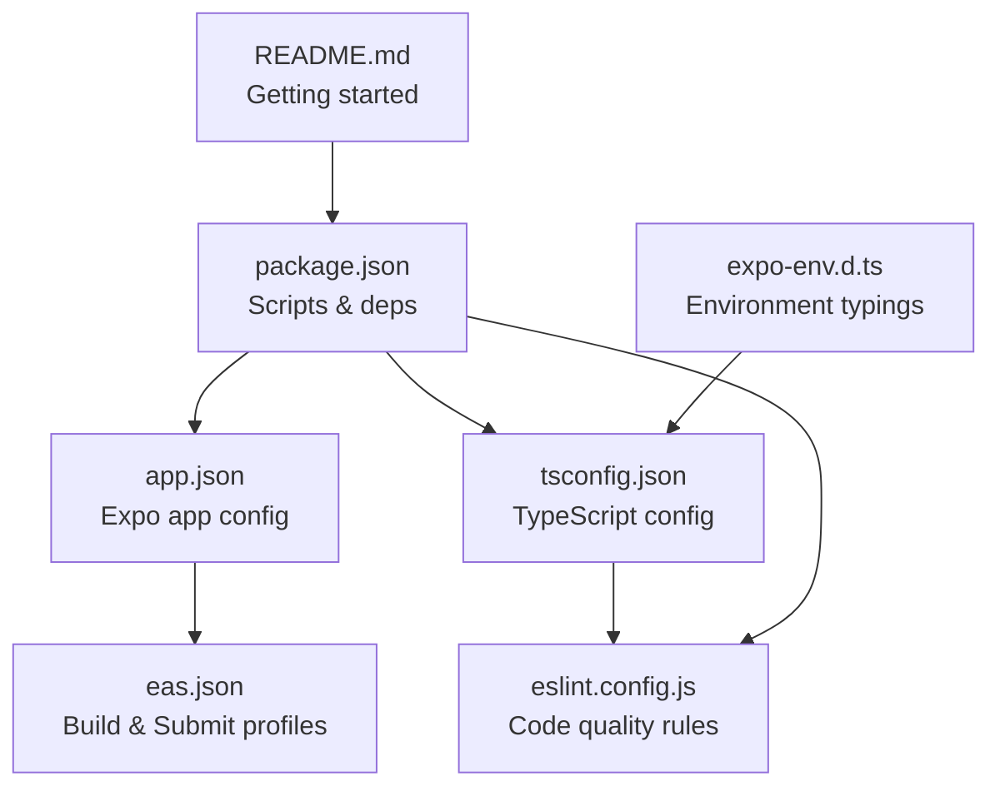
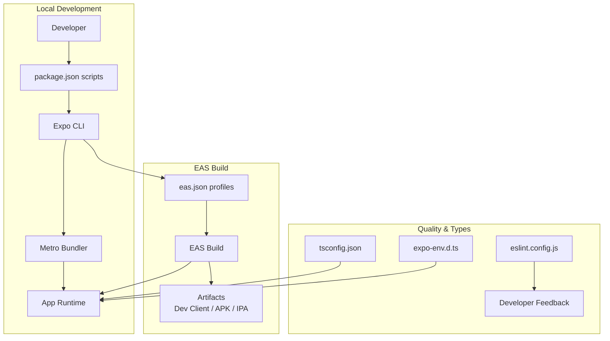
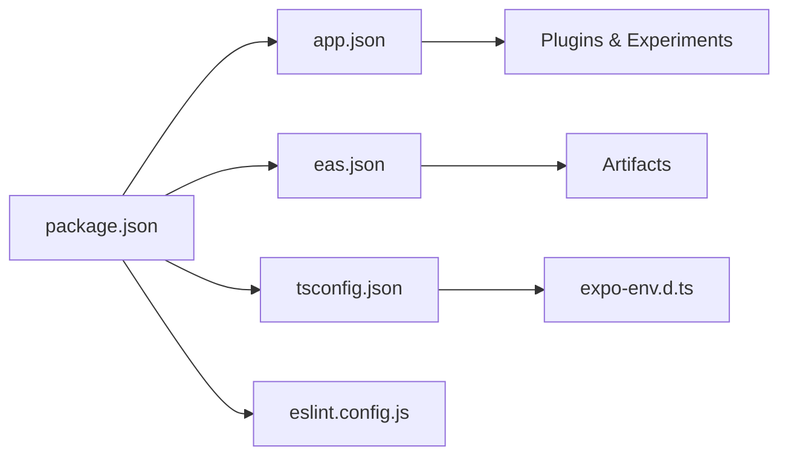

# Configuration and Deployment

<cite>
**Referenced Files in This Document**
- [app.json](file://app.json)
- [eas.json](file://eas.json)
- [tsconfig.json](file://tsconfig.json)
- [eslint.config.js](file://eslint.config.js)
- [package.json](file://package.json)
- [expo-env.d.ts](file://expo-env.d.ts)
- [README.md](file://README.md)
</cite>

## Table of Contents
1. [Introduction](#introduction)
2. [Project Structure](#project-structure)
3. [Core Components](#core-components)
4. [Architecture Overview](#architecture-overview)
5. [Detailed Component Analysis](#detailed-component-analysis)
6. [Dependency Analysis](#dependency-analysis)
7. [Performance Considerations](#performance-considerations)
8. [Troubleshooting Guide](#troubleshooting-guide)
9. [Conclusion](#conclusion)
10. [Appendices](#appendices)

## Introduction
This document explains how to configure and deploy SampleJapCounter using Expo and EAS Build. It covers the Expo app configuration, EAS Build profiles, TypeScript and ESLint setup, environment typing, and practical guidance for development and production builds. It also outlines customization options and common troubleshooting steps.

## Project Structure
The project follows an Expo monorepo-like layout with configuration files at the repository root and application code under the app directory. Key configuration files include:
- app.json: Expo app metadata, platform-specific settings, plugins, experiments, and EAS project ID
- eas.json: EAS Build and Submit configuration for development, preview, and production
- tsconfig.json: TypeScript compiler options and path aliases
- eslint.config.js: ESLint flat config extending Expo’s recommended rules
- package.json: Scripts, dependencies, and devDependencies
- expo-env.d.ts: Type reference for Expo environment typings
- README.md: Getting started instructions and links to Expo docs

**Diagram sources**
- [app.json](file://app.json#L1-L55)
- [eas.json](file://eas.json#L1-L22)
- [tsconfig.json](file://tsconfig.json#L1-L18)
- [eslint.config.js](file://eslint.config.js#L1-L11)
- [package.json](file://package.json#L1-L52)
- [expo-env.d.ts](file://expo-env.d.ts#L1-L3)
- [README.md](file://README.md#L1-L51)

**Section sources**
- [README.md](file://README.md#L1-L51)
- [package.json](file://package.json#L1-L52)

## Core Components
- Expo app configuration (app.json)
  - Defines app metadata (name, slug, version), orientation, icon, scheme, interface style, and experiments
  - Platform-specific settings for iOS and Android (tablet support, adaptive icon, edge-to-edge, predictive back gesture, package)
  - Web output mode and favicon
  - Plugins (expo-router, splash screen, sqlite)
  - Typed routes and React Compiler experiments
  - EAS project ID and owner
- EAS Build configuration (eas.json)
  - CLI version and app version source
  - Build profiles: development (internal distribution, dev client), preview (internal), production (auto-increment)
  - Submit profile for production
- TypeScript configuration (tsconfig.json)
  - Extends Expo base TS config
  - Enables strict mode
  - Path alias @/*
  - Includes Expo type generation and env declaration
- ESLint configuration (eslint.config.js)
  - Flat config extending Expo’s recommended rules
  - Ignores dist folder
- Environment typings (expo-env.d.ts)
  - Declares Expo types for environment variables
- Scripts and dependencies (package.json)
  - Start commands for mobile and web
  - Lint script
  - Expo and navigation dependencies
  - Dev tooling for TypeScript and ESLint

**Section sources**
- [app.json](file://app.json#L1-L55)
- [eas.json](file://eas.json#L1-L22)
- [tsconfig.json](file://tsconfig.json#L1-L18)
- [eslint.config.js](file://eslint.config.js#L1-L11)
- [expo-env.d.ts](file://expo-env.d.ts#L1-L3)
- [package.json](file://package.json#L1-L52)

## Architecture Overview
The configuration architecture ties together the app manifest, build orchestration, and developer tooling. The diagram below shows how these components interact during local development and EAS builds.

**Diagram sources**
- [package.json](file://package.json#L5-L11)
- [eas.json](file://eas.json#L6-L21)
- [tsconfig.json](file://tsconfig.json#L1-L18)
- [eslint.config.js](file://eslint.config.js#L1-L11)
- [expo-env.d.ts](file://expo-env.d.ts#L1-L3)

## Detailed Component Analysis

### Expo Configuration (app.json)
Key areas:
- App identity and metadata: name, slug, version, orientation, icon, scheme, interface style
- Platform-specific settings:
  - iOS: tablet support
  - Android: adaptive icon, edge-to-edge, predictive back gesture, package name
  - Web: static output and favicon
- Plugins and experiments:
  - Plugins: router, splash screen, sqlite
  - Experiments: typed routes, React compiler
- EAS integration:
  - Project ID and owner included under extra.eas and top-level owner

Customization tips:
- Update version and app name for releases
- Adjust platform flags (e.g., adaptive icon foreground/background) to match brand guidelines
- Add or remove plugins as features change
- Keep experiments enabled if you want to leverage typed routes and React Compiler

**Section sources**
- [app.json](file://app.json#L1-L55)

### EAS Build Configuration (eas.json)
Profiles and behavior:
- CLI:
  - Version requirement ensures compatibility
  - Remote app version source aligns with remote versioning
- Build profiles:
  - development: internal distribution with development client
  - preview: internal distribution for testing
  - production: auto-incremented version for store submissions
- Submit profile:
  - Production submit block configured for automated submission workflows

Build process guidance:
- Use development for internal testing and QA
- Use preview for broader internal testing
- Use production for store release after thorough validation

**Section sources**
- [eas.json](file://eas.json#L1-L22)

### TypeScript Configuration (tsconfig.json)
Highlights:
- Extends Expo’s base TS config
- Enforces strict type checking
- Path alias @/* mapped to project root
- Includes generated Expo types and environment declaration

Implications:
- Strict mode improves type safety
- Path aliases simplify imports
- Generated types enable accurate inference for Expo APIs

**Section sources**
- [tsconfig.json](file://tsconfig.json#L1-L18)

### ESLint Configuration (eslint.config.js)
Highlights:
- Uses Expo’s flat config for modern ESLint
- Ignores dist folder
- Integrates seamlessly with TypeScript via Expo’s config

Best practices:
- Run the lint script regularly
- Resolve reported issues before committing
- Keep rules aligned with team standards

**Section sources**
- [eslint.config.js](file://eslint.config.js#L1-L11)

### Environment Typings (expo-env.d.ts)
Purpose:
- Provides type definitions for Expo environment variables
- Ensures type-safe access to runtime constants and environment data

Guidance:
- Do not edit this file manually
- Keep it under version control but outside of public repos if it contains sensitive keys

**Section sources**
- [expo-env.d.ts](file://expo-env.d.ts#L1-L3)

### Scripts and Dependencies (package.json)
Scripts:
- start, android, ios, web launch the Expo dev server or simulator/emulator
- lint runs ESLint

Dependencies:
- Expo SDK, router, SQLite, splash screen, and related libraries
- Navigation and UI packages
- React and React Native core
- Dev tooling: TypeScript, ESLint, and Expo’s ESLint config

**Section sources**
- [package.json](file://package.json#L1-L52)

## Dependency Analysis
The configuration files depend on each other as follows:
- package.json scripts trigger local development and linting
- app.json defines app behavior and plugin usage
- eas.json orchestrates build and submit workflows
- tsconfig.json and eslint.config.js enforce code quality and type safety
- expo-env.d.ts augments type safety for environment variables

**Diagram sources**
- [package.json](file://package.json#L1-L52)
- [app.json](file://app.json#L1-L55)
- [eas.json](file://eas.json#L1-L22)
- [tsconfig.json](file://tsconfig.json#L1-L18)
- [eslint.config.js](file://eslint.config.js#L1-L11)
- [expo-env.d.ts](file://expo-env.d.ts#L1-L3)

**Section sources**
- [package.json](file://package.json#L1-L52)
- [app.json](file://app.json#L1-L55)
- [eas.json](file://eas.json#L1-L22)
- [tsconfig.json](file://tsconfig.json#L1-L18)
- [eslint.config.js](file://eslint.config.js#L1-L11)
- [expo-env.d.ts](file://expo-env.d.ts#L1-L3)

## Performance Considerations
- Enable React Compiler experiment in app.json to potentially improve runtime performance and bundle size
- Keep plugins minimal and remove unused ones to reduce build overhead
- Use strict TypeScript settings to catch errors early and avoid runtime issues
- Run ESLint pre-commit to maintain code quality and prevent regressions

[No sources needed since this section provides general guidance]

## Troubleshooting Guide
Common setup issues and resolutions:
- Build fails due to CLI version mismatch
  - Ensure the EAS CLI version meets the minimum requirement in eas.json
- Missing environment typings
  - Verify expo-env.d.ts exists and is included in tsconfig.json
- Lint errors after adding new dependencies
  - Run the lint script and resolve reported issues
- Incorrect app version or build number
  - For production, rely on auto-increment; otherwise adjust version fields in app.json
- Plugin conflicts
  - Review plugins in app.json and disable or update conflicting ones
- Web output not generated
  - Confirm web output setting in app.json and rebuild

**Section sources**
- [eas.json](file://eas.json#L2-L4)
- [expo-env.d.ts](file://expo-env.d.ts#L1-L3)
- [tsconfig.json](file://tsconfig.json#L14-L16)
- [eslint.config.js](file://eslint.config.js#L1-L11)
- [app.json](file://app.json#L23-L26)

## Conclusion
SampleJapCounter’s configuration integrates Expo app settings, EAS Build profiles, TypeScript strictness, and ESLint quality checks. By following the documented setup and customization guidance, teams can reliably develop, test, and ship builds across platforms while maintaining type safety and code quality.

[No sources needed since this section summarizes without analyzing specific files]

## Appendices
- Getting started
  - Install dependencies and start the development server using the scripts defined in package.json
  - Explore the README for additional guidance and links to Expo documentation

**Section sources**
- [README.md](file://README.md#L13-L26)
- [package.json](file://package.json#L5-L11)