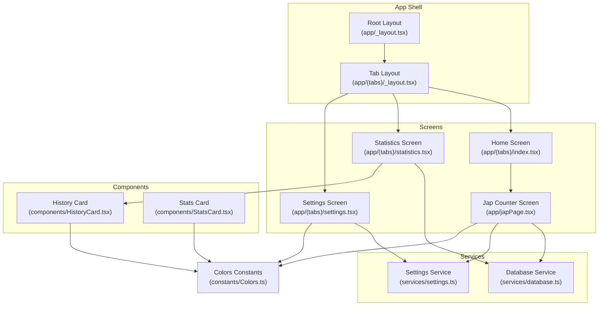
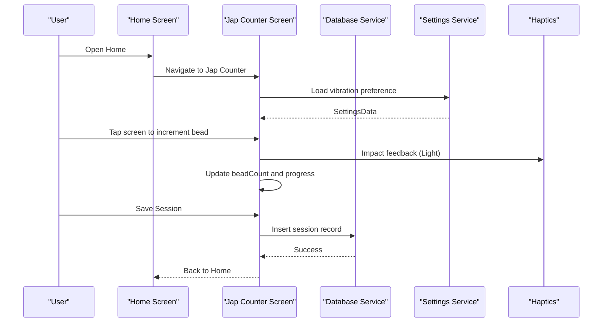
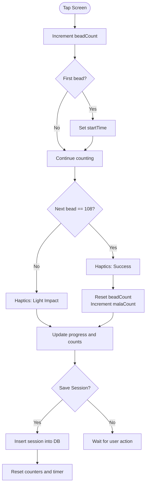
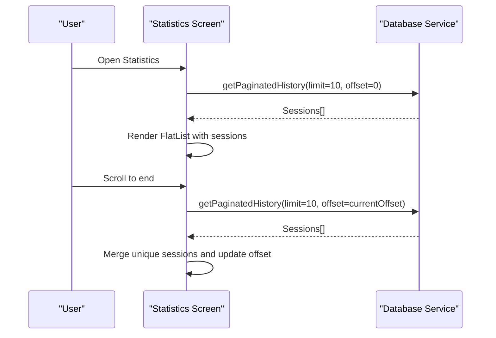
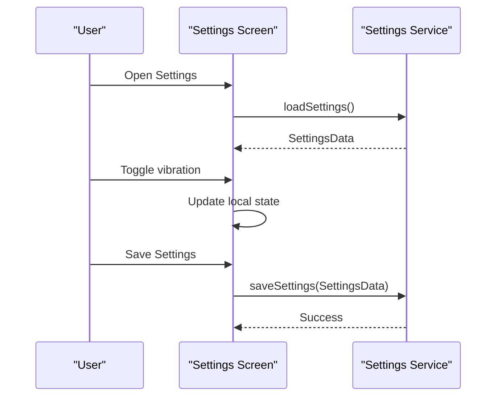
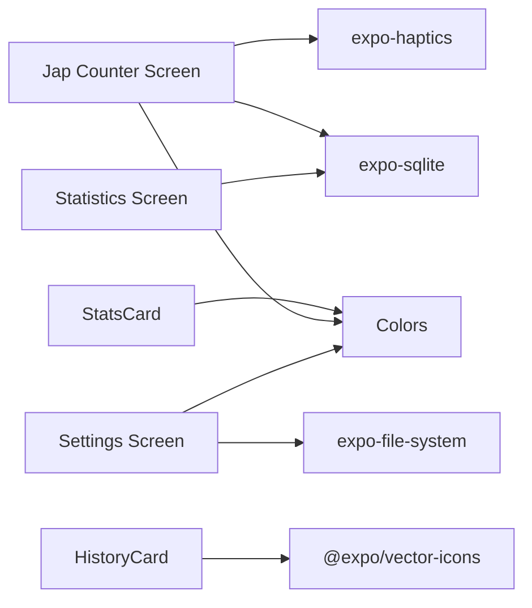

# Core Features

<cite>
**Referenced Files in This Document**
- [app/japPage.tsx](file://app/japPage.tsx)
- [app/(tabs)/statistics.tsx](file://app/(tabs)/statistics.tsx)
- [app/(tabs)/settings.tsx](file://app/(tabs)/settings.tsx)
- [app/(tabs)/_layout.tsx](file://app/(tabs)/_layout.tsx)
- [app/_layout.tsx](file://app/_layout.tsx)
- [services/database.ts](file://services/database.ts)
- [services/settings.ts](file://services/settings.ts)
- [components/HistoryCard.tsx](file://components/HistoryCard.tsx)
- [components/StatsCard.tsx](file://components/StatsCard.tsx)
- [constants/Colors.ts](file://constants/Colors.ts)
- [package.json](file://package.json)
</cite>

## Table of Contents
1. [Introduction](#introduction)
2. [Project Structure](#project-structure)
3. [Core Components](#core-components)
4. [Architecture Overview](#architecture-overview)
5. [Detailed Component Analysis](#detailed-component-analysis)
6. [Dependency Analysis](#dependency-analysis)
7. [Performance Considerations](#performance-considerations)
8. [Troubleshooting Guide](#troubleshooting-guide)
9. [Conclusion](#conclusion)

## Introduction
This document explains the core features of SampleJapCounter: the Jap counter interface with real-time bead counting and circular progress visualization, haptic feedback integration, the statistics dashboard with daily and lifetime metrics, session history management with pagination, and the settings management system for user preferences and vibration controls. It also covers component usage patterns, service integrations, and user interaction flows, with implementation details and data handling approaches.

## Project Structure
The application follows a file-based routing structure with a root layout and tabbed screens. Services encapsulate persistence and settings, while reusable components present data and cards.

**Diagram sources**
- [app/_layout.tsx](file://app/_layout.tsx#L7-L27)
- [app/(tabs)/_layout.tsx](file://app/(tabs)/_layout.tsx#L7-L58)
- [app/japPage.tsx](file://app/japPage.tsx#L1-L289)
- [app/(tabs)/statistics.tsx](file://app/(tabs)/statistics.tsx#L1-L117)
- [app/(tabs)/settings.tsx](file://app/(tabs)/settings.tsx#L1-L192)
- [services/database.ts](file://services/database.ts#L1-L132)
- [services/settings.ts](file://services/settings.ts#L1-L47)
- [components/HistoryCard.tsx](file://components/HistoryCard.tsx#L1-L134)
- [components/StatsCard.tsx](file://components/StatsCard.tsx#L1-L56)
- [constants/Colors.ts](file://constants/Colors.ts#L1-L19)

**Section sources**
- [app/_layout.tsx](file://app/_layout.tsx#L1-L27)
- [app/(tabs)/_layout.tsx](file://app/(tabs)/_layout.tsx#L1-L58)
- [package.json](file://package.json#L1-L52)

## Core Components
- Jap Counter Screen: Real-time bead counting, circular progress visualization, haptic feedback, and save session flow.
- Statistics Screen: Paginated session history display with daily and lifetime metrics calculation.
- Settings Screen: User profile and vibration preference management.
- Database Service: SQLite-backed persistence for sessions and statistics aggregation.
- Settings Service: Local file-based settings storage with defaults and merging.
- Shared Components: HistoryCard for session details and StatsCard for summary metrics.

**Section sources**
- [app/japPage.tsx](file://app/japPage.tsx#L18-L221)
- [app/(tabs)/statistics.tsx](file://app/(tabs)/statistics.tsx#L8-L88)
- [app/(tabs)/settings.tsx](file://app/(tabs)/settings.tsx#L8-L96)
- [services/database.ts](file://services/database.ts#L12-L132)
- [services/settings.ts](file://services/settings.ts#L3-L47)
- [components/HistoryCard.tsx](file://components/HistoryCard.tsx#L13-L66)
- [components/StatsCard.tsx](file://components/StatsCard.tsx#L12-L20)

## Architecture Overview
The app initializes the database at startup and exposes three primary screens: Home (Jap counter), Statistics (history and metrics), and Settings (preferences). Data flows through dedicated services, with UI components rendering and user interactions triggering actions that persist state.

**Diagram sources**
- [app/_layout.tsx](file://app/_layout.tsx#L7-L10)
- [app/japPage.tsx](file://app/japPage.tsx#L30-L38)
- [app/japPage.tsx](file://app/japPage.tsx#L102-L121)
- [app/japPage.tsx](file://app/japPage.tsx#L123-L160)
- [services/database.ts](file://services/database.ts#L41-L64)
- [services/settings.ts](file://services/settings.ts#L16-L34)

## Detailed Component Analysis

### Jap Counter Interface
The Jap counter provides a full-screen circular progress visualization and real-time bead counting. It integrates haptic feedback for tactile cues and supports saving sessions with duration tracking.

Key behaviors:
- Real-time bead counting with immediate timer start on first tap.
- Circular progress drawn via SVG with dynamic stroke dashoffset.
- Haptic feedback: light impact on each bead, success notification on mala completion.
- Save session flow with confirmation dialog and database insertion.
- Navigation guard prevents accidental exit with unsaved changes.

**Diagram sources**
- [app/japPage.tsx](file://app/japPage.tsx#L102-L121)
- [app/japPage.tsx](file://app/japPage.tsx#L53-L68)
- [app/japPage.tsx](file://app/japPage.tsx#L123-L160)

Implementation details:
- Circular progress: radius and circumference computed from window width; strokeDashoffset derived from progress.
- Timer: interval updates elapsed seconds; resets when startTime is cleared.
- Haptics: light impact per bead; success notification on mala completion.
- Persistence: save triggers addSession with god_name, bead_count, mala_count, and duration_sec.
- Navigation guard: alerts user when leaving with unsaved changes.

**Section sources**
- [app/japPage.tsx](file://app/japPage.tsx#L11-L16)
- [app/japPage.tsx](file://app/japPage.tsx#L45-L50)
- [app/japPage.tsx](file://app/japPage.tsx#L53-L68)
- [app/japPage.tsx](file://app/japPage.tsx#L70-L99)
- [app/japPage.tsx](file://app/japPage.tsx#L102-L121)
- [app/japPage.tsx](file://app/japPage.tsx#L123-L160)
- [constants/Colors.ts](file://constants/Colors.ts#L1-L19)

### Statistics Dashboard
The statistics dashboard displays paginated session history and calculates daily and lifetime metrics. It uses a FlatList with onEndReached for infinite scroll and merges new items to avoid duplicates.

Key behaviors:
- Fetch sessions with limit/offset pagination.
- Merge new pages to avoid duplicates using id sets.
- Footer spinner during loading.
- Empty state messaging when no sessions exist.
- Uses HistoryCard to render individual session entries.

**Diagram sources**
- [app/(tabs)/statistics.tsx](file://app/(tabs)/statistics.tsx#L14-L45)
- [services/database.ts](file://services/database.ts#L118-L131)

Metrics calculation:
- Daily totals: sum of bead_count and mala_count grouped by date; total beads computed as (mala_count * 108) + bead_count.
- Lifetime totals: global sums across all sessions.

**Section sources**
- [app/(tabs)/statistics.tsx](file://app/(tabs)/statistics.tsx#L8-L88)
- [services/database.ts](file://services/database.ts#L66-L106)
- [components/HistoryCard.tsx](file://components/HistoryCard.tsx#L13-L66)

### Session History Management
Session history is presented via HistoryCard components, each showing:
- Formatted date/time header
- Total beads (malas × 108 + beads)
- Malas count and duration breakdown

Pagination:
- Fixed page size of 10 sessions.
- Offset increases per page; stops when fewer than 10 records are returned.
- Duplicate prevention by comparing ids across pages.

**Section sources**
- [app/(tabs)/statistics.tsx](file://app/(tabs)/statistics.tsx#L14-L45)
- [components/HistoryCard.tsx](file://components/HistoryCard.tsx#L13-L66)
- [services/database.ts](file://services/database.ts#L118-L131)

### Settings Management System
The settings screen manages user preferences including vibration control and profile name. Settings are persisted locally using the settings service.

Key behaviors:
- Load settings on focus with defaults merged for schema compatibility.
- Update local state on change; save persists to file.
- Vibrations toggle controls haptic feedback in the Jap counter.

**Diagram sources**
- [app/(tabs)/settings.tsx](file://app/(tabs)/settings.tsx#L13-L43)
- [services/settings.ts](file://services/settings.ts#L16-L46)

**Section sources**
- [app/(tabs)/settings.tsx](file://app/(tabs)/settings.tsx#L8-L96)
- [services/settings.ts](file://services/settings.ts#L3-L47)

### Component Usage Patterns
- HistoryCard: Reused in Statistics screen to render each session with date, total beads, malas, and duration.
- StatsCard: Used to present summary metrics (e.g., daily and lifetime totals) in a compact card layout.
- Colors: Centralized theme constants consumed across screens and components for consistent styling.

**Section sources**
- [components/HistoryCard.tsx](file://components/HistoryCard.tsx#L13-L66)
- [components/StatsCard.tsx](file://components/StatsCard.tsx#L12-L20)
- [constants/Colors.ts](file://constants/Colors.ts#L1-L19)

## Dependency Analysis
External libraries and their roles:
- expo-sqlite: SQLite database for session persistence.
- expo-haptics: Haptic feedback for user interactions.
- react-native-svg: Vector graphics for circular progress.
- expo-file-system: Local file storage for settings.
- expo-router: Navigation and routing.
- @expo/vector-icons: Icons for tabs and stats.

**Diagram sources**
- [package.json](file://package.json#L13-L42)
- [app/japPage.tsx](file://app/japPage.tsx#L3-L9)
- [app/(tabs)/statistics.tsx](file://app/(tabs)/statistics.tsx#L1)
- [app/(tabs)/settings.tsx](file://app/(tabs)/settings.tsx#L1)
- [components/HistoryCard.tsx](file://components/HistoryCard.tsx#L2)
- [components/StatsCard.tsx](file://components/StatsCard.tsx#L1)
- [constants/Colors.ts](file://constants/Colors.ts#L1-L19)

**Section sources**
- [package.json](file://package.json#L13-L42)

## Performance Considerations
- Database initialization occurs once at app startup to avoid repeated overhead.
- Pagination limits reduce memory usage and network overhead for history lists.
- Timer updates occur at 1-second intervals; consider throttling if needed for heavy UI updates.
- Haptic feedback is conditionally enabled via settings to balance user experience and battery life.
- SVG progress drawing is lightweight; ensure not to recompute unnecessarily by deriving values from existing state.

## Troubleshooting Guide
Common issues and resolutions:
- Database initialization errors: Verify SQLite permissions and that initDB is called during app bootstrap.
- Settings file not readable/writable: Confirm file path existence and write permissions; defaults are created automatically if missing.
- Haptic feedback not triggering: Ensure vibrationEnabled is true and device supports haptics.
- History not updating: Confirm onEndReached threshold and that the last page returns fewer than the limit to signal completion.
- Navigation guard not working: Ensure listeners are attached and that startTime and counters are checked before allowing navigation.

**Section sources**
- [app/_layout.tsx](file://app/_layout.tsx#L7-L10)
- [services/database.ts](file://services/database.ts#L12-L39)
- [services/settings.ts](file://services/settings.ts#L16-L46)
- [app/japPage.tsx](file://app/japPage.tsx#L70-L99)
- [app/(tabs)/statistics.tsx](file://app/(tabs)/statistics.tsx#L74-L85)

## Conclusion
SampleJapCounter delivers a focused, efficient experience centered on the Jap counter with real-time feedback, haptic integration, and robust persistence. The statistics dashboard and settings screens complement the core functionality with practical data insights and user customization. The modular architecture, clear service boundaries, and reusable components support maintainability and extensibility.