# Jap Counter Interface

<cite>
**Referenced Files in This Document**
- [japPage.tsx](file://app/japPage.tsx)
- [database.ts](file://services/database.ts)
- [settings.ts](file://services/settings.ts)
- [Colors.ts](file://constants/Colors.ts)
- [HistoryCard.tsx](file://components/HistoryCard.tsx)
- [StatsCard.tsx](file://components/StatsCard.tsx)
- [_layout.tsx](file://app/_layout.tsx)
- [statistics.tsx](file://app/(tabs)/statistics.tsx)
- [settings.tsx](file://app/(tabs)/settings.tsx)
- [package.json](file://package.json)
</cite>

## Table of Contents
1. [Introduction](#introduction)
2. [Project Structure](#project-structure)
3. [Core Components](#core-components)
4. [Architecture Overview](#architecture-overview)
5. [Detailed Component Analysis](#detailed-component-analysis)
6. [Dependency Analysis](#dependency-analysis)
7. [Performance Considerations](#performance-considerations)
8. [Troubleshooting Guide](#troubleshooting-guide)
9. [Conclusion](#conclusion)

## Introduction
This document provides comprehensive technical documentation for the Jap counter interface implementation. The Jap counter is a meditation practice application that tracks prayer beads (malas) during jap chanting sessions. The interface features real-time bead counting with state management, circular progress visualization using SVG, haptic feedback integration, timer functionality, navigation guards, and database-backed session persistence.

The implementation follows modern React Native patterns with Expo Router for navigation, Expo Haptics for tactile feedback, and Expo SQLite for local data persistence. The design emphasizes accessibility with safe area insets and responsive touch handling.

## Project Structure
The Jap counter application follows a modular file-based routing structure with clear separation of concerns:

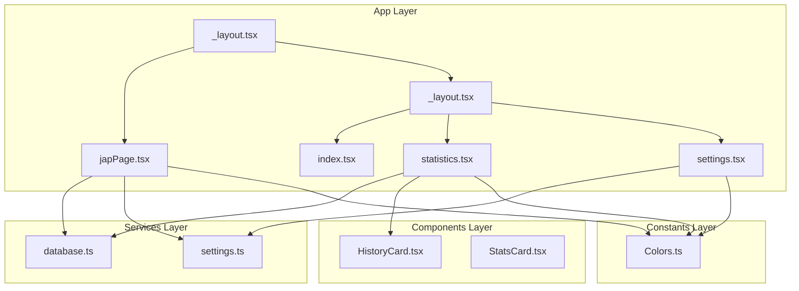

**Diagram sources**
- [japPage.tsx](file://app/japPage.tsx#L1-L289)
- [database.ts](file://services/database.ts#L1-L132)
- [settings.ts](file://services/settings.ts#L1-L47)
- [HistoryCard.tsx](file://components/HistoryCard.tsx#L1-L134)
- [StatsCard.tsx](file://components/StatsCard.tsx#L1-L56)

**Section sources**
- [japPage.tsx](file://app/japPage.tsx#L1-L289)
- [database.ts](file://services/database.ts#L1-L132)
- [settings.ts](file://services/settings.ts#L1-L47)

## Core Components

### Real-Time Bead Counting System
The bead counting mechanism implements sophisticated state management with automatic timer start and completion detection:

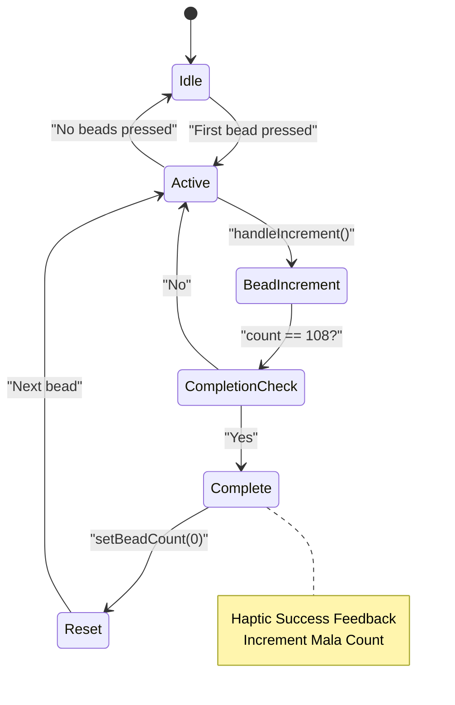

**Diagram sources**
- [japPage.tsx](file://app/japPage.tsx#L102-L121)

The system maintains two primary state variables:
- `beadCount`: Tracks current beads in the mala (0-108)
- `malaCount`: Tracks completed mala cycles

**Section sources**
- [japPage.tsx](file://app/japPage.tsx#L24-L25)
- [japPage.tsx](file://app/japPage.tsx#L102-L121)

### Circular Progress Visualization
The SVG-based progress visualization creates a smooth circular indicator with dynamic stroke calculations:

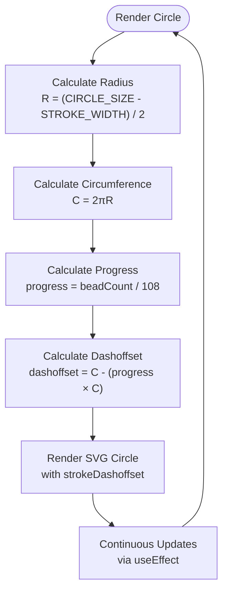

**Diagram sources**
- [japPage.tsx](file://app/japPage.tsx#L12-L16)
- [japPage.tsx](file://app/japPage.tsx#L41-L42)
- [japPage.tsx](file://app/japPage.tsx#L168-L192)

**Section sources**
- [japPage.tsx](file://app/japPage.tsx#L12-L16)
- [japPage.tsx](file://app/japPage.tsx#L41-L42)
- [japPage.tsx](file://app/japPage.tsx#L168-L192)

### Haptic Feedback Integration
The haptic feedback system provides tactile responses for user interactions:

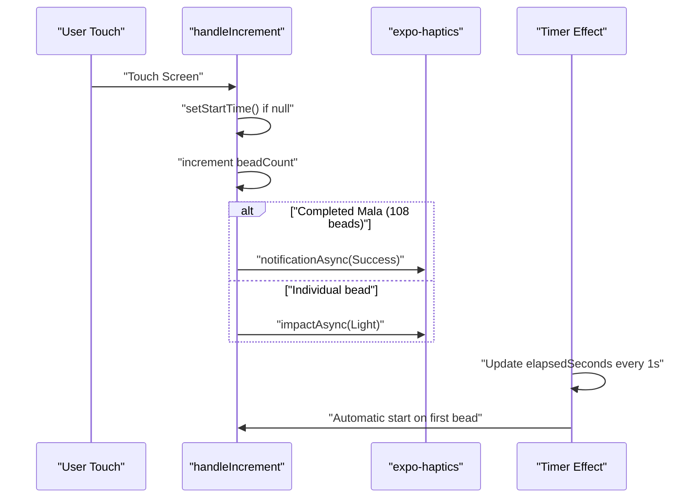

**Diagram sources**
- [japPage.tsx](file://app/japPage.tsx#L102-L121)
- [japPage.tsx](file://app/japPage.tsx#L52-L68)

**Section sources**
- [japPage.tsx](file://app/japPage.tsx#L102-L121)
- [japPage.tsx](file://app/japPage.tsx#L52-L68)

### Timer Functionality
The timer implements automatic start/stop behavior with precise time tracking:

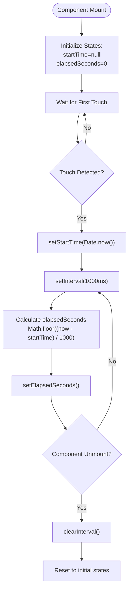

**Diagram sources**
- [japPage.tsx](file://app/japPage.tsx#L26-L28)
- [japPage.tsx](file://app/japPage.tsx#L52-L68)

**Section sources**
- [japPage.tsx](file://app/japPage.tsx#L26-L28)
- [japPage.tsx](file://app/japPage.tsx#L52-L68)

### Navigation Guard System
The navigation guard prevents accidental session abandonment with user confirmation:

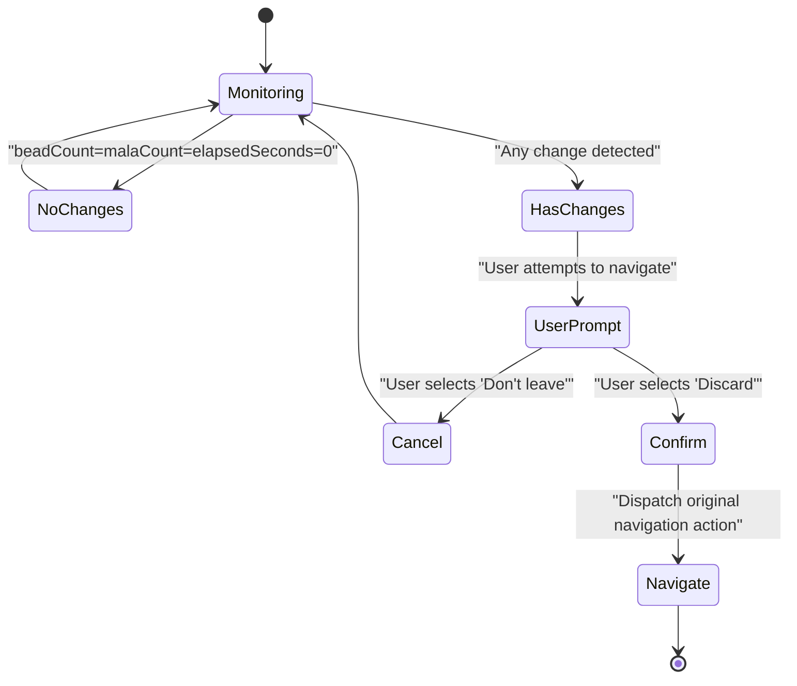

**Diagram sources**
- [japPage.tsx](file://app/japPage.tsx#L70-L99)

**Section sources**
- [japPage.tsx](file://app/japPage.tsx#L70-L99)

### Save Session Functionality
The save session process integrates database persistence with user confirmation:

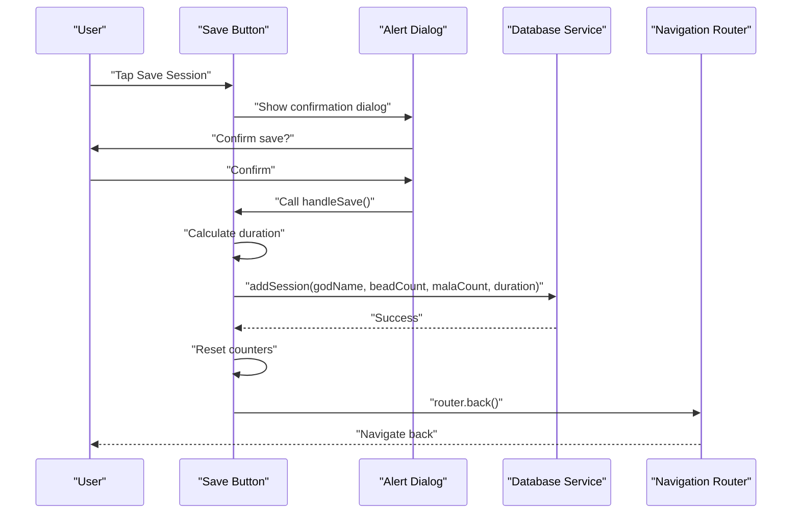

**Diagram sources**
- [japPage.tsx](file://app/japPage.tsx#L123-L160)
- [database.ts](file://services/database.ts#L41-L64)

**Section sources**
- [japPage.tsx](file://app/japPage.tsx#L123-L160)
- [database.ts](file://services/database.ts#L41-L64)

## Architecture Overview

The Jap counter follows a layered architecture pattern with clear separation between UI presentation, business logic, and data persistence:

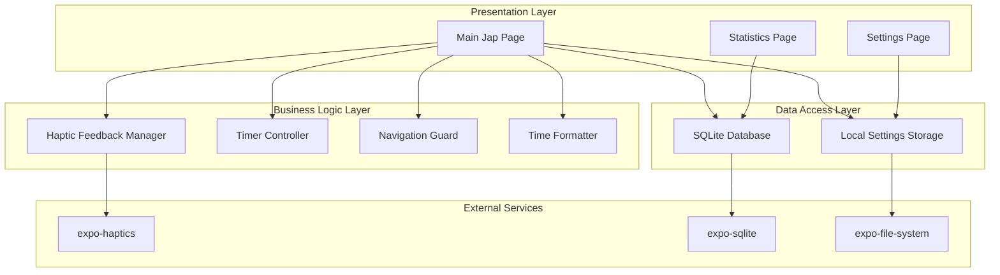

**Diagram sources**
- [japPage.tsx](file://app/japPage.tsx#L1-L10)
- [database.ts](file://services/database.ts#L1-L10)
- [settings.ts](file://services/settings.ts#L1-L14)

**Section sources**
- [japPage.tsx](file://app/japPage.tsx#L1-L10)
- [database.ts](file://services/database.ts#L1-L10)
- [settings.ts](file://services/settings.ts#L1-L14)

## Detailed Component Analysis

### Main Jap Counter Component
The primary component orchestrates all functionality with sophisticated state management and lifecycle handling:

#### State Management Architecture
The component manages four critical state variables with automatic synchronization:

| State Variable | Type | Purpose | Update Trigger |
|---|---|---|---|
| `beadCount` | `number` | Current beads in mala (0-108) | `handleIncrement()` |
| `malaCount` | `number` | Completed mala cycles | `handleIncrement()` |
| `startTime` | `number \| null` | Session start timestamp | `handleIncrement()` |
| `elapsedSeconds` | `number` | Session duration in seconds | `useEffect` timer |

#### Touch Handling Implementation
The touch system implements dual-layer interaction with pressable containers and event propagation control:

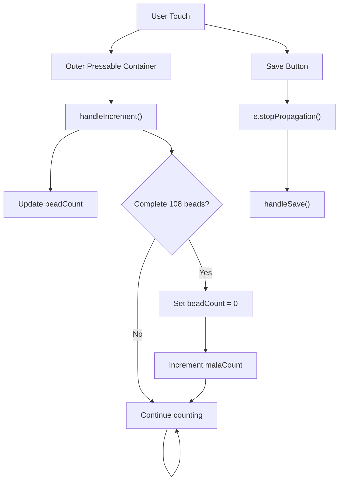

**Diagram sources**
- [japPage.tsx](file://app/japPage.tsx#L162-L220)
- [japPage.tsx](file://app/japPage.tsx#L102-L121)
- [japPage.tsx](file://app/japPage.tsx#L205-L216)

**Section sources**
- [japPage.tsx](file://app/japPage.tsx#L162-L220)
- [japPage.tsx](file://app/japPage.tsx#L102-L121)
- [japPage.tsx](file://app/japPage.tsx#L205-L216)

### Database Integration
The SQLite database provides persistent storage for session history with robust initialization and migration support:

#### Database Schema Design
The `jap_sessions` table structure supports comprehensive session tracking:

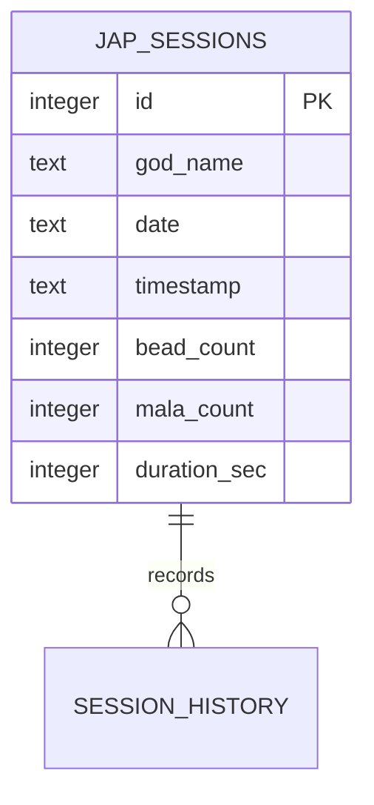

**Diagram sources**
- [database.ts](file://services/database.ts#L17-L25)

#### Initialization and Migration
The database initialization process ensures schema compatibility across application versions:

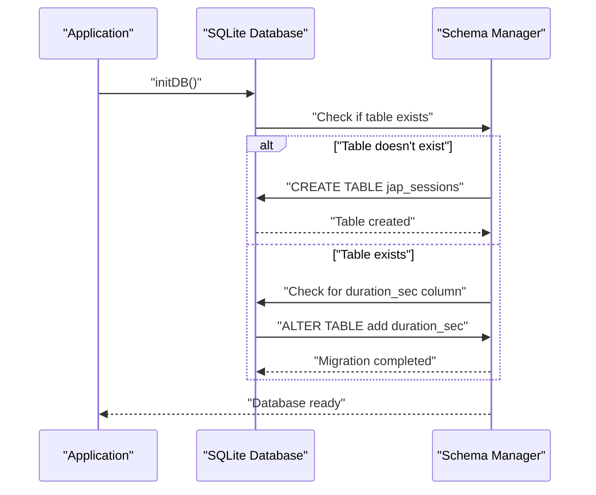

**Diagram sources**
- [database.ts](file://services/database.ts#L12-L39)

**Section sources**
- [database.ts](file://services/database.ts#L12-L39)
- [database.ts](file://services/database.ts#L41-L64)

### Settings Management
The settings system provides user preference persistence with default fallbacks:

#### Settings Data Model
The settings interface defines configurable preferences:

| Setting | Type | Default | Description |
|---|---|---|---|
| `userName` | `string` | `''` | User's display name |
| `vibrationEnabled` | `boolean` | `true` | Enable/disable haptic feedback |

#### Settings Persistence Strategy
The settings service implements robust file-based storage with automatic migration:

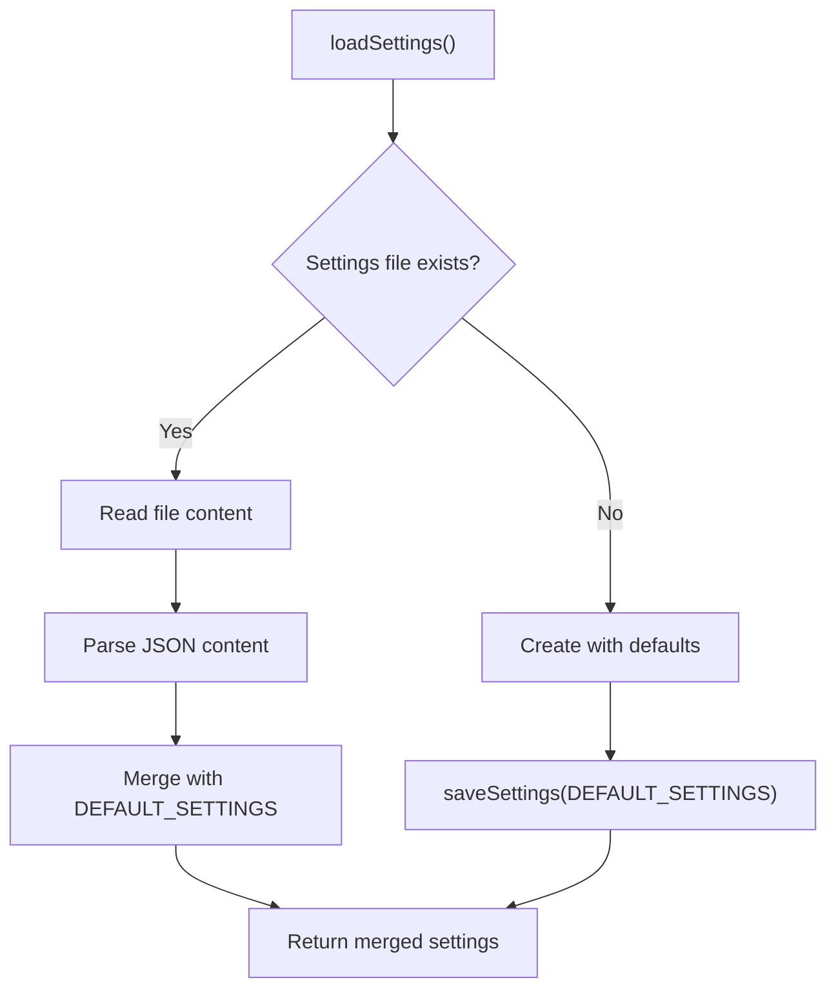

**Diagram sources**
- [settings.ts](file://services/settings.ts#L16-L34)

**Section sources**
- [settings.ts](file://services/settings.ts#L3-L7)
- [settings.ts](file://services/settings.ts#L16-L34)

### Statistics and History Components
The statistics page provides comprehensive session history with pagination and formatting:

#### History Card Component
Each history entry displays formatted session data with visual indicators:

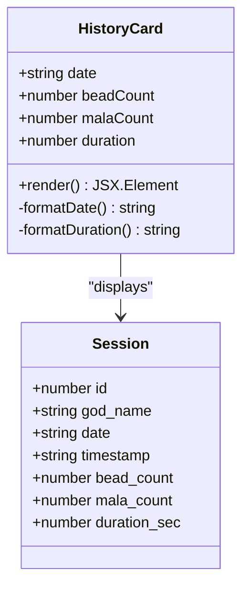

**Diagram sources**
- [HistoryCard.tsx](file://components/HistoryCard.tsx#L6-L11)
- [database.ts](file://services/database.ts#L108-L116)

**Section sources**
- [HistoryCard.tsx](file://components/HistoryCard.tsx#L1-L134)
- [statistics.tsx](file://app/(tabs)/statistics.tsx#L53-L60)

## Dependency Analysis

### External Dependencies
The application relies on several key external libraries for core functionality:

```mermaid
graph TB
subgraph "UI & Navigation"
ExpoRouter[expo-router]
SafeArea[react-native-safe-area-context]
GestureHandler[react-native-gesture-handler]
Reanimated[react-native-reanimated]
end
subgraph "System Integration"
Haptics[expo-haptics]
SQLite[expo-sqlite]
FileSystem[expo-file-system]
end
subgraph "Graphics & Icons"
SVG[react-native-svg]
VectorIcons[@expo/vector-icons]
end
subgraph "Runtime"
React[react]
RN[react-native]
Expo[expo]
end
JapPage --> ExpoRouter
JapPage --> SafeArea
JapPage --> Haptics
JapPage --> SQLite
JapPage --> SVG
StatsPage --> SQLite
SettingsPage --> FileSystem
```

**Diagram sources**
- [package.json](file://package.json#L13-L42)

**Section sources**
- [package.json](file://package.json#L13-L42)

### Internal Module Dependencies
The internal dependency graph shows clear module boundaries and communication patterns:

```mermaid
graph LR
subgraph "UI Modules"
JapPage[app/japPage.tsx]
StatsPage[app/(tabs)/statistics.tsx]
SettingsPage[app/(tabs)/settings.tsx]
end
subgraph "Service Modules"
Database[services/database.ts]
SettingsSvc[services/settings.ts]
end
subgraph "Component Modules"
HistoryCard[components/HistoryCard.tsx]
StatsCard[components/StatsCard.tsx]
end
subgraph "Utility Modules"
Colors[constants/Colors.ts]
RootLayout[app/_layout.tsx]
TabLayout[app/(tabs)/_layout.tsx]
end
JapPage --> Database
JapPage --> SettingsSvc
StatsPage --> Database
StatsPage --> HistoryCard
SettingsPage --> SettingsSvc
JapPage --> Colors
StatsPage --> Colors
SettingsPage --> Colors
RootLayout --> Database
RootLayout --> Colors
```

**Diagram sources**
- [japPage.tsx](file://app/japPage.tsx#L1-L10)
- [database.ts](file://services/database.ts#L1-L10)
- [settings.ts](file://services/settings.ts#L1-L7)

**Section sources**
- [japPage.tsx](file://app/japPage.tsx#L1-L10)
- [database.ts](file://services/database.ts#L1-L10)
- [settings.ts](file://services/settings.ts#L1-L7)

## Performance Considerations

### Real-Time Update Optimization
The application implements several strategies to maintain smooth real-time updates:

#### Efficient State Updates
- **Batched Updates**: Timer updates occur every 1000ms to balance accuracy and performance
- **Conditional Rendering**: SVG progress updates only when beadCount changes
- **Memoized Handlers**: useCallback prevents unnecessary re-renders of event handlers

#### Memory Management Strategies
- **Cleanup Functions**: useEffect return functions properly clear intervals
- **Event Listener Cleanup**: Navigation guard removes listeners on unmount
- **Component Lifecycle**: Proper cleanup prevents memory leaks in long-running sessions

#### Rendering Performance
- **SVG Optimization**: Single SVG container with dynamic stroke properties
- **Minimal DOM Nodes**: Efficient component structure reduces rendering overhead
- **StyleSheet Caching**: Pre-computed styles minimize runtime calculations

### Database Performance
The SQLite integration includes performance optimizations:

#### Connection Management
- **Singleton Pattern**: Database connection reused across operations
- **Connection Pooling**: Single active connection prevents resource contention
- **Transaction Batching**: Multiple operations within single transaction context

#### Query Optimization
- **Indexed Columns**: Primary key indexing on session ID
- **Efficient Queries**: SELECT statements optimized for session history
- **Pagination Strategy**: LIMIT/OFFSET for scalable history loading

### Haptic Feedback Performance
The haptic system minimizes performance impact:

#### Feedback Optimization
- **Conditional Execution**: Haptic feedback only when enabled in settings
- **Debounced Calls**: Prevents rapid successive haptic calls
- **Platform-Specific**: Uses native haptic APIs for optimal performance

## Troubleshooting Guide

### Common Issues and Solutions

#### Database Initialization Failures
**Symptoms**: Application crashes on startup with database errors
**Causes**: 
- SQLite database corruption
- Permission issues with file system
- Migration failures

**Solutions**:
- Verify database file permissions
- Clear app cache and restart
- Check SQLite version compatibility

#### Haptic Feedback Not Working
**Symptoms**: No tactile response during bead counting
**Causes**:
- Device compatibility issues
- Haptic feedback disabled in system settings
- Library initialization failures

**Solutions**:
- Test on physical device (simulator limitations)
- Verify device supports haptic feedback
- Check system haptic settings

#### Timer Not Starting
**Symptoms**: Elapsed time remains at 0 despite bead counting
**Causes**:
- Timer effect not triggering
- State update conflicts
- Component unmounting prematurely

**Solutions**:
- Verify useEffect dependencies array
- Check for state update race conditions
- Ensure component remains mounted during session

#### Navigation Guard Issues
**Symptoms**: Navigation guard not preventing screen exit
**Causes**:
- Event listener not properly attached
- State comparison logic errors
- Navigation library conflicts

**Solutions**:
- Verify navigation object availability
- Check state variable dependencies
- Review navigation library version compatibility

### Debugging Tools and Techniques
The application includes built-in logging for troubleshooting:

#### Console Logging
- Session save operations log detailed information
- Database operations provide success/error messages
- Settings loading includes diagnostic information

#### State Inspection
- Real-time state updates visible in component
- Timer values update every second
- Progress calculations reflected in SVG rendering

**Section sources**
- [japPage.tsx](file://app/japPage.tsx#L139-L155)
- [database.ts](file://services/database.ts#L59-L63)

## Conclusion
The Jap counter interface implementation demonstrates comprehensive React Native development practices with attention to user experience, performance, and reliability. The modular architecture supports maintainability while the real-time features provide responsive user interaction.

Key strengths include:
- **Robust State Management**: Well-structured state variables with automatic synchronization
- **Performance Optimization**: Efficient rendering and memory management strategies
- **User Experience**: Thoughtful haptic feedback and visual progress indication
- **Data Persistence**: Reliable SQLite integration with migration support
- **Navigation Safety**: Effective prevention of accidental session abandonment

The implementation serves as a solid foundation for meditation tracking applications, with clear extensibility points for additional features such as session categories, export functionality, and advanced analytics.