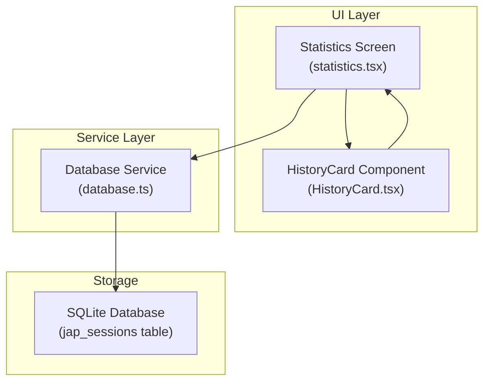
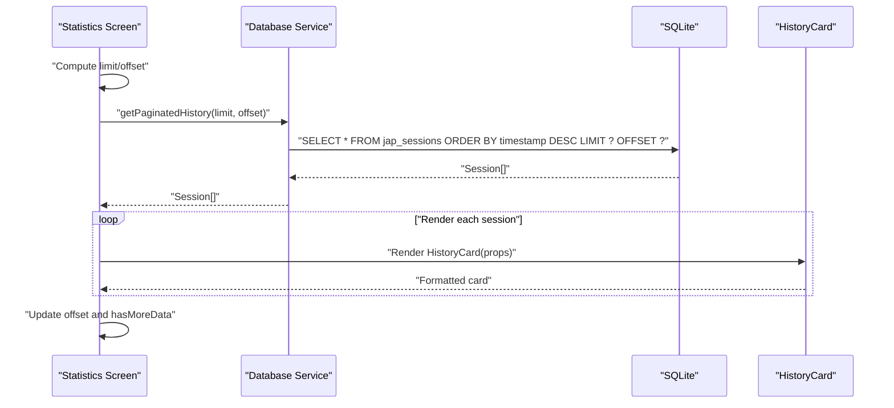
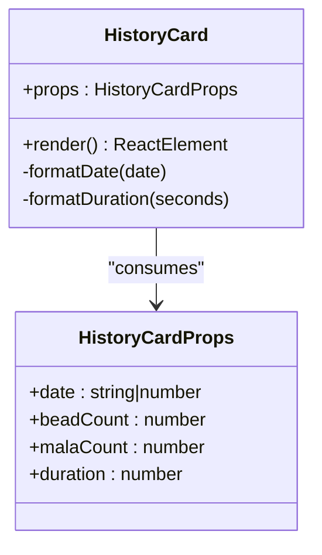
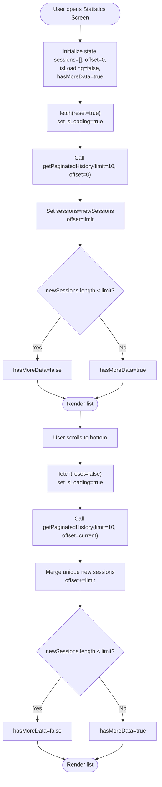
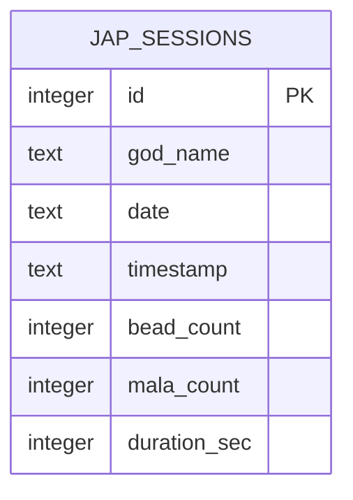
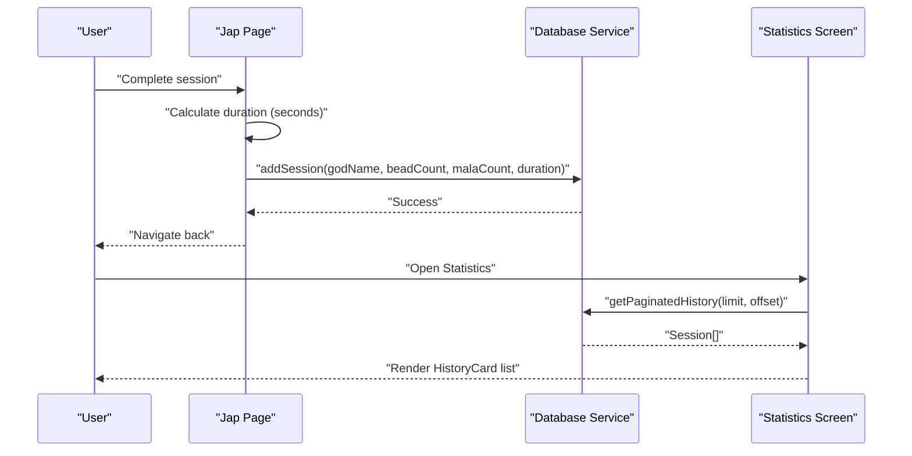
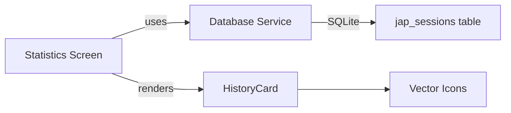

# Session History Management

<cite>
**Referenced Files in This Document**
- [HistoryCard.tsx](file://components/HistoryCard.tsx)
- [database.ts](file://services/database.ts)
- [statistics.tsx](file://app/(tabs)/statistics.tsx)
- [japPage.tsx](file://app/japPage.tsx)
- [_layout.tsx](file://app/_layout.tsx)
- [package.json](file://package.json)
</cite>

## Table of Contents
1. [Introduction](#introduction)
2. [Project Structure](#project-structure)
3. [Core Components](#core-components)
4. [Architecture Overview](#architecture-overview)
5. [Detailed Component Analysis](#detailed-component-analysis)
6. [Dependency Analysis](#dependency-analysis)
7. [Performance Considerations](#performance-considerations)
8. [Troubleshooting Guide](#troubleshooting-guide)
9. [Conclusion](#conclusion)

## Introduction
This document describes the session history management system for the Jap Counter application. It covers the paginated session listing implementation, the HistoryCard component for individual session display, database query patterns for retrieving historical session data, the session detail view presentation, pagination mechanics for large datasets, data formatting for beads, malas, and durations, and the component architecture integrating HistoryCard with the overall history screen. Performance considerations for loading and rendering large datasets are also addressed.

## Project Structure
The session history system spans three primary areas:
- Database service layer for SQLite-backed persistence and queries
- UI screen for listing sessions with pagination
- Reusable HistoryCard component for rendering individual session entries

**Diagram sources**
- [statistics.tsx](file://app/(tabs)/statistics.tsx#L1-L117)
- [HistoryCard.tsx](file://components/HistoryCard.tsx#L1-L134)
- [database.ts](file://services/database.ts#L1-L132)

**Section sources**
- [statistics.tsx](file://app/(tabs)/statistics.tsx#L1-L117)
- [HistoryCard.tsx](file://components/HistoryCard.tsx#L1-L134)
- [database.ts](file://services/database.ts#L1-L132)

## Core Components
- HistoryCard: Renders a single historical session with formatted date, total beads, mala count, and duration.
- Statistics Screen: Implements paginated listing of sessions using FlatList and manages offset/limit for incremental loading.
- Database Service: Provides initialization, insertion, and paginated retrieval of sessions with proper ordering.

Key responsibilities:
- HistoryCard formats timestamps, computes total beads from malas and beads, and displays duration in HH:MM:SS.
- Statistics Screen controls loading state, determines when to load more data, and deduplicates newly fetched items.
- Database Service ensures ordered retrieval by timestamp descending and handles migration for duration_sec.

**Section sources**
- [HistoryCard.tsx](file://components/HistoryCard.tsx#L6-L66)
- [statistics.tsx](file://app/(tabs)/statistics.tsx#L8-L88)
- [database.ts](file://services/database.ts#L118-L131)

## Architecture Overview
The system follows a unidirectional data flow:
- UI triggers fetch with limit and offset
- Database service executes SQL with ORDER BY timestamp DESC and applies LIMIT/OFFSET
- UI renders HistoryCard instances for each session
- Pagination continues until fewer results than limit are returned

**Diagram sources**
- [statistics.tsx](file://app/(tabs)/statistics.tsx#L14-L45)
- [database.ts](file://services/database.ts#L118-L125)
- [HistoryCard.tsx](file://components/HistoryCard.tsx#L13-L66)

## Detailed Component Analysis

### HistoryCard Component
Purpose:
- Display a single historical session with:
  - Formatted date/time header
  - Hero section showing total beads computed as (mala_count × 108) + bead_count
  - Stats row with mala count and duration in HH:MM:SS

Implementation highlights:
- Props define date, beadCount, malaCount, and duration (seconds)
- Date formatting uses locale-aware date/time formatting
- Duration formatting rounds seconds to nearest minute/hour/second for display
- Uses themed colors and responsive layout for dark mode

**Diagram sources**
- [HistoryCard.tsx](file://components/HistoryCard.tsx#L6-L66)

**Section sources**
- [HistoryCard.tsx](file://components/HistoryCard.tsx#L13-L66)

### Statistics Screen (Session History Listing)
Responsibilities:
- Manages state for sessions, offset, loading, and availability of more data
- Fetches paginated sessions on mount and when user scrolls near the end
- Deduplicates newly fetched items against existing ones
- Renders HistoryCard for each session
- Handles empty state and loading indicator

Pagination logic:
- Initial load resets offset to limit
- Subsequent loads append unique sessions and increments offset by limit
- Sets hasMoreData based on whether fewer than limit items were returned

**Diagram sources**
- [statistics.tsx](file://app/(tabs)/statistics.tsx#L8-L88)

**Section sources**
- [statistics.tsx](file://app/(tabs)/statistics.tsx#L8-L88)

### Database Service (Session History Queries)
Database schema:
- Table: jap_sessions
- Columns: id, god_name, date, timestamp, bead_count, mala_count, duration_sec
- Migration adds duration_sec with default 0 if missing

Query patterns:
- Insertion: Records current date, timestamp, bead_count, mala_count, and duration_sec
- Paginated retrieval: SELECT * ORDER BY timestamp DESC LIMIT ? OFFSET ?
- Aggregation helpers: getStatsForDate and getAllTimeStats compute totals

**Diagram sources**
- [database.ts](file://services/database.ts#L17-L25)

**Section sources**
- [database.ts](file://services/database.ts#L12-L39)
- [database.ts](file://services/database.ts#L41-L64)
- [database.ts](file://services/database.ts#L66-L106)
- [database.ts](file://services/database.ts#L118-L131)

### Session Detail View and Navigation
While the repository does not include a dedicated session detail screen, the session data model and saving mechanism are present:
- Sessions are saved with timestamp, bead_count, mala_count, and duration_sec
- The statistics screen lists sessions and renders them via HistoryCard
- Navigation to the session detail screen would require adding a route and a detail component

Current saving flow:
- Timer calculates duration in seconds
- addSession persists session data to the database
- Statistics screen fetches and displays sessions

**Diagram sources**
- [japPage.tsx](file://app/japPage.tsx#L134-L156)
- [database.ts](file://services/database.ts#L41-L64)
- [statistics.tsx](file://app/(tabs)/statistics.tsx#L14-L45)

**Section sources**
- [japPage.tsx](file://app/japPage.tsx#L134-L156)
- [database.ts](file://services/database.ts#L41-L64)
- [statistics.tsx](file://app/(tabs)/statistics.tsx#L14-L45)

## Dependency Analysis
External dependencies relevant to session history:
- expo-sqlite: SQLite database access for session persistence
- react-native: FlatList for efficient list rendering
- @expo/vector-icons: Icons for mala and timer in HistoryCard

**Diagram sources**
- [package.json](file://package.json#L28-L38)
- [statistics.tsx](file://app/(tabs)/statistics.tsx#L1-L6)
- [HistoryCard.tsx](file://components/HistoryCard.tsx#L1-L4)
- [database.ts](file://services/database.ts#L1-L10)

**Section sources**
- [package.json](file://package.json#L13-L42)
- [statistics.tsx](file://app/(tabs)/statistics.tsx#L1-L6)
- [HistoryCard.tsx](file://components/HistoryCard.tsx#L1-L4)
- [database.ts](file://services/database.ts#L1-L10)

## Performance Considerations
- Database ordering: Queries use ORDER BY timestamp DESC to ensure newest sessions appear first, minimizing UI reordering overhead.
- Pagination: LIMIT/OFFSET prevents loading the entire dataset at once, reducing memory pressure and initial render time.
- Deduplication: Newly fetched sessions are filtered against existing IDs to prevent duplicates during infinite scroll.
- Rendering efficiency: FlatList virtualizes rows, rendering only visible items and recycling cells.
- Icon usage: Vector icons are lightweight and cached by the framework.
- Storage mode: WAL mode improves concurrent reads/writes for SQLite.

Potential enhancements:
- Virtualization: FlatList already provides virtualization; ensure keyExtractor is stable and items are immutable to maximize reuse.
- Indexing: Consider adding an index on timestamp for very large datasets if query performance becomes a concern.
- Batch updates: Debounce fetch calls when scrolling rapidly to reduce redundant network/database calls.
- Caching: Cache recent pages in memory to avoid re-querying when returning to the list.

[No sources needed since this section provides general guidance]

## Troubleshooting Guide
Common issues and resolutions:
- Empty list: Ensure database initialization occurs before fetching. The root layout initializes the database on startup.
- Duplicate items during pagination: The UI filters new items against existing IDs; verify that keyExtractor uses a stable identifier.
- No more data flag incorrect: The system sets hasMoreData based on whether fewer than limit items were returned; confirm limit remains constant.
- Duration formatting anomalies: Duration is rounded to nearest minute/hour/second; verify that duration_sec is stored correctly during session save.
- Icon rendering: Ensure vector icons are installed and available; the component imports them directly.

**Section sources**
- [_layout.tsx](file://app/_layout.tsx#L7-L10)
- [statistics.tsx](file://app/(tabs)/statistics.tsx#L27-L32)
- [statistics.tsx](file://app/(tabs)/statistics.tsx#L35-L39)
- [HistoryCard.tsx](file://components/HistoryCard.tsx#L30-L32)
- [database.ts](file://services/database.ts#L41-L64)

## Conclusion
The session history management system combines a robust database layer with a responsive UI to deliver an efficient, paginated listing of historical sessions. HistoryCard encapsulates the presentation logic for individual entries, while the Statistics Screen orchestrates data loading, deduplication, and rendering. The database service ensures ordered retrieval and handles schema evolution. Together, these components provide a scalable foundation for managing large volumes of session data with smooth user experience.