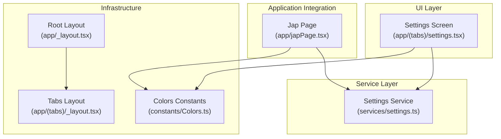
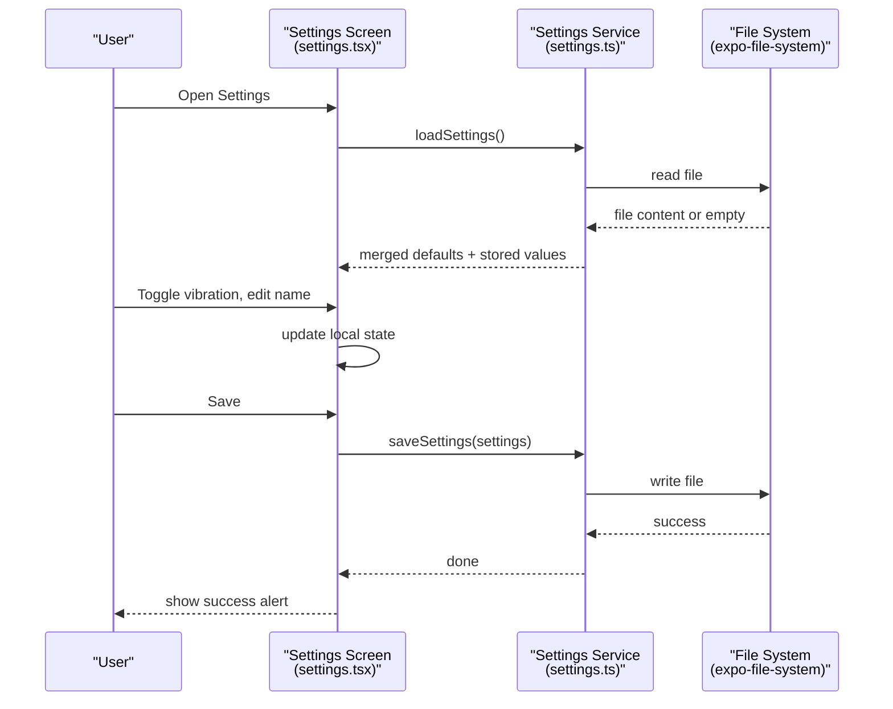
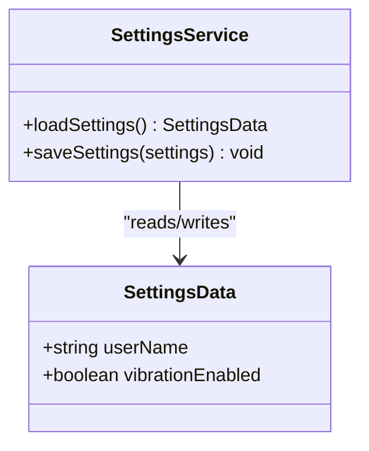
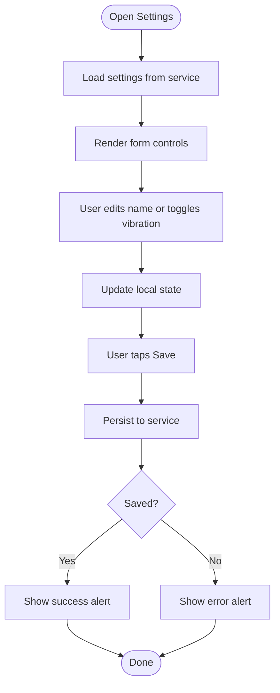
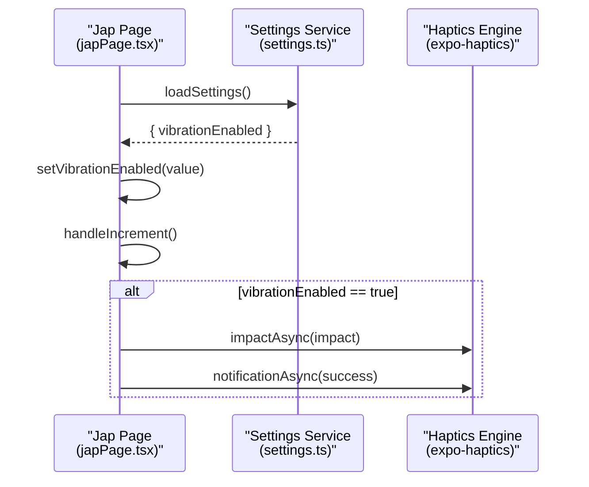
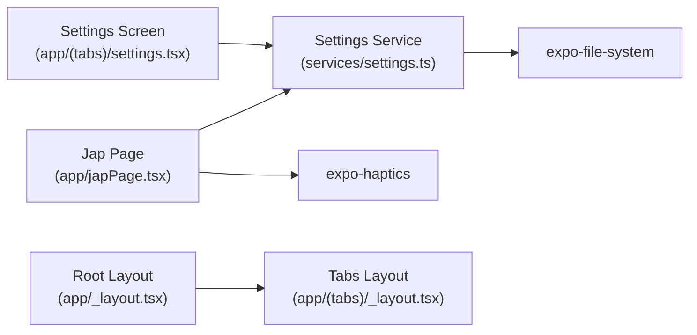

# Settings Management

<cite>
**Referenced Files in This Document**
- [settings.ts](file://services/settings.ts)
- [settings.tsx](file://app/(tabs)/settings.tsx)
- [japPage.tsx](file://app/japPage.tsx)
- [database.ts](file://services/database.ts)
- [Colors.ts](file://constants/Colors.ts)
- [_layout.tsx](file://app/_layout.tsx)
- [Tabs _layout.tsx](file://app/(tabs)/_layout.tsx)
- [package.json](file://package.json)
- [app.json](file://app.json)
- [eas.json](file://eas.json)
</cite>

## Table of Contents
1. [Introduction](#introduction)
2. [Project Structure](#project-structure)
3. [Core Components](#core-components)
4. [Architecture Overview](#architecture-overview)
5. [Detailed Component Analysis](#detailed-component-analysis)
6. [Dependency Analysis](#dependency-analysis)
7. [Performance Considerations](#performance-considerations)
8. [Troubleshooting Guide](#troubleshooting-guide)
9. [Conclusion](#conclusion)
10. [Appendices](#appendices)

## Introduction
This document describes the settings management system for the application. It covers the user preference configuration interface (including vibration preference toggles), the settings persistence mechanism using file system storage, the settings service architecture, and the workflows for loading and saving settings with error handling. It also explains how settings integrate with UI components and how preferences affect application behavior in real-time, particularly around haptic feedback during meditation sessions.

## Project Structure
The settings system spans several modules:
- UI layer: a dedicated settings screen that renders profile and preferences controls
- Service layer: a settings service that persists and loads user preferences to/from the file system
- Application integration: screens that consume settings to apply user preferences at runtime
- Supporting infrastructure: color constants and routing configuration

**Diagram sources**
- [settings.tsx](file://app/(tabs)/settings.tsx#L1-L192)
- [settings.ts](file://services/settings.ts#L1-L47)
- [japPage.tsx](file://app/japPage.tsx#L1-L289)
- [Colors.ts](file://constants/Colors.ts#L1-L19)
- [_layout.tsx](file://app/_layout.tsx#L1-L27)
- [Tabs _layout.tsx](file://app/(tabs)/_layout.tsx#L1-L58)

**Section sources**
- [settings.tsx](file://app/(tabs)/settings.tsx#L1-L192)
- [settings.ts](file://services/settings.ts#L1-L47)
- [japPage.tsx](file://app/japPage.tsx#L1-L289)
- [Colors.ts](file://constants/Colors.ts#L1-L19)
- [_layout.tsx](file://app/_layout.tsx#L1-L27)
- [Tabs _layout.tsx](file://app/(tabs)/_layout.tsx#L1-L58)

## Core Components
- Settings data model and defaults
  - Defines the shape of persisted settings and provides sensible defaults
- Settings service
  - Loads settings from persistent storage and merges with defaults
  - Saves settings to persistent storage
- Settings UI
  - Presents profile and preferences controls
  - Updates local state and triggers saves
- Runtime integration
  - Consumes settings to apply user preferences at runtime (e.g., haptic feedback)

Key responsibilities:
- Persistence: file system storage via Expo FileSystem
- Validation: merges loaded data with defaults to handle missing keys gracefully
- Real-time application: reads settings on screen focus to reflect user choices immediately

**Section sources**
- [settings.ts](file://services/settings.ts#L3-L12)
- [settings.ts](file://services/settings.ts#L16-L46)
- [settings.tsx](file://app/(tabs)/settings.tsx#L8-L96)
- [japPage.tsx](file://app/japPage.tsx#L28-L38)

## Architecture Overview
The settings architecture follows a clean separation of concerns:
- UI components manage presentation and user interactions
- The settings service encapsulates persistence and validation
- Application screens subscribe to settings to apply user preferences

**Diagram sources**
- [settings.tsx](file://app/(tabs)/settings.tsx#L13-L39)
- [settings.ts](file://services/settings.ts#L16-L46)

## Detailed Component Analysis

### Settings Service
The settings service defines the data contract, default values, and persistence logic.

- Data model
  - userName: string
  - vibrationEnabled: boolean
- Defaults
  - userName: empty string
  - vibrationEnabled: true
- Persistence
  - Uses Expo FileSystem to read/write a JSON file in the document directory
  - On load, merges stored values with defaults to handle schema evolution
  - On save, writes current settings to disk

Validation and migration:
- Missing keys in stored settings are filled by merging with defaults
- If the file does not exist, it is created with defaults

Error handling:
- Load errors fall back to defaults
- Save errors are logged and rethrown to the caller

**Diagram sources**
- [settings.ts](file://services/settings.ts#L3-L12)
- [settings.ts](file://services/settings.ts#L16-L46)

**Section sources**
- [settings.ts](file://services/settings.ts#L3-L12)
- [settings.ts](file://services/settings.ts#L16-L46)

### Settings UI Component
The settings screen provides:
- Profile section: editable user name
- Preferences section: vibration toggle switch
- Save action with success/error feedback

User experience considerations:
- Immediate feedback via alerts
- Consistent theming with color constants
- Safe area insets for mobile layouts

**Diagram sources**
- [settings.tsx](file://app/(tabs)/settings.tsx#L13-L39)
- [settings.tsx](file://app/(tabs)/settings.tsx#L41-L96)
- [Colors.ts](file://constants/Colors.ts#L1-L19)

**Section sources**
- [settings.tsx](file://app/(tabs)/settings.tsx#L8-L96)
- [Colors.ts](file://constants/Colors.ts#L1-L19)

### Runtime Integration: Applying Settings in the App
The meditation page consumes settings to apply user preferences at runtime.

Behavior:
- On screen focus, settings are fetched and vibrationEnabled is applied
- During bead increments, light haptic feedback is emitted
- Upon completing a mala, success haptic feedback is emitted when enabled

**Diagram sources**
- [japPage.tsx](file://app/japPage.tsx#L30-L38)
- [japPage.tsx](file://app/japPage.tsx#L102-L121)
- [settings.ts](file://services/settings.ts#L16-L34)

**Section sources**
- [japPage.tsx](file://app/japPage.tsx#L28-L38)
- [japPage.tsx](file://app/japPage.tsx#L102-L121)

### Settings Loading and Saving Workflows
- Loading
  - Check if the settings file exists
  - If present, read and parse JSON; merge with defaults
  - If absent, create file with defaults and return defaults
  - On any error, log and return defaults
- Saving
  - Ensure file exists (create if needed)
  - Serialize settings to JSON and write to disk
  - On error, log and rethrow

Error handling:
- UI layer catches save errors and shows an alert
- Service layer logs load/save errors and returns safe defaults

**Section sources**
- [settings.ts](file://services/settings.ts#L16-L46)
- [settings.tsx](file://app/(tabs)/settings.tsx#L31-L39)

### Data Validation Patterns
- Schema evolution safety
  - Merge stored settings with defaults to ensure missing keys are populated
  - This prevents crashes if new fields are added in future versions
- Type safety
  - Strongly typed SettingsData interface constrains allowed fields
- Fallback behavior
  - Empty or invalid files are handled gracefully by returning defaults

**Section sources**
- [settings.ts](file://services/settings.ts#L22-L24)
- [settings.ts](file://services/settings.ts#L16-L34)

### Settings Migration Strategies
- Current approach
  - Merge stored values with defaults on load
  - Ensures backward compatibility when new fields are introduced
- Future enhancements
  - Versioned settings: include a version field and migrate on load
  - Schema validation: reject incompatible configurations with clear messages
  - Rollback strategy: keep a backup of previous settings before applying migrations

[No sources needed since this section provides general guidance]

### User Experience Considerations
- Real-time updates
  - Settings are reloaded on screen focus to reflect recent changes
- Immediate feedback
  - Success/error alerts confirm save outcomes
- Accessibility
  - Theming aligns with dark mode and consistent color tokens
- Mobile-first design
  - Safe area insets and responsive layouts

**Section sources**
- [settings.tsx](file://app/(tabs)/settings.tsx#L25-L29)
- [settings.tsx](file://app/(tabs)/settings.tsx#L31-L39)
- [Colors.ts](file://constants/Colors.ts#L1-L19)

## Dependency Analysis
External dependencies relevant to settings:
- Expo FileSystem: file system operations for settings persistence
- Expo Router: navigation and screen lifecycle integration
- Expo Haptics: runtime application of vibration preferences
- Expo SQLite: unrelated to settings but part of the broader app architecture

**Diagram sources**
- [settings.ts](file://services/settings.ts#L1)
- [settings.tsx](file://app/(tabs)/settings.tsx#L1-L7)
- [japPage.tsx](file://app/japPage.tsx#L1-L9)
- [_layout.tsx](file://app/_layout.tsx#L1-L27)
- [Tabs _layout.tsx](file://app/(tabs)/_layout.tsx#L1-L58)

**Section sources**
- [package.json](file://package.json#L13-L42)
- [app.json](file://app.json#L27-L42)
- [eas.json](file://eas.json#L1-L22)

## Performance Considerations
- File I/O cost
  - Settings are small JSON documents; frequent reads/writes are lightweight
- Minimize unnecessary writes
  - Only save when the user explicitly requests it
- Avoid blocking UI
  - All file operations are asynchronous; ensure UI remains responsive
- Network/file availability
  - The service handles missing files and parsing errors gracefully

[No sources needed since this section provides general guidance]

## Troubleshooting Guide
Common issues and resolutions:
- Settings not persisting
  - Verify the settings file exists in the document directory
  - Check for write permissions and available storage
- Settings revert to defaults unexpectedly
  - Corrupted or empty file content triggers fallback to defaults
  - Validate JSON syntax and structure
- Save failures
  - Inspect console logs for errors during save
  - Confirm the app has permission to write to the document directory
- Haptic feedback not triggering
  - Ensure vibrationEnabled is true
  - Verify the device supports haptic feedback

**Section sources**
- [settings.ts](file://services/settings.ts#L16-L46)
- [settings.tsx](file://app/(tabs)/settings.tsx#L31-L39)
- [japPage.tsx](file://app/japPage.tsx#L108-L118)

## Conclusion
The settings management system provides a robust, user-friendly way to configure preferences and apply them in real-time. By separating UI, persistence, and runtime logic, the system is maintainable, extensible, and resilient to configuration changes. The current design safely handles schema evolution and offers immediate feedback to users.

## Appendices

### Settings Data Model
- Fields
  - userName: string
  - vibrationEnabled: boolean
- Defaults
  - userName: empty string
  - vibrationEnabled: true

**Section sources**
- [settings.ts](file://services/settings.ts#L3-L12)

### Settings Persistence Location
- File path
  - Document directory under a filename used by the settings service
- Storage mechanism
  - JSON serialization with file system operations

**Section sources**
- [settings.ts](file://services/settings.ts#L14-L41)