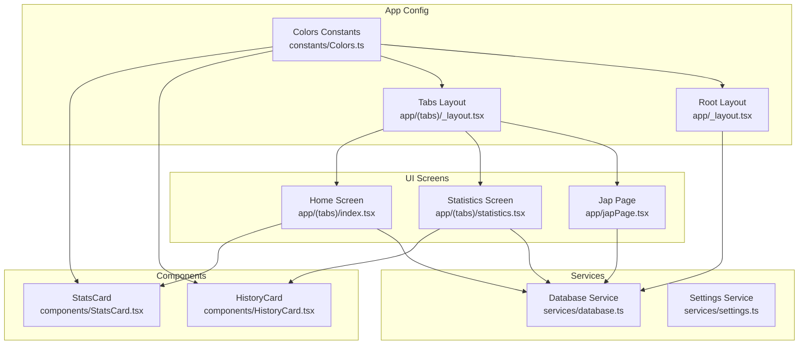
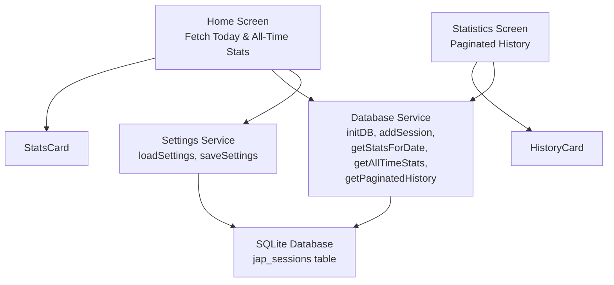
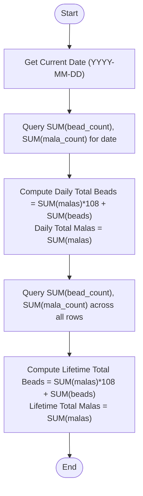
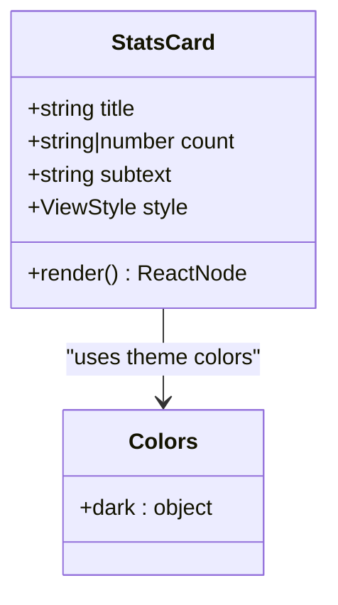
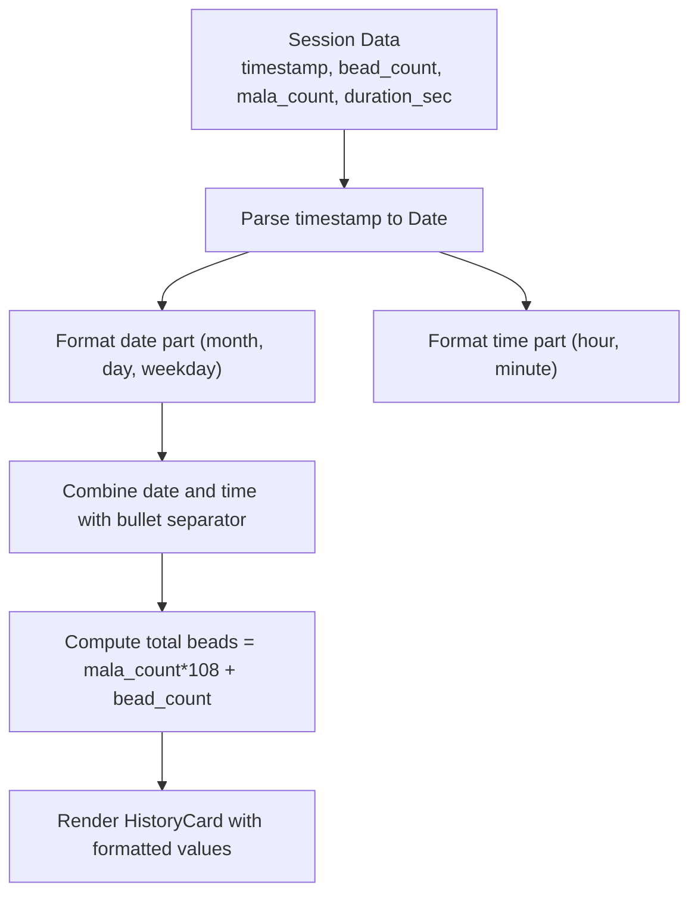
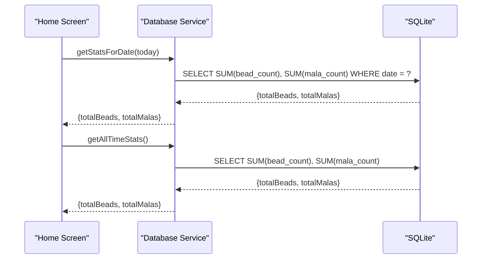
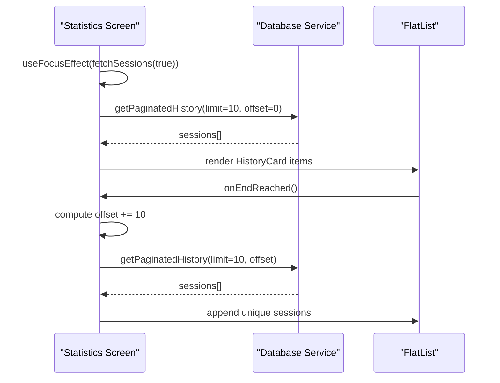
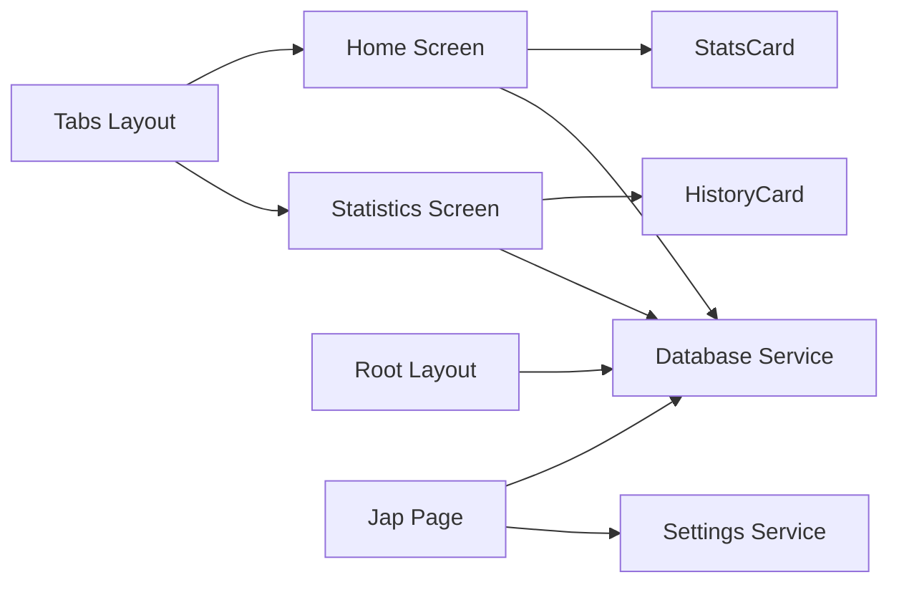

# Statistics Dashboard

<cite>
**Referenced Files in This Document**
- [app/(tabs)/statistics.tsx](file://app/(tabs)/statistics.tsx)
- [components/StatsCard.tsx](file://components/StatsCard.tsx)
- [services/database.ts](file://services/database.ts)
- [app/(tabs)/index.tsx](file://app/(tabs)/index.tsx)
- [components/HistoryCard.tsx](file://components/HistoryCard.tsx)
- [app/_layout.tsx](file://app/_layout.tsx)
- [app/(tabs)/_layout.tsx](file://app/(tabs)/_layout.tsx)
- [constants/Colors.ts](file://constants/Colors.ts)
- [services/settings.ts](file://services/settings.ts)
- [app/japPage.tsx](file://app/japPage.tsx)
</cite>

## Table of Contents
1. [Introduction](#introduction)
2. [Project Structure](#project-structure)
3. [Core Components](#core-components)
4. [Architecture Overview](#architecture-overview)
5. [Detailed Component Analysis](#detailed-component-analysis)
6. [Dependency Analysis](#dependency-analysis)
7. [Performance Considerations](#performance-considerations)
8. [Troubleshooting Guide](#troubleshooting-guide)
9. [Conclusion](#conclusion)
10. [Appendices](#appendices)

## Introduction
This document provides comprehensive documentation for the statistics dashboard functionality. It explains how daily and lifetime statistics are calculated, how the StatsCard component renders individual metric cards, how practice metrics are aggregated from stored session data, and how the system integrates with the database service to retrieve historical session information. It also covers UI layout structure, responsive design considerations, component composition patterns, data fetching and display mechanisms, performance optimization strategies for large datasets, and caching approaches. Finally, it includes examples of statistic calculations and data formatting used throughout the dashboard.

## Project Structure
The statistics dashboard spans several key areas:
- UI screens under app/(tabs) for home and statistics views
- Reusable components for rendering cards
- Database service for persistence and retrieval
- Color constants for consistent theming
- Settings service for user preferences
- Global layout configuration for navigation and initialization

**Diagram sources**
- [app/(tabs)/index.tsx](file://app/(tabs)/index.tsx#L1-L120)
- [app/(tabs)/statistics.tsx](file://app/(tabs)/statistics.tsx#L1-L117)
- [components/StatsCard.tsx](file://components/StatsCard.tsx#L1-L56)
- [components/HistoryCard.tsx](file://components/HistoryCard.tsx#L1-L134)
- [services/database.ts](file://services/database.ts#L1-L132)
- [services/settings.ts](file://services/settings.ts#L1-L47)
- [app/_layout.tsx](file://app/_layout.tsx#L1-L27)
- [app/(tabs)/_layout.tsx](file://app/(tabs)/_layout.tsx#L1-L58)
- [constants/Colors.ts](file://constants/Colors.ts#L1-L19)

**Section sources**
- [app/(tabs)/index.tsx](file://app/(tabs)/index.tsx#L1-L120)
- [app/(tabs)/statistics.tsx](file://app/(tabs)/statistics.tsx#L1-L117)
- [components/StatsCard.tsx](file://components/StatsCard.tsx#L1-L56)
- [components/HistoryCard.tsx](file://components/HistoryCard.tsx#L1-L134)
- [services/database.ts](file://services/database.ts#L1-L132)
- [services/settings.ts](file://services/settings.ts#L1-L47)
- [app/_layout.tsx](file://app/_layout.tsx#L1-L27)
- [app/(tabs)/_layout.tsx](file://app/(tabs)/_layout.tsx#L1-L58)
- [constants/Colors.ts](file://constants/Colors.ts#L1-L19)

## Core Components
- StatsCard: A reusable card component that displays a title, a large numeric count, and a small descriptive subtext. It uses theme-aware colors and responsive sizing.
- HistoryCard: A card that renders a single session’s details including formatted date/time, total beads (malas × 108 + beads), malas count, and duration in hours/minutes/seconds.
- Database Service: Provides initialization, session creation, daily and lifetime statistics retrieval, and paginated history retrieval.
- Home Screen: Fetches today’s and all-time statistics and renders two StatsCards.
- Statistics Screen: Implements infinite scroll pagination to load session history and renders each session via HistoryCard.
- Settings Service: Manages user preferences (e.g., vibration) used during session recording.
- Layouts: Configure global navigation and database initialization.

**Section sources**
- [components/StatsCard.tsx](file://components/StatsCard.tsx#L1-L56)
- [components/HistoryCard.tsx](file://components/HistoryCard.tsx#L1-L134)
- [services/database.ts](file://services/database.ts#L1-L132)
- [app/(tabs)/index.tsx](file://app/(tabs)/index.tsx#L1-L120)
- [app/(tabs)/statistics.tsx](file://app/(tabs)/statistics.tsx#L1-L117)
- [services/settings.ts](file://services/settings.ts#L1-L47)
- [app/_layout.tsx](file://app/_layout.tsx#L1-L27)
- [app/(tabs)/_layout.tsx](file://app/(tabs)/_layout.tsx#L1-L58)

## Architecture Overview
The statistics dashboard follows a layered architecture:
- Presentation Layer: Home and Statistics screens render UI and orchestrate data fetching.
- Component Layer: StatsCard and HistoryCard encapsulate presentation logic.
- Service Layer: Database service abstracts SQLite operations; Settings service manages user preferences.
- Persistence Layer: SQLite database stores session records with date, timestamp, bead counts, mala counts, and duration.

**Diagram sources**
- [app/(tabs)/index.tsx](file://app/(tabs)/index.tsx#L1-L120)
- [app/(tabs)/statistics.tsx](file://app/(tabs)/statistics.tsx#L1-L117)
- [components/StatsCard.tsx](file://components/StatsCard.tsx#L1-L56)
- [components/HistoryCard.tsx](file://components/HistoryCard.tsx#L1-L134)
- [services/database.ts](file://services/database.ts#L1-L132)
- [services/settings.ts](file://services/settings.ts#L1-L47)

## Detailed Component Analysis

### Daily and Lifetime Statistics Calculation
Daily statistics are computed by summing bead_count and mala_count for the current date and converting to total beads using the formula:
- Total Beads = (mala_count_sum × 108) + bead_count_sum
- Total Malas = mala_count_sum

Lifetime statistics are computed by summing across all sessions similarly.

**Diagram sources**
- [services/database.ts](file://services/database.ts#L66-L106)
- [app/(tabs)/index.tsx](file://app/(tabs)/index.tsx#L13-L25)

**Section sources**
- [services/database.ts](file://services/database.ts#L66-L106)
- [app/(tabs)/index.tsx](file://app/(tabs)/index.tsx#L13-L25)

### StatsCard Component Usage Patterns
StatsCard accepts:
- title: Card label
- count: Numeric or string value to display prominently
- subtext: Supporting text (e.g., “Malas”)
- style: Optional additional styling

It renders a centered card with a prominent count, a smaller title, and a subtle subtext. The component relies on theme colors for consistent appearance across light/dark modes.

**Diagram sources**
- [components/StatsCard.tsx](file://components/StatsCard.tsx#L5-L20)
- [constants/Colors.ts](file://constants/Colors.ts#L3-L18)

**Section sources**
- [components/StatsCard.tsx](file://components/StatsCard.tsx#L1-L56)
- [constants/Colors.ts](file://constants/Colors.ts#L1-L19)

### Data Aggregation for Practice Metrics
The HistoryCard aggregates and formats:
- Date/Time: Uses locale-aware formatting to show short month, day, weekday, and time separated by a bullet.
- Total Beads: Computes (mala_count × 108) + bead_count.
- Malas: Displays mala_count with label.
- Duration: Formats seconds into hours, minutes, and seconds.

**Diagram sources**
- [components/HistoryCard.tsx](file://components/HistoryCard.tsx#L13-L66)

**Section sources**
- [components/HistoryCard.tsx](file://components/HistoryCard.tsx#L1-L134)

### Integration with Database Services
The database service initializes the SQLite database, creates the jap_sessions table, and exposes:
- Initialization: Ensures the database is opened and schema is ready.
- Session Creation: Adds a new session with date, timestamp, bead_count, mala_count, and duration_sec.
- Daily Stats: Retrieves sums for the current date.
- Lifetime Stats: Retrieves sums across all sessions.
- Paginated History: Retrieves sessions ordered by timestamp descending with limit and offset.

**Diagram sources**
- [services/database.ts](file://services/database.ts#L66-L106)
- [app/(tabs)/index.tsx](file://app/(tabs)/index.tsx#L13-L25)

**Section sources**
- [services/database.ts](file://services/database.ts#L1-L132)
- [app/(tabs)/index.tsx](file://app/(tabs)/index.tsx#L1-L120)

### UI Layout Structure and Responsive Design
- Home Screen: Uses a vertical layout with a header, two StatsCards arranged horizontally, and a prominent action button. Styles use percentage widths and spacing for responsiveness.
- Statistics Screen: Uses a FlatList with a footer spinner and empty state text. Content padding ensures safe area compliance.
- Colors: Centralized theme values define backgrounds, surfaces, tints, borders, and text colors for consistent dark-mode styling.

Responsive considerations:
- Flexbox layout adapts to device width.
- Safe area insets are applied to top/bottom containers.
- Typography scales with device density; card sizes use fixed dimensions with proportional margins.

**Section sources**
- [app/(tabs)/index.tsx](file://app/(tabs)/index.tsx#L67-L120)
- [app/(tabs)/statistics.tsx](file://app/(tabs)/statistics.tsx#L90-L117)
- [constants/Colors.ts](file://constants/Colors.ts#L1-L19)

### Component Composition Patterns
- Home Screen composes StatsCard twice to show daily and lifetime totals.
- Statistics Screen composes HistoryCard for each session item in the FlatList.
- Both screens rely on centralized color constants and theme-aware styles.

**Section sources**
- [app/(tabs)/index.tsx](file://app/(tabs)/index.tsx#L38-L52)
- [app/(tabs)/statistics.tsx](file://app/(tabs)/statistics.tsx#L53-L60)

### Fetching and Displaying Statistics
- Home Screen: On focus, computes today’s date, fetches daily and lifetime stats, and sets state to update StatsCards.
- Statistics Screen: On focus, resets pagination and loads initial batch; on scroll near end, loads more pages while preventing duplicate entries.

**Diagram sources**
- [app/(tabs)/statistics.tsx](file://app/(tabs)/statistics.tsx#L14-L51)
- [services/database.ts](file://services/database.ts#L118-L131)

**Section sources**
- [app/(tabs)/statistics.tsx](file://app/(tabs)/statistics.tsx#L1-L117)
- [services/database.ts](file://services/database.ts#L118-L131)

## Dependency Analysis
- Home Screen depends on Database Service for stats and on StatsCard for rendering.
- Statistics Screen depends on Database Service for paginated history and on HistoryCard for rendering.
- Root Layout initializes the database on app startup.
- Tabs Layout defines navigation between Home, Statistics, and Settings.
- Settings Service is used by Jap Page to load user preferences.

**Diagram sources**
- [app/(tabs)/index.tsx](file://app/(tabs)/index.tsx#L1-L120)
- [app/(tabs)/statistics.tsx](file://app/(tabs)/statistics.tsx#L1-L117)
- [app/_layout.tsx](file://app/_layout.tsx#L1-L27)
- [app/(tabs)/_layout.tsx](file://app/(tabs)/_layout.tsx#L1-L58)
- [services/settings.ts](file://services/settings.ts#L1-L47)

**Section sources**
- [app/(tabs)/index.tsx](file://app/(tabs)/index.tsx#L1-L120)
- [app/(tabs)/statistics.tsx](file://app/(tabs)/statistics.tsx#L1-L117)
- [app/_layout.tsx](file://app/_layout.tsx#L1-L27)
- [app/(tabs)/_layout.tsx](file://app/(tabs)/_layout.tsx#L1-L58)
- [services/settings.ts](file://services/settings.ts#L1-L47)

## Performance Considerations
- Database Indexing: Consider adding an index on the date column to accelerate daily stats queries.
- Pagination: The Statistics Screen already uses limit/offset pagination to avoid loading all sessions at once.
- Deduplication: The Statistics Screen filters out duplicates by comparing session IDs before appending new items.
- Efficient Rendering: FlatList virtualization reduces memory usage for long histories.
- Caching Strategies:
  - In-memory cache: Store recent daily and lifetime stats in component state to minimize repeated queries.
  - Database-level: Use PRAGMA settings for write-ahead logging to improve concurrency and durability.
  - UI-level: Debounce frequent re-renders by batching state updates and avoiding unnecessary re-computation of totals.
- Large Datasets:
  - Batch size tuning: Adjust limit based on device performance and network conditions.
  - Lazy loading: Continue using onEndReached to load more data progressively.
  - Memory pressure: Periodically clear older cached data if memory usage becomes high.

[No sources needed since this section provides general guidance]

## Troubleshooting Guide
- Database Initialization Failures: Ensure initDB is called during app startup. Check console logs for errors during schema creation or migration.
- Empty Statistics: Verify that sessions are being saved with valid bead_count, mala_count, and duration_sec. Confirm that timestamps are stored correctly.
- Pagination Issues: Ensure offset increments match the limit and that duplicate detection compares session IDs.
- UI Not Updating: Confirm useFocusEffect triggers fetch on screen focus and that state setters are invoked after successful database queries.
- Formatting Problems: Validate date parsing and locale formatting for HistoryCard. Ensure duration formatting handles zero and edge cases.

**Section sources**
- [app/_layout.tsx](file://app/_layout.tsx#L8-L10)
- [services/database.ts](file://services/database.ts#L12-L39)
- [app/(tabs)/statistics.tsx](file://app/(tabs)/statistics.tsx#L14-L51)
- [components/HistoryCard.tsx](file://components/HistoryCard.tsx#L13-L66)

## Conclusion
The statistics dashboard provides a clean, efficient way to track daily and lifetime practice metrics. It leverages a modular component architecture, centralized theming, and a robust database service to deliver responsive and scalable UI. By combining pagination, deduplication, and in-memory caching, the system remains performant even with large histories. Future enhancements could include indexing, configurable batch sizes, and richer analytics.

[No sources needed since this section summarizes without analyzing specific files]

## Appendices

### Example Statistic Calculations
- Daily Total Beads: Sum of bead_count plus (sum of mala_count × 108)
- Lifetime Total Beads: Sum of bead_count plus (sum of mala_count × 108)
- Duration Formatting: Convert seconds to HH:MM:SS

**Section sources**
- [services/database.ts](file://services/database.ts#L66-L106)
- [components/HistoryCard.tsx](file://components/HistoryCard.tsx#L28-L66)

### Data Formatting Approaches
- Date/Time: Short month/day/weekday plus localized time with a bullet separator.
- Duration: Hours, minutes, and seconds rounded to nearest unit.

**Section sources**
- [components/HistoryCard.tsx](file://components/HistoryCard.tsx#L16-L32)