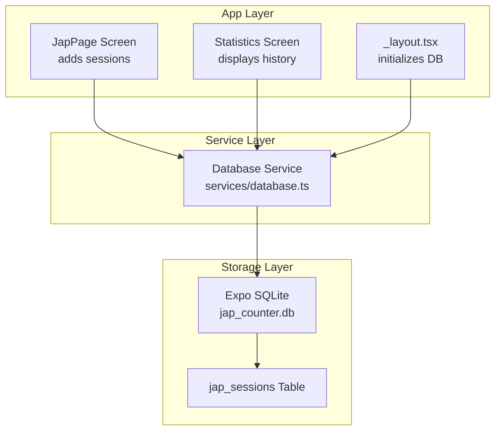
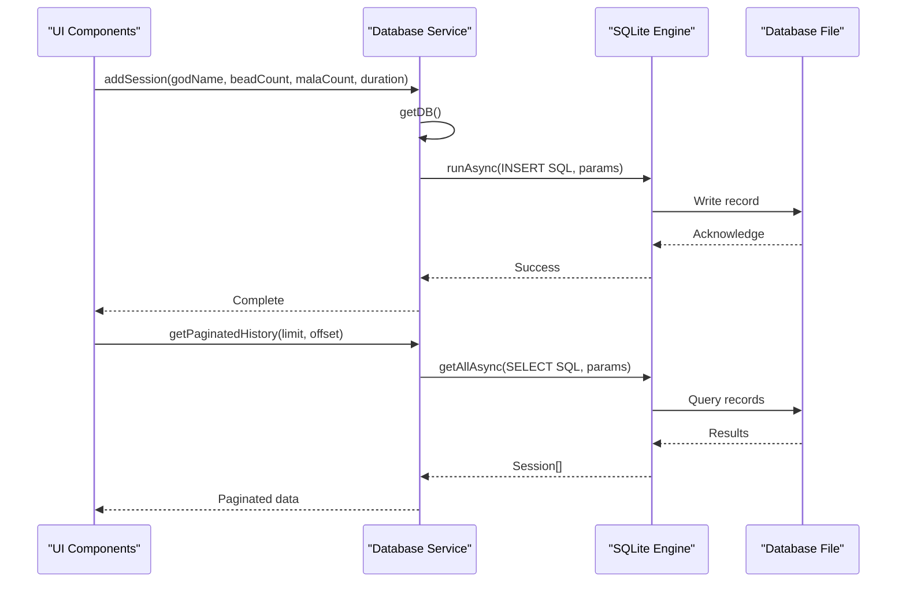
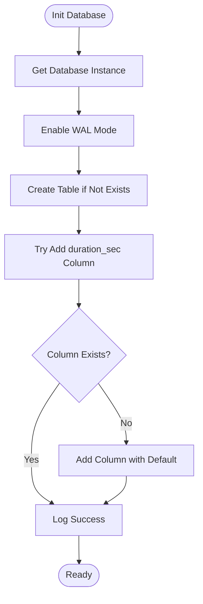
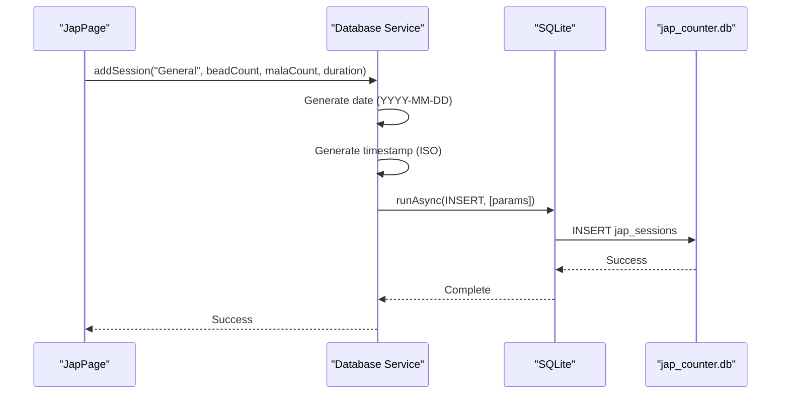
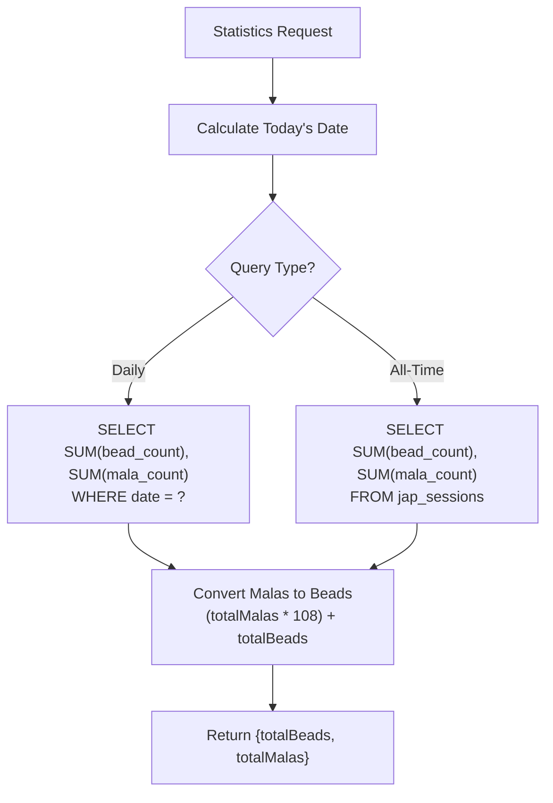
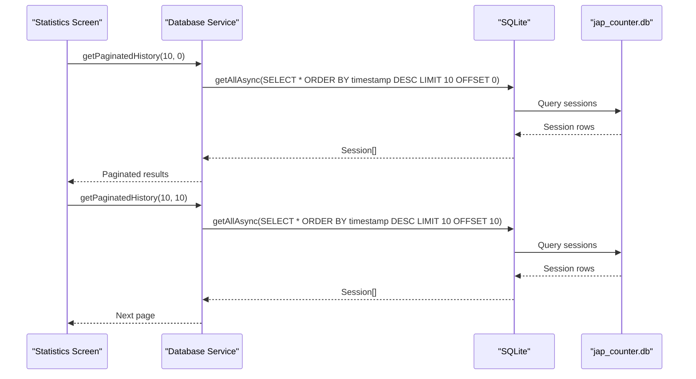
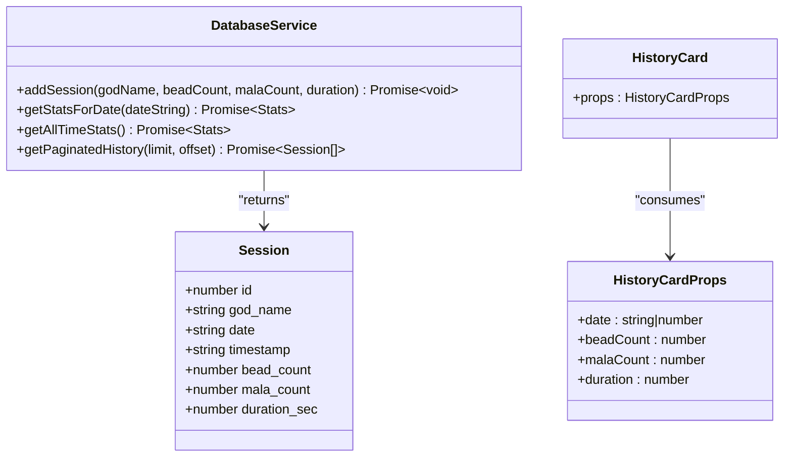
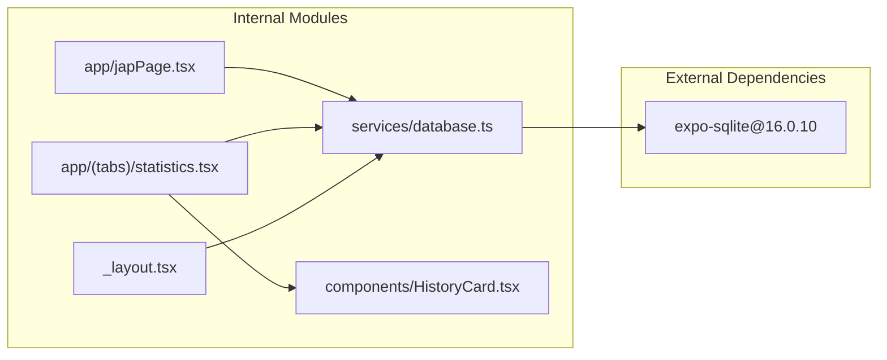
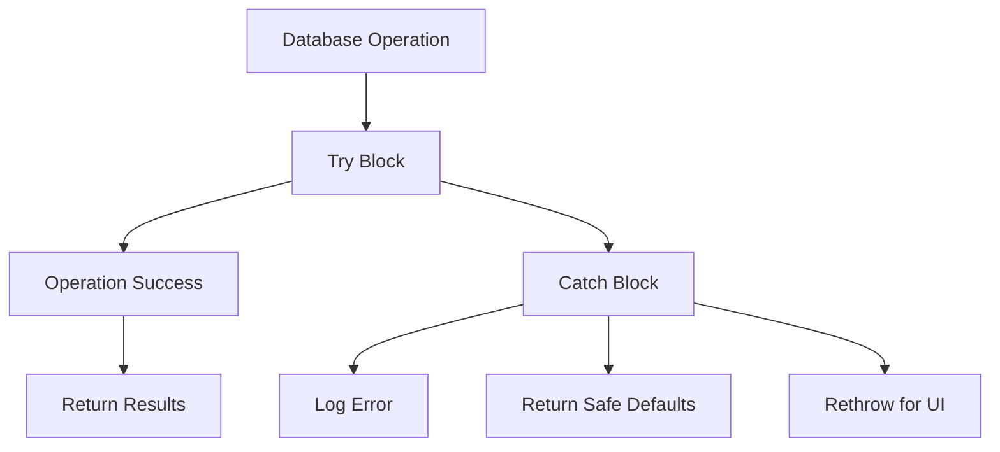

# Database Service

<cite>
**Referenced Files in This Document**
- [database.ts](file://services/database.ts)
- [japPage.tsx](file://app/japPage.tsx)
- [statistics.tsx](file://app/(tabs)/statistics.tsx)
- [_layout.tsx](file://app/_layout.tsx)
- [HistoryCard.tsx](file://components/HistoryCard.tsx)
- [package.json](file://package.json)
</cite>

## Table of Contents
1. [Introduction](#introduction)
2. [Project Structure](#project-structure)
3. [Core Components](#core-components)
4. [Architecture Overview](#architecture-overview)
5. [Detailed Component Analysis](#detailed-component-analysis)
6. [Dependency Analysis](#dependency-analysis)
7. [Performance Considerations](#performance-considerations)
8. [Troubleshooting Guide](#troubleshooting-guide)
9. [Conclusion](#conclusion)

## Introduction
This document provides comprehensive documentation for the SQLite database service implementation in SampleJapCounter. The application uses Expo SQLite to persist meditation session data with a dedicated table structure and a clean repository-style service layer. The documentation covers database initialization, schema definition, CRUD operations, migration strategy, error handling patterns, and TypeScript integration.

## Project Structure
The database service is implemented as a centralized module that encapsulates all SQLite operations. It follows a repository pattern where the service exposes typed functions for data access while hiding the underlying database implementation details.

**Diagram sources**
- [database.ts](file://services/database.ts#L1-L132)
- [japPage.tsx](file://app/japPage.tsx#L1-L289)
- [statistics.tsx](file://app/(tabs)/statistics.tsx#L1-L117)
- [_layout.tsx](file://app/_layout.tsx#L1-L27)

**Section sources**
- [database.ts](file://services/database.ts#L1-L132)
- [package.json](file://package.json#L13-L28)

## Core Components
The database service consists of a singleton database connection manager and a set of repository-style functions that encapsulate all data access logic.

### Database Initialization
The service initializes the SQLite database with write-ahead logging (WAL) mode for improved concurrency and creates the required table structure if it doesn't exist.

### Schema Definition
The `jap_sessions` table stores meditation session data with the following fields:
- `id`: Auto-incrementing primary key
- `god_name`: Text identifier for the deity or practice focus
- `date`: Date string in YYYY-MM-DD format
- `timestamp`: Full ISO timestamp for precise ordering
- `bead_count`: Number of individual beads counted
- `mala_count`: Number of malas (108-bead rosary rounds)
- `duration_sec`: Session duration in seconds (with default value)

### CRUD Operations
The service provides four primary operations:
- `addSession`: Creates new session records
- `getStatsForDate`: Aggregates statistics for a specific date
- `getAllTimeStats`: Provides cumulative statistics
- `getPaginatedHistory`: Retrieves session history with pagination

**Section sources**
- [database.ts](file://services/database.ts#L12-L39)
- [database.ts](file://services/database.ts#L108-L131)

## Architecture Overview
The database service follows a layered architecture pattern with clear separation of concerns between the UI, service, and storage layers.

**Diagram sources**
- [database.ts](file://services/database.ts#L41-L64)
- [database.ts](file://services/database.ts#L118-L131)

## Detailed Component Analysis

### Database Initialization and Migration Strategy
The initialization process ensures backward compatibility by attempting to add new columns to existing tables and gracefully handling errors when columns already exist.

**Diagram sources**
- [database.ts](file://services/database.ts#L12-L39)

Key implementation details:
- Uses write-ahead logging (WAL) for better concurrent access
- Creates table with explicit column definitions and constraints
- Attempts migration for existing installations without duration_sec column
- Gracefully handles migration errors by catching exceptions

**Section sources**
- [database.ts](file://services/database.ts#L12-L39)

### Session Management Operations

#### Add Session Operation
The addSession function handles session creation with automatic timestamp generation and parameterized queries for security.

**Diagram sources**
- [database.ts](file://services/database.ts#L41-L64)
- [japPage.tsx](file://app/japPage.tsx#L134-L156)

Implementation characteristics:
- Uses parameterized queries to prevent SQL injection
- Automatically generates timestamps for accurate ordering
- Throws errors for upstream handling
- Returns completion status for UI feedback

**Section sources**
- [database.ts](file://services/database.ts#L41-L64)
- [japPage.tsx](file://app/japPage.tsx#L134-L156)

#### Statistics Operations
The service provides two aggregation functions for calculating meditation statistics.

**Diagram sources**
- [database.ts](file://services/database.ts#L66-L106)

Both functions:
- Use aggregate SQL functions for efficient calculations
- Return TypeScript-typed results with proper defaults
- Handle errors gracefully by returning zero values
- Convert mala counts to bead equivalents (108 beads per mala)

**Section sources**
- [database.ts](file://services/database.ts#L66-L106)

#### Pagination Implementation
The getPaginatedHistory function provides efficient data retrieval with configurable limits and offsets.

**Diagram sources**
- [database.ts](file://services/database.ts#L118-L131)
- [statistics.tsx](file://app/(tabs)/statistics.tsx#L14-L45)

Pagination features:
- Orders results by timestamp in descending order (newest first)
- Uses LIMIT and OFFSET for efficient paging
- Returns TypeScript-typed Session interface
- Handles errors by returning empty arrays

**Section sources**
- [database.ts](file://services/database.ts#L118-L131)
- [statistics.tsx](file://app/(tabs)/statistics.tsx#L14-L45)

### TypeScript Integration Patterns

#### Session Interface Definition
The Session interface provides strong typing for database records and UI components.

**Diagram sources**
- [database.ts](file://services/database.ts#L108-L116)
- [HistoryCard.tsx](file://components/HistoryCard.tsx#L6-L11)

TypeScript integration highlights:
- Strongly typed function parameters and return values
- Consistent interface definitions across modules
- Generic type parameters for query results
- Proper type inference for database operations

**Section sources**
- [database.ts](file://services/database.ts#L108-L116)
- [HistoryCard.tsx](file://components/HistoryCard.tsx#L6-L11)

## Dependency Analysis
The database service has minimal external dependencies and follows a clean architecture pattern.

**Diagram sources**
- [package.json](file://package.json#L28-L28)
- [database.ts](file://services/database.ts#L1-L1)
- [japPage.tsx](file://app/japPage.tsx#L9-L9)
- [statistics.tsx](file://app/(tabs)/statistics.tsx#L6-L6)

Dependency characteristics:
- Single external dependency on expo-sqlite
- No circular dependencies between modules
- Clear separation between service and presentation layers
- Minimal coupling through well-defined interfaces

**Section sources**
- [package.json](file://package.json#L13-L28)

## Performance Considerations
The database service implements several performance optimizations:

### Concurrency and Transaction Management
- Uses write-ahead logging (WAL) mode for improved concurrent access
- Single database connection instance prevents connection overhead
- Parameterized queries reduce parsing overhead

### Query Optimization
- Indexed by timestamp for efficient chronological queries
- Aggregate queries minimize data transfer
- Pagination prevents loading large datasets into memory

### Memory Management
- Lazy initialization of database connections
- Proper error handling prevents resource leaks
- Efficient result processing with typed interfaces

## Troubleshooting Guide

### Common Issues and Solutions

#### Database Initialization Failures
- **Symptom**: Application fails to start with database errors
- **Cause**: File system permissions or corrupted database file
- **Solution**: Clear app data or reinstall the application

#### Migration Errors
- **Symptom**: Duration column errors during startup
- **Cause**: Previous installation without proper migration
- **Solution**: The service automatically handles migration attempts

#### Query Performance Issues
- **Symptom**: Slow loading of session history
- **Cause**: Large dataset without proper indexing
- **Solution**: Use pagination parameters effectively

#### Error Handling Patterns
The service implements consistent error handling across all operations:

**Diagram sources**
- [database.ts](file://services/database.ts#L47-L63)
- [database.ts](file://services/database.ts#L76-L84)
- [database.ts](file://services/database.ts#L98-L105)
- [database.ts](file://services/database.ts#L128-L130)

**Section sources**
- [database.ts](file://services/database.ts#L47-L63)
- [database.ts](file://services/database.ts#L76-L84)
- [database.ts](file://services/database.ts#L98-L105)
- [database.ts](file://services/database.ts#L128-L130)

## Conclusion
The SampleJapCounter database service demonstrates a robust implementation of SQLite persistence with modern React Native patterns. The service provides:

- **Clean Architecture**: Well-separated concerns with repository pattern implementation
- **Type Safety**: Comprehensive TypeScript integration with strongly typed interfaces
- **Backward Compatibility**: Automatic migration strategy for schema evolution
- **Performance**: Optimized queries with pagination and efficient indexing
- **Reliability**: Consistent error handling and graceful degradation

The implementation serves as an excellent example of how to structure database operations in a mobile application while maintaining code quality, performance, and maintainability.