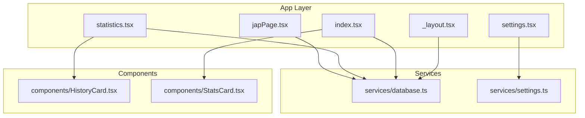
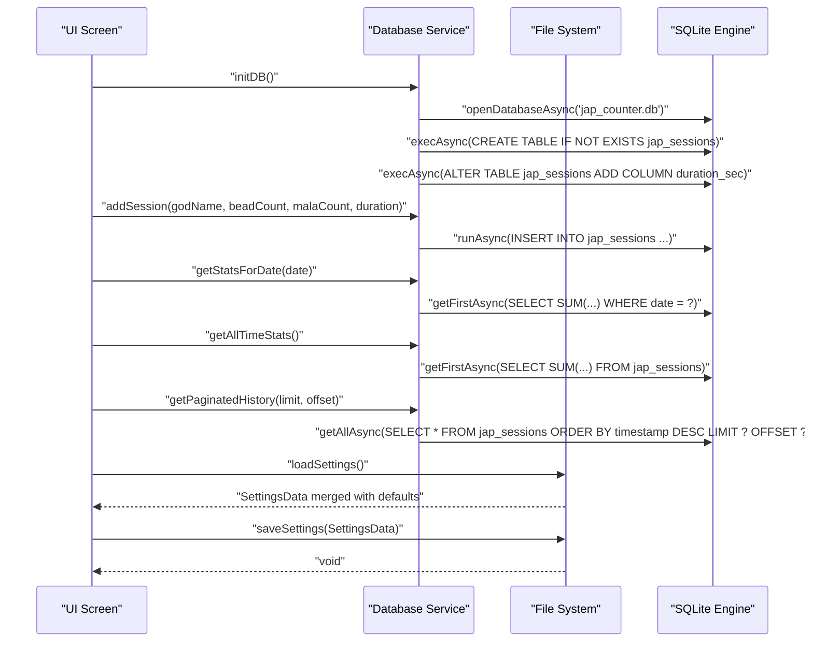
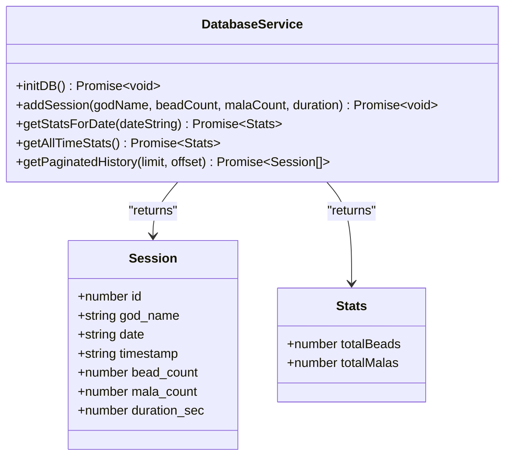
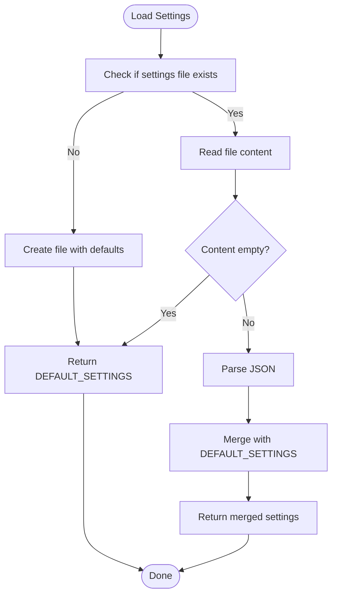
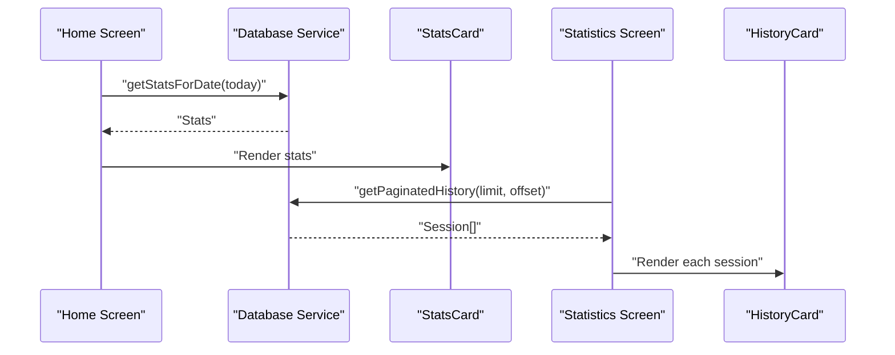
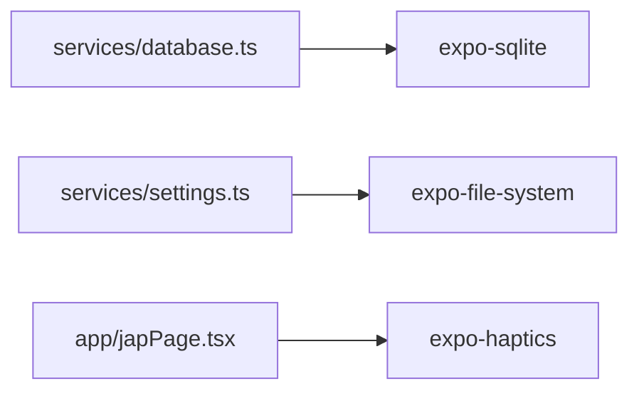

# Database and Services

<cite>
**Referenced Files in This Document**
- [database.ts](file://services/database.ts)
- [settings.ts](file://services/settings.ts)
- [_layout.tsx](file://app/_layout.tsx)
- [index.tsx](file://app/(tabs)/index.tsx)
- [statistics.tsx](file://app/(tabs)/statistics.tsx)
- [settings.tsx](file://app/(tabs)/settings.tsx)
- [japPage.tsx](file://app/japPage.tsx)
- [HistoryCard.tsx](file://components/HistoryCard.tsx)
- [StatsCard.tsx](file://components/StatsCard.tsx)
- [package.json](file://package.json)
</cite>

## Table of Contents
1. [Introduction](#introduction)
2. [Project Structure](#project-structure)
3. [Core Components](#core-components)
4. [Architecture Overview](#architecture-overview)
5. [Detailed Component Analysis](#detailed-component-analysis)
6. [Dependency Analysis](#dependency-analysis)
7. [Performance Considerations](#performance-considerations)
8. [Troubleshooting Guide](#troubleshooting-guide)
9. [Conclusion](#conclusion)

## Introduction
This document provides comprehensive documentation for SampleJapCounter's database and service layer implementation. It covers the SQLite database schema for the jap_sessions table, the database service architecture including CRUD operations, migration support, and error handling patterns. It also documents the settings service for user preference management and file system persistence, along with service initialization, dependency injection patterns, and data access patterns. The repository pattern implementation and service-to-component communication are explained, with examples of database queries, transaction handling, and data validation.

## Project Structure
The project follows a modular structure with dedicated service modules under the services directory and UI components under the app directory. The database service manages the SQLite database and exposes typed CRUD operations. The settings service handles user preferences persisted to the file system. UI screens consume these services to present data and collect user input.

**Diagram sources**
- [_layout.tsx](file://app/_layout.tsx#L1-L27)
- [database.ts](file://services/database.ts#L1-L132)
- [settings.ts](file://services/settings.ts#L1-L47)
- [index.tsx](file://app/(tabs)/index.tsx#L1-L120)
- [statistics.tsx](file://app/(tabs)/statistics.tsx#L1-L117)
- [settings.tsx](file://app/(tabs)/settings.tsx#L1-L192)
- [japPage.tsx](file://app/japPage.tsx#L1-L289)
- [HistoryCard.tsx](file://components/HistoryCard.tsx#L1-L134)
- [StatsCard.tsx](file://components/StatsCard.tsx#L1-L56)

**Section sources**
- [_layout.tsx](file://app/_layout.tsx#L1-L27)
- [database.ts](file://services/database.ts#L1-L132)
- [settings.ts](file://services/settings.ts#L1-L47)

## Core Components
- Database Service: Manages SQLite database initialization, schema creation/migration, and CRUD operations for jap_sessions.
- Settings Service: Handles user preference persistence using the file system with default fallback and schema merging.
- UI Screens: Consume services to display statistics, manage settings, and record sessions.

Key responsibilities:
- Database Service: Initialize database, create table with migration support, insert sessions, compute daily/all-time stats, and paginate history.
- Settings Service: Load/save settings with default values and schema backward compatibility.

**Section sources**
- [database.ts](file://services/database.ts#L1-L132)
- [settings.ts](file://services/settings.ts#L1-L47)

## Architecture Overview
The architecture employs a layered approach:
- UI Layer: Screens and components that trigger actions and render data.
- Service Layer: Encapsulates data access logic and business rules.
- Data Access Layer: SQLite database and file system for persistence.

**Diagram sources**
- [_layout.tsx](file://app/_layout.tsx#L1-L27)
- [database.ts](file://services/database.ts#L1-L132)
- [settings.ts](file://services/settings.ts#L1-L47)

## Detailed Component Analysis

### Database Service Implementation
The database service encapsulates all SQLite operations with a singleton-like lazy initialization pattern. It defines the jap_sessions table schema and provides typed CRUD operations.

- Initialization and Schema Management
  - Initializes the database connection lazily.
  - Creates the jap_sessions table with primary key, timestamps, counts, and duration.
  - Applies migration to add duration_sec column if missing.

- CRUD Operations
  - Insert: addSession inserts a new session with computed date and timestamp.
  - Query: getStatsForDate computes totals for a given date; getAllTimeStats computes totals across all sessions.
  - Pagination: getPaginatedHistory retrieves sessions with limit/offset ordering by timestamp descending.

- Error Handling
  - All operations wrap database calls in try/catch blocks and log errors.
  - Functions return safe defaults when queries fail.

- Data Types and Validation
  - Session interface defines strict field types for type safety.
  - Input validation occurs at the UI level (e.g., beadCount, malaCount, duration are numeric).

**Diagram sources**
- [database.ts](file://services/database.ts#L108-L131)

**Section sources**
- [database.ts](file://services/database.ts#L1-L132)

#### Database Queries and Transactions
- Schema Creation and Migration
  - Creates jap_sessions table with required fields.
  - Adds duration_sec column with default value if not present.

- Insert Operation
  - Inserts a new session with date and timestamp derived from current time.

- Aggregation Queries
  - Summarizes bead and mala counts for a specific date.
  - Computes totals across all sessions.

- Pagination Query
  - Retrieves sessions ordered by timestamp descending with configurable limit and offset.

- Transaction Handling
  - Uses runAsync for single statements; no explicit transaction blocks are used in the current implementation.

- Data Validation
  - UI ensures numeric inputs before calling addSession.
  - Database enforces NOT NULL constraints at schema level.

**Section sources**
- [database.ts](file://services/database.ts#L12-L39)
- [database.ts](file://services/database.ts#L41-L64)
- [database.ts](file://services/database.ts#L66-L106)
- [database.ts](file://services/database.ts#L118-L131)

### Settings Service Implementation
The settings service manages user preferences persisted to the file system with default values and schema merging for backward compatibility.

- Persistence Mechanism
  - Uses expo-file-system to read/write a JSON file in the document directory.
  - Ensures the settings file exists by creating it with defaults if absent.

- Default Values and Schema Compatibility
  - Defines DEFAULT_SETTINGS with sensible defaults.
  - Merges loaded settings with defaults to handle missing keys introduced in future versions.

- Error Handling
  - Catches exceptions during load/save and logs errors.
  - Returns defaults on failure to ensure robustness.

**Diagram sources**
- [settings.ts](file://services/settings.ts#L16-L34)

**Section sources**
- [settings.ts](file://services/settings.ts#L1-L47)

### Service Initialization and Dependency Injection Patterns
- Database Initialization
  - Called once during app startup in the root layout component.
  - Ensures database is ready before any UI component attempts to use it.

- Dependency Injection
  - Services are imported directly by UI components.
  - No explicit DI container is used; functions are exported and consumed where needed.

- Data Access Patterns
  - UI components call service functions directly.
  - Services encapsulate database/file operations, returning typed results.

**Section sources**
- [_layout.tsx](file://app/_layout.tsx#L1-L27)
- [index.tsx](file://app/(tabs)/index.tsx#L1-L120)
- [statistics.tsx](file://app/(tabs)/statistics.tsx#L1-L117)
- [settings.tsx](file://app/(tabs)/settings.tsx#L1-L192)
- [japPage.tsx](file://app/japPage.tsx#L1-L289)

### Repository Pattern Implementation
While not strictly a traditional repository pattern, the database service acts as a data access layer that could evolve into a repository-style abstraction:

- Abstraction of Data Access
  - Centralizes SQL operations behind service functions.
  - Provides typed interfaces for consumers.

- Potential Evolution
  - Could introduce a separate repository module with methods like create, read, update, delete.
  - Would encapsulate SQL queries and provide higher-level domain operations.

- Current Implementation Benefits
  - Clear separation between UI and data access.
  - Consistent error handling and logging.

**Section sources**
- [database.ts](file://services/database.ts#L1-L132)

### Service-to-Component Communication
- Home Screen
  - Fetches today's and all-time stats using database service functions.
  - Displays aggregated data via StatsCard components.

- Statistics Screen
  - Loads paginated session history using getPaginatedHistory.
  - Renders each session using HistoryCard components.

- Settings Screen
  - Loads and saves settings using settings service functions.
  - Updates UI state based on user input.

- Jap Page
  - Loads user preferences via settings service.
  - Saves sessions via database service upon user confirmation.

**Diagram sources**
- [index.tsx](file://app/(tabs)/index.tsx#L1-L120)
- [statistics.tsx](file://app/(tabs)/statistics.tsx#L1-L117)
- [database.ts](file://services/database.ts#L108-L131)
- [HistoryCard.tsx](file://components/HistoryCard.tsx#L1-L134)
- [StatsCard.tsx](file://components/StatsCard.tsx#L1-L56)

**Section sources**
- [index.tsx](file://app/(tabs)/index.tsx#L1-L120)
- [statistics.tsx](file://app/(tabs)/statistics.tsx#L1-L117)
- [settings.tsx](file://app/(tabs)/settings.tsx#L1-L192)
- [japPage.tsx](file://app/japPage.tsx#L1-L289)

## Dependency Analysis
External dependencies relevant to services:
- expo-sqlite: SQLite database engine for mobile.
- expo-file-system: File system access for settings persistence.
- expo-haptics: Vibration feedback for user interactions.

**Diagram sources**
- [package.json](file://package.json#L13-L42)
- [database.ts](file://services/database.ts#L1-L10)
- [settings.ts](file://services/settings.ts#L1-L1)
- [japPage.tsx](file://app/japPage.tsx#L1-L9)

**Section sources**
- [package.json](file://package.json#L13-L42)

## Performance Considerations
- Database
  - Uses WAL mode for improved concurrency.
  - Index-free table with ORDER BY on timestamp; consider adding an index on timestamp for large datasets.
  - Pagination with LIMIT/OFFSET is efficient for incremental loading.
  - Aggregation queries use SUM; ensure appropriate indexing if performance becomes a concern.

- File System
  - Settings file is small; JSON parse/write is lightweight.
  - Defaults merge avoids re-parsing large configurations.

- UI
  - Lazy initialization prevents unnecessary database opens.
  - Efficient rendering with FlatList and memoized callbacks.

## Troubleshooting Guide
Common issues and resolutions:
- Database Initialization Failures
  - Ensure initDB is called during app startup.
  - Check console logs for initialization errors.

- Migration Errors
  - Column addition is wrapped in try/catch; existing columns are ignored.
  - Verify schema changes if unexpected behavior occurs.

- Settings Load/Save Failures
  - File existence checks and default creation handle missing files.
  - JSON parsing errors fall back to defaults.

- UI Data Not Updating
  - UseFocusEffect triggers data refresh on screen focus.
  - Verify service calls and error logs.

**Section sources**
- [database.ts](file://services/database.ts#L12-L39)
- [database.ts](file://services/database.ts#L66-L106)
- [database.ts](file://services/database.ts#L118-L131)
- [settings.ts](file://services/settings.ts#L16-L46)
- [index.tsx](file://app/(tabs)/index.tsx#L13-L25)
- [statistics.tsx](file://app/(tabs)/statistics.tsx#L47-L51)

## Conclusion
The SampleJapCounter service layer provides a clean separation between UI and data access. The database service offers essential CRUD operations with schema migration and robust error handling, while the settings service ensures reliable user preference persistence. The architecture supports scalable enhancements such as repository pattern adoption and additional indexing strategies for improved performance.