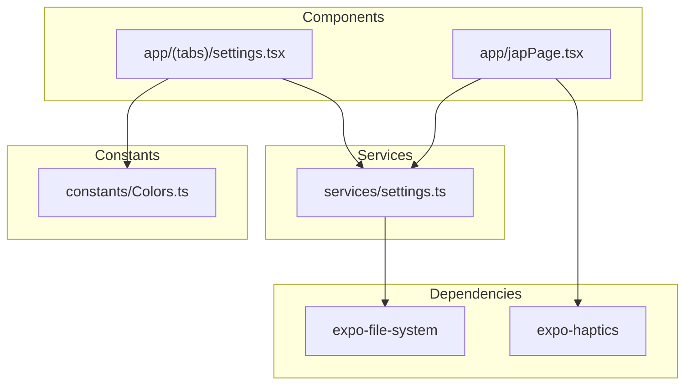
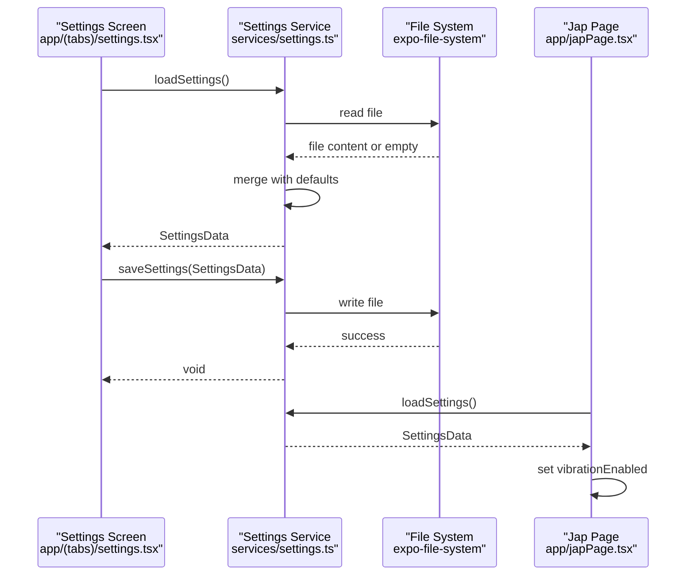
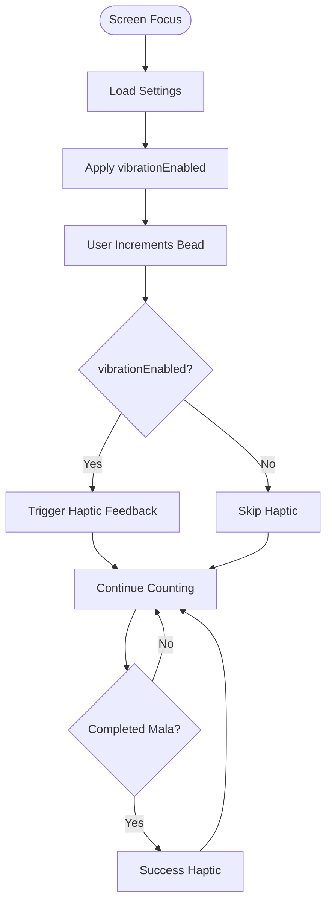
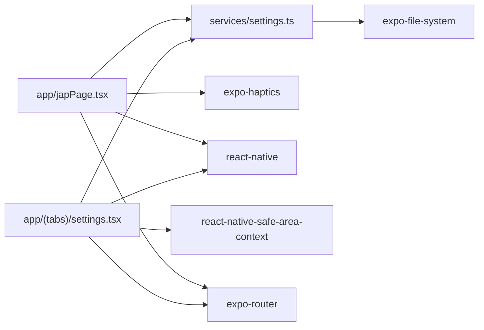

# Settings Service

<cite>
**Referenced Files in This Document**
- [services/settings.ts](file://services/settings.ts)
- [app/(tabs)/settings.tsx](file://app/(tabs)/settings.tsx)
- [app/japPage.tsx](file://app/japPage.tsx)
- [constants/Colors.ts](file://constants/Colors.ts)
- [package.json](file://package.json)
</cite>

## Table of Contents
1. [Introduction](#introduction)
2. [Project Structure](#project-structure)
3. [Core Components](#core-components)
4. [Architecture Overview](#architecture-overview)
5. [Detailed Component Analysis](#detailed-component-analysis)
6. [Dependency Analysis](#dependency-analysis)
7. [Performance Considerations](#performance-considerations)
8. [Troubleshooting Guide](#troubleshooting-guide)
9. [Conclusion](#conclusion)
10. [Appendices](#appendices)

## Introduction
This document describes the settings service implementation in SampleJapCounter, focusing on the settings data structure, user preference management, and file system persistence mechanisms. It explains the settings initialization process, default value handling, preference validation, and the service interface for reading and writing user preferences. It also covers integration with the component layer, settings persistence patterns, and guidance for extending the settings service while maintaining backward compatibility.

## Project Structure
The settings service is implemented as a small, focused module that handles user preferences and persists them to the device file system. The primary implementation resides in the services directory, with integration points in the settings screen and the main counter page.

**Diagram sources**
- [services/settings.ts](file://services/settings.ts#L1-L47)
- [app/(tabs)/settings.tsx](file://app/(tabs)/settings.tsx#L1-L96)
- [app/japPage.tsx](file://app/japPage.tsx#L1-L38)
- [constants/Colors.ts](file://constants/Colors.ts#L1-L19)

**Section sources**
- [services/settings.ts](file://services/settings.ts#L1-L47)
- [app/(tabs)/settings.tsx](file://app/(tabs)/settings.tsx#L1-L96)
- [app/japPage.tsx](file://app/japPage.tsx#L1-L38)
- [constants/Colors.ts](file://constants/Colors.ts#L1-L19)

## Core Components
The settings service consists of a strongly-typed data structure, default values, and two primary functions for persistence: loading and saving settings.

- SettingsData interface defines the shape of persisted user preferences.
- DEFAULT_SETTINGS provides initial values and acts as a schema baseline for backward compatibility.
- loadSettings reads from persistent storage and merges with defaults to handle schema evolution.
- saveSettings writes the current settings to persistent storage.

Key characteristics:
- Persistence location: Application document directory using expo-file-system.
- Schema evolution: Backward compatible merge with defaults ensures missing keys are filled.
- Error handling: Robust error logging and graceful fallback to defaults during load failures.

**Section sources**
- [services/settings.ts](file://services/settings.ts#L3-L12)
- [services/settings.ts](file://services/settings.ts#L16-L34)
- [services/settings.ts](file://services/settings.ts#L36-L46)

## Architecture Overview
The settings service integrates with UI components through explicit function calls. The settings screen manages local state and delegates persistence to the service. The main counter page loads settings on focus to apply user preferences (such as vibration) at runtime.

**Diagram sources**
- [app/(tabs)/settings.tsx](file://app/(tabs)/settings.tsx#L13-L23)
- [app/(tabs)/settings.tsx](file://app/(tabs)/settings.tsx#L31-L39)
- [services/settings.ts](file://services/settings.ts#L16-L34)
- [services/settings.ts](file://services/settings.ts#L36-L46)
- [app/japPage.tsx](file://app/japPage.tsx#L32-L36)

## Detailed Component Analysis

### Settings Data Structure
The SettingsData interface defines the persisted user preferences:
- userName: string
- vibrationEnabled: boolean

Defaults:
- userName: empty string
- vibrationEnabled: true

Backward compatibility:
- Future schema additions can be handled by merging loaded data with DEFAULT_SETTINGS, ensuring missing keys receive default values.

Validation:
- No runtime validation is performed on the settings data itself. Validation occurs implicitly through type safety enforced by TypeScript and the boolean nature of vibrationEnabled.

**Section sources**
- [services/settings.ts](file://services/settings.ts#L3-L12)

### Settings Initialization and Persistence
Initialization flow:
- On first run, if the settings file does not exist, saveSettings is invoked with DEFAULT_SETTINGS, creating the file.
- On subsequent runs, loadSettings reads the file, parses JSON, and merges with DEFAULT_SETTINGS to handle missing keys.

Persistence mechanism:
- Uses expo-file-system to read/write a JSON file named user_settings.json in the application document directory.
- Writes are synchronous operations executed within async functions to ensure consistent state.

Error handling:
- loadSettings logs errors and returns DEFAULT_SETTINGS to guarantee the app remains functional.
- saveSettings logs errors and rethrows to surface failures to the caller.

**Section sources**
- [services/settings.ts](file://services/settings.ts#L16-L34)
- [services/settings.ts](file://services/settings.ts#L36-L46)

### Settings Service Interface
The service exposes two functions:
- loadSettings(): Promise<SettingsData>
  - Reads the settings file if present, parses JSON, merges with defaults, and returns the result.
  - Creates the file with defaults if it does not exist.
  - Returns defaults on parse errors or empty content.
- saveSettings(settings: SettingsData): Promise<void>
  - Ensures the file exists, then writes the serialized settings object.

Integration points:
- Settings screen: Manages local state and calls saveSettings on user action.
- Jap page: Loads settings on focus to configure vibration behavior.

**Section sources**
- [services/settings.ts](file://services/settings.ts#L16-L34)
- [services/settings.ts](file://services/settings.ts#L36-L46)
- [app/(tabs)/settings.tsx](file://app/(tabs)/settings.tsx#L13-L23)
- [app/(tabs)/settings.tsx](file://app/(tabs)/settings.tsx#L31-L39)
- [app/japPage.tsx](file://app/japPage.tsx#L32-L36)

### Settings Screen Integration
The settings screen manages user preferences locally and persists them via the service:
- Local state: useState<SettingsData>(DEFAULT_SETTINGS)
- Loading: loadSettingsService() is called on screen focus to populate local state.
- Editing: updateSetting(key, value) updates local state immutably.
- Saving: saveSettingsService(settings) persists changes and shows user feedback.

UI elements:
- Profile section: TextInput bound to userName.
- Preferences section: Switch bound to vibrationEnabled.
- Save button: Triggers save operation with success/error alerts.

Styling:
- Uses Colors.dark theme constants for consistent appearance.

**Section sources**
- [app/(tabs)/settings.tsx](file://app/(tabs)/settings.tsx#L8-L96)
- [constants/Colors.ts](file://constants/Colors.ts#L1-L19)

### Vibration Integration in Counter Page
The counter page demonstrates runtime application of settings:
- On focus, loadSettings is called to retrieve user preferences.
- The vibrationEnabled flag controls haptic feedback during bead increments and completion.
- Uses expo-haptics for vibration effects.

**Diagram sources**
- [app/japPage.tsx](file://app/japPage.tsx#L30-L38)
- [app/japPage.tsx](file://app/japPage.tsx#L102-L121)

**Section sources**
- [app/japPage.tsx](file://app/japPage.tsx#L1-L38)
- [app/japPage.tsx](file://app/japPage.tsx#L102-L121)

## Dependency Analysis
External dependencies:
- expo-file-system: Provides file operations for reading/writing settings.
- expo-haptics: Provides haptic feedback based on user preferences.
- react-native: UI components and state management.
- react-native-safe-area-context: Safe area insets for responsive layouts.
- expo-router: Navigation hooks for focus events.

Internal dependencies:
- Settings screen depends on the settings service for persistence.
- Jap page depends on the settings service for runtime preferences.

**Diagram sources**
- [app/(tabs)/settings.tsx](file://app/(tabs)/settings.tsx#L1-L6)
- [app/japPage.tsx](file://app/japPage.tsx#L1-L4)
- [services/settings.ts](file://services/settings.ts#L1)
- [package.json](file://package.json#L21-L23)

**Section sources**
- [package.json](file://package.json#L13-L42)
- [app/(tabs)/settings.tsx](file://app/(tabs)/settings.tsx#L1-L6)
- [app/japPage.tsx](file://app/japPage.tsx#L1-L4)
- [services/settings.ts](file://services/settings.ts#L1)

## Performance Considerations
- File I/O cost: Settings are read/written synchronously within async functions. For typical usage, this is negligible. If performance becomes a concern, consider debouncing saves or batching updates.
- JSON parsing: Parsing is lightweight and occurs infrequently (on load/save).
- Memory footprint: Settings are small objects; memory usage is minimal.
- Network/file system: No network calls; persistence is local.

## Troubleshooting Guide
Common issues and resolutions:
- Settings not persisting:
  - Verify the settings file exists in the document directory and is readable/writable.
  - Check for permission issues or storage constraints.
- Settings revert to defaults unexpectedly:
  - Ensure loadSettings is called on screen focus to repopulate state.
  - Confirm that saveSettings is invoked after state updates.
- Errors during load/save:
  - Review console logs for error messages from loadSettings/saveSettings.
  - Confirm that DEFAULT_SETTINGS are used as fallbacks.

Operational checks:
- Confirm that the settings file is created on first run with default values.
- Validate that updates to vibrationEnabled propagate to the counter page after reload.

**Section sources**
- [services/settings.ts](file://services/settings.ts#L16-L34)
- [services/settings.ts](file://services/settings.ts#L36-L46)
- [app/(tabs)/settings.tsx](file://app/(tabs)/settings.tsx#L13-L23)
- [app/(tabs)/settings.tsx](file://app/(tabs)/settings.tsx#L31-L39)

## Conclusion
The settings service in SampleJapCounter provides a clean, backward-compatible mechanism for managing user preferences. It uses a simple JSON file for persistence, merges loaded data with defaults for schema evolution, and integrates seamlessly with UI components. The design supports easy extension with new preferences while maintaining robust error handling and predictable behavior.

## Appendices

### Extending the Settings Service
Guidance for adding new preferences:
- Add the new field to the SettingsData interface.
- Update DEFAULT_SETTINGS with a sensible default value.
- Update the settings screen UI to reflect the new preference.
- Integrate the new preference in relevant components (e.g., apply vibrationEnabled in the counter page).
- Ensure backward compatibility by relying on the merge-with-defaults strategy during load.

Maintaining backward compatibility:
- Always merge loaded settings with DEFAULT_SETTINGS to fill missing keys.
- Avoid removing fields from DEFAULT_SETTINGS to prevent breaking existing persisted data.
- When renaming or restructuring fields, implement migration logic in loadSettings to transform legacy data.

Examples of usage patterns:
- Retrieving settings: Call loadSettings in components that need user preferences.
- Updating settings: Update local state and call saveSettings to persist changes.
- Error handling: Wrap save/load calls with try/catch blocks and display user-friendly alerts.

**Section sources**
- [services/settings.ts](file://services/settings.ts#L3-L12)
- [services/settings.ts](file://services/settings.ts#L16-L34)
- [services/settings.ts](file://services/settings.ts#L36-L46)
- [app/(tabs)/settings.tsx](file://app/(tabs)/settings.tsx#L13-L23)
- [app/(tabs)/settings.tsx](file://app/(tabs)/settings.tsx#L31-L39)
- [app/japPage.tsx](file://app/japPage.tsx#L30-L38)