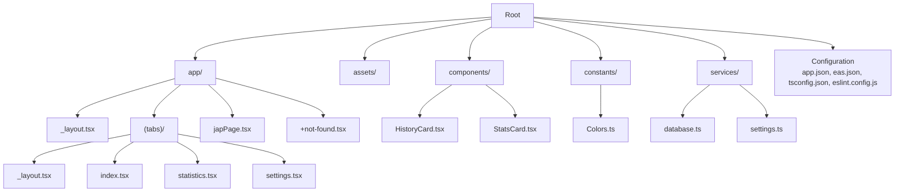
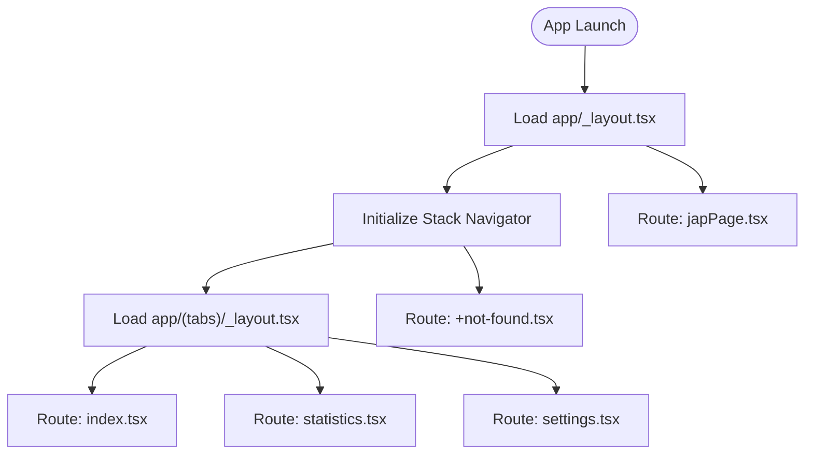
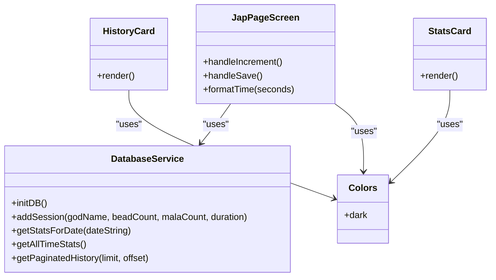

# Getting Started

<cite>
**Referenced Files in This Document**
- [README.md](file://README.md)
- [package.json](file://package.json)
- [app.json](file://app.json)
- [eas.json](file://eas.json)
- [tsconfig.json](file://tsconfig.json)
- [eslint.config.js](file://eslint.config.js)
- [app/_layout.tsx](file://app/_layout.tsx)
- [app/(tabs)/_layout.tsx](file://app/(tabs)/_layout.tsx)
- [app/japPage.tsx](file://app/japPage.tsx)
- [constants/Colors.ts](file://constants/Colors.ts)
- [services/database.ts](file://services/database.ts)
- [components/HistoryCard.tsx](file://components/HistoryCard.tsx)
- [components/StatsCard.tsx](file://components/StatsCard.tsx)
</cite>

## Table of Contents
1. [Introduction](#introduction)
2. [Prerequisites](#prerequisites)
3. [Installation](#installation)
4. [Development Workflow](#development-workflow)
5. [Project Structure](#project-structure)
6. [File-Based Routing](#file-based-routing)
7. [Key Components Overview](#key-components-overview)
8. [Environment Configuration](#environment-configuration)
9. [Troubleshooting](#troubleshooting)
10. [Resetting the Project](#resetting-the-project)
11. [Conclusion](#conclusion)

## Introduction
SampleJapCounter is an Expo-based React Native application that helps track jap (malas) meditation sessions. It uses file-based routing, SQLite for local persistence, and a modern development stack with TypeScript and ESLint. This guide walks you through setting up the project, running it across platforms, understanding the structure, and resetting to a clean slate.

## Prerequisites
Before installing and running the project, ensure you have the following tools installed:
- Node.js: Required to run npm scripts and manage dependencies.
- npm or Yarn: Package manager to install dependencies and run scripts.
- Expo CLI or the Expo terminal commands: Used to start the development server and launch platforms.
- Optional: Android Studio Emulator or Xcode Simulator for native device emulation.
- Optional: Expo Go app on your mobile device for quick testing.

These tools enable you to clone the repository, install dependencies, and run the app on multiple platforms.

**Section sources**
- [README.md](file://README.md#L1-L51)
- [package.json](file://package.json#L1-L52)

## Installation
Follow these steps to install and prepare the project:

1. Clone the repository to your local machine.
2. Open a terminal in the project root.
3. Install dependencies using your preferred package manager:
   - npm: Run the install script defined in the project.
4. Start the development server:
   - Use the Expo start command to launch the dev server and open the project in your chosen platform.

After installation, you can choose to run the app via:
- Expo Go on a physical device
- Android emulator
- iOS simulator
- Web browser

These options are described in the project’s getting started instructions.

**Section sources**
- [README.md](file://README.md#L7-L26)
- [package.json](file://package.json#L5-L11)

## Development Workflow
Once installed, use the following workflow to develop and test the app:

- Start the development server with the Expo start command.
- Choose a platform from the options presented:
  - Development builds
  - Android emulator
  - iOS simulator
  - Expo Go
- Edit files under the app directory to implement features. The project uses file-based routing, so new routes are created by adding files in the app directory.

The project also includes convenience scripts for platform-specific starts and linting.

**Section sources**
- [README.md](file://README.md#L13-L26)
- [package.json](file://package.json#L5-L11)

## Project Structure
The repository follows a conventional Expo structure with a focus on file-based routing and modular components:

- app/: Contains route files and nested layouts. Routes are derived from file names and folder nesting.
- assets/: Static assets such as images.
- components/: Reusable UI components.
- constants/: Shared constants (e.g., theme colors).
- services/: Business logic and data access (e.g., SQLite database initialization and queries).
- Configuration files: app.json, eas.json, tsconfig.json, eslint.config.js.

**Diagram sources**
- [app/_layout.tsx](file://app/_layout.tsx#L1-L27)
- [app/(tabs)/_layout.tsx](file://app/(tabs)/_layout.tsx#L1-L58)
- [app/japPage.tsx](file://app/japPage.tsx#L1-L289)
- [constants/Colors.ts](file://constants/Colors.ts#L1-L19)
- [services/database.ts](file://services/database.ts#L1-L132)
- [components/HistoryCard.tsx](file://components/HistoryCard.tsx#L1-L134)
- [components/StatsCard.tsx](file://components/StatsCard.tsx#L1-L56)
- [app.json](file://app.json#L1-L55)
- [eas.json](file://eas.json#L1-L22)
- [tsconfig.json](file://tsconfig.json#L1-L18)
- [eslint.config.js](file://eslint.config.js#L1-L11)

**Section sources**
- [app.json](file://app.json#L1-L55)
- [eas.json](file://eas.json#L1-L22)
- [tsconfig.json](file://tsconfig.json#L1-L18)
- [eslint.config.js](file://eslint.config.js#L1-L11)

## File-Based Routing
SampleJapCounter uses Expo Router’s file-based routing. Routes are inferred from the file system:

- app/_layout.tsx: Defines the root layout and global stack configuration.
- app/(tabs)/_layout.tsx: Defines tab navigation with three tabs: Home, Statistics, Settings.
- app/japPage.tsx: A dedicated page for the meditation counter.
- app/+not-found.tsx: A fallback route for unmatched paths.

Nested folders like (tabs) group related routes and layouts. Screen options and headers are configured per route file.

**Diagram sources**
- [app/_layout.tsx](file://app/_layout.tsx#L1-L27)
- [app/(tabs)/_layout.tsx](file://app/(tabs)/_layout.tsx#L1-L58)
- [app/japPage.tsx](file://app/japPage.tsx#L1-L289)

**Section sources**
- [README.md](file://README.md#L26-L26)
- [app/_layout.tsx](file://app/_layout.tsx#L1-L27)
- [app/(tabs)/_layout.tsx](file://app/(tabs)/_layout.tsx#L1-L58)

## Key Components Overview
This section highlights major building blocks of the app:

- Theme and Colors
  - Centralized theme tokens are defined in constants/Colors.ts and consumed across screens and components.
- Database Layer
  - services/database.ts initializes SQLite, creates tables, and exposes CRUD-like helpers for session data.
- UI Components
  - components/HistoryCard.tsx renders individual session entries with formatted date, beads, malas, and duration.
  - components/StatsCard.tsx renders summary statistics cards.
- Jap Counter Page
  - app/japPage.tsx implements the meditation counter with SVG progress visuals, timers, vibration feedback, and save logic.

**Diagram sources**
- [constants/Colors.ts](file://constants/Colors.ts#L1-L19)
- [services/database.ts](file://services/database.ts#L1-L132)
- [components/HistoryCard.tsx](file://components/HistoryCard.tsx#L1-L134)
- [components/StatsCard.tsx](file://components/StatsCard.tsx#L1-L56)
- [app/japPage.tsx](file://app/japPage.tsx#L1-L289)

**Section sources**
- [constants/Colors.ts](file://constants/Colors.ts#L1-L19)
- [services/database.ts](file://services/database.ts#L1-L132)
- [components/HistoryCard.tsx](file://components/HistoryCard.tsx#L1-L134)
- [components/StatsCard.tsx](file://components/StatsCard.tsx#L1-L56)
- [app/japPage.tsx](file://app/japPage.tsx#L1-L289)

## Environment Configuration
The project includes several configuration files that influence build, runtime, and development behavior:

- app.json
  - Defines app metadata, platform-specific settings (iOS, Android, Web), plugins (e.g., expo-router, splash screen, SQLite), experiments (typed routes, React compiler), and EAS project ID.
- eas.json
  - Configures EAS Build profiles (development, preview, production) and submission settings.
- tsconfig.json
  - Extends Expo’s base TS config, enables strict mode, and sets module resolution paths for cleaner imports.
- eslint.config.js
  - Integrates ESLint with Expo’s recommended flat config and ignores built artifacts.

These files collectively define how the app behaves across platforms and how development tools operate.

**Section sources**
- [app.json](file://app.json#L1-L55)
- [eas.json](file://eas.json#L1-L22)
- [tsconfig.json](file://tsconfig.json#L1-L18)
- [eslint.config.js](file://eslint.config.js#L1-L11)

## Troubleshooting
Common setup issues and resolutions:

- Cannot start the development server
  - Ensure Node.js and npm/Yarn are installed and up to date.
  - Reinstall dependencies if the install step fails.
  - Clear caches if stale lockfiles cause issues.
- Platform-specific errors
  - Android: Ensure Android Studio and an emulator/device are properly configured.
  - iOS: Ensure Xcode and a simulator are installed.
- SQLite initialization failures
  - Verify the database service initializes without permission or platform-specific errors.
- Linting errors
  - Run the linter script and resolve reported issues using the configured ESLint rules.

Use the project’s scripts to streamline tasks and keep the environment consistent.

**Section sources**
- [README.md](file://README.md#L13-L26)
- [package.json](file://package.json#L5-L11)
- [services/database.ts](file://services/database.ts#L12-L39)

## Resetting the Project
To start fresh with a blank app directory while preserving the starter code:

- Run the reset script defined in the project’s scripts.
- This moves the current starter code to a temporary example directory and creates a clean app directory for you to build from scratch.

This is useful when you want to remove boilerplate and rebuild the project with your own routes and components.

**Section sources**
- [README.md](file://README.md#L28-L36)
- [package.json](file://package.json#L7-L7)

## Conclusion
You are now equipped to install, run, and develop SampleJapCounter across multiple platforms. Use the file-based routing system to add new pages, leverage the SQLite-backed services for persistence, and customize the UI with reusable components. When you need a clean slate, use the provided reset script to regenerate a blank app directory.