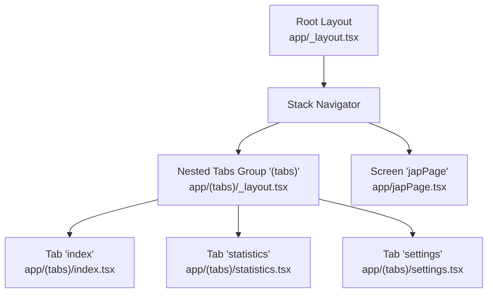
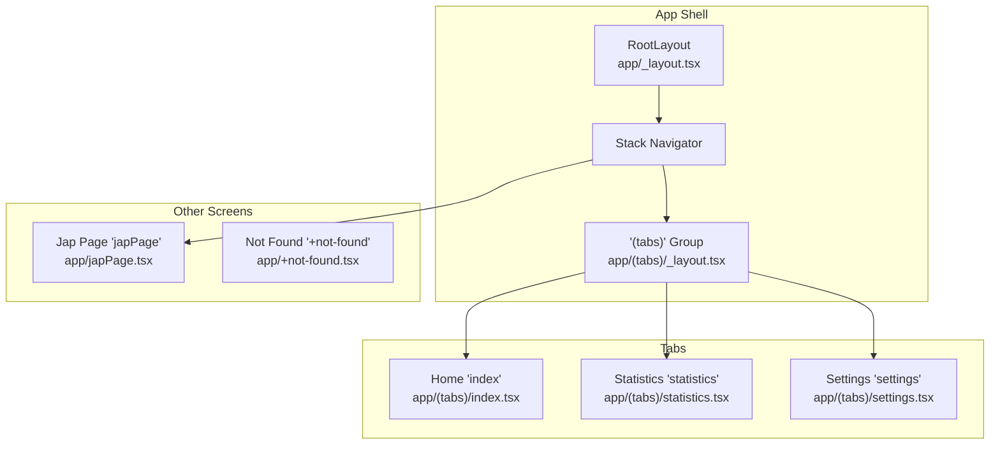
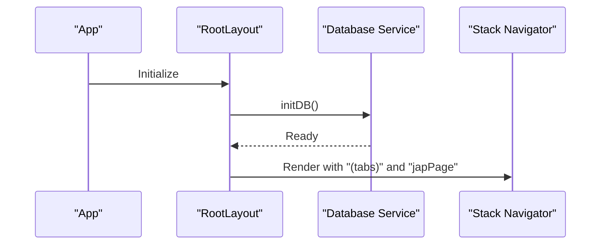
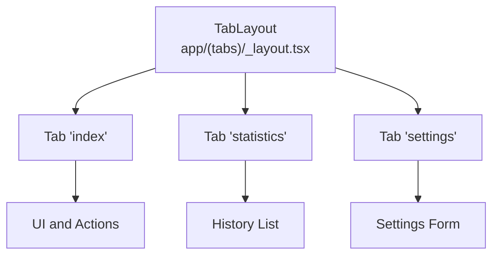
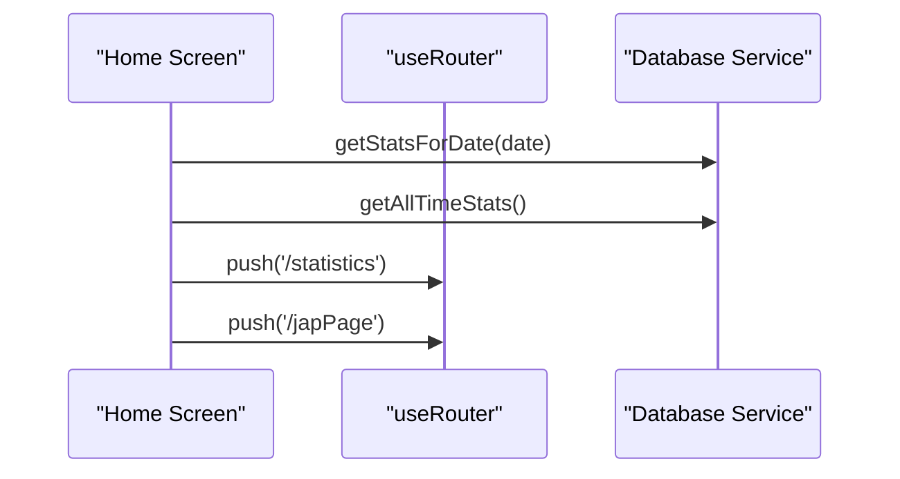
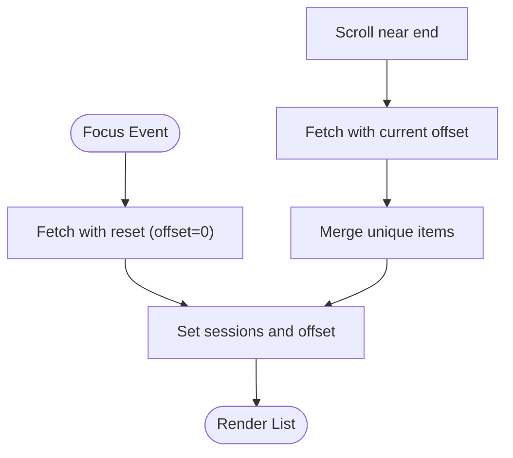
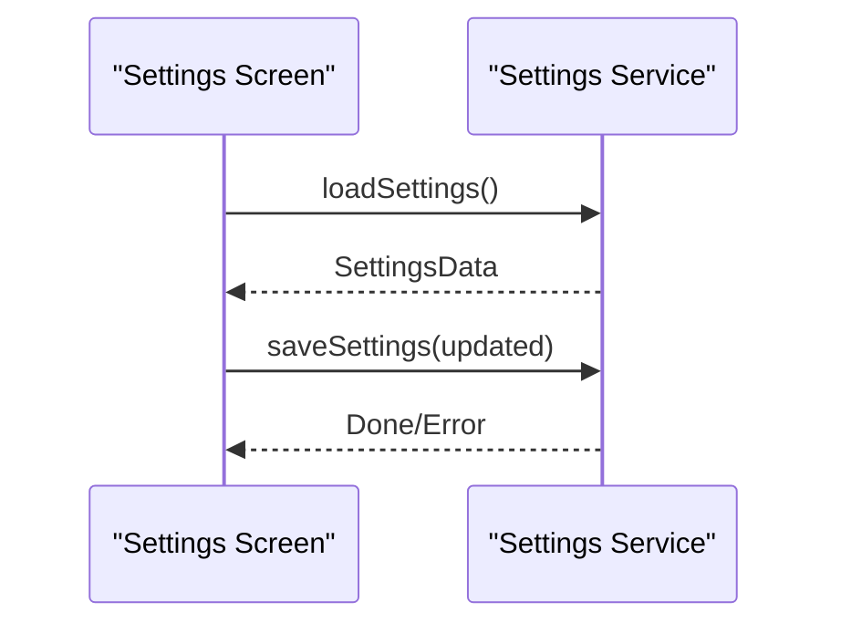
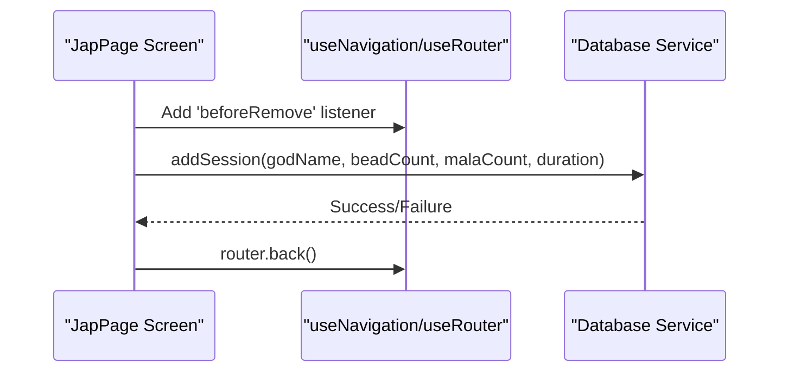
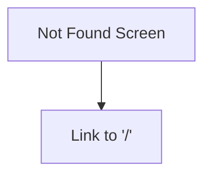
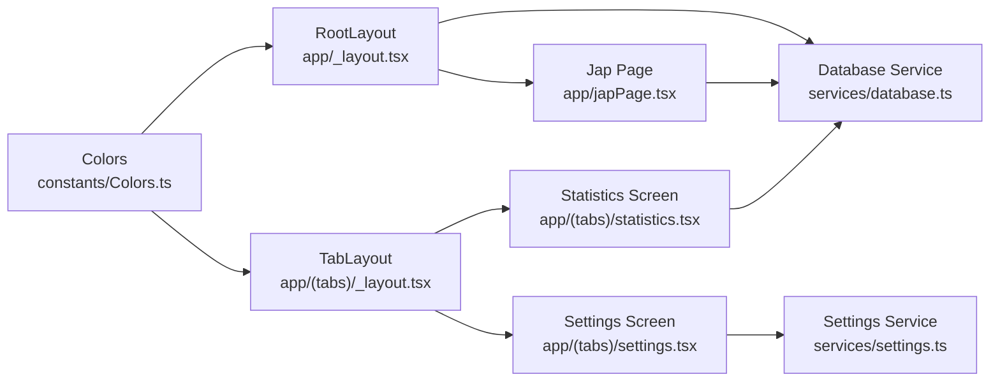

# Navigation and Routing

<cite>
**Referenced Files in This Document**
- [app/_layout.tsx](file://app/_layout.tsx)
- [app/(tabs)/_layout.tsx](file://app/(tabs)/_layout.tsx)
- [app/(tabs)/index.tsx](file://app/(tabs)/index.tsx)
- [app/(tabs)/statistics.tsx](file://app/(tabs)/statistics.tsx)
- [app/(tabs)/settings.tsx](file://app/(tabs)/settings.tsx)
- [app/japPage.tsx](file://app/japPage.tsx)
- [app/+not-found.tsx](file://app/+not-found.tsx)
- [services/database.ts](file://services/database.ts)
- [services/settings.ts](file://services/settings.ts)
- [constants/Colors.ts](file://constants/Colors.ts)
- [app.json](file://app.json)
- [package.json](file://package.json)
</cite>

## Table of Contents
1. [Introduction](#introduction)
2. [Project Structure](#project-structure)
3. [Core Components](#core-components)
4. [Architecture Overview](#architecture-overview)
5. [Detailed Component Analysis](#detailed-component-analysis)
6. [Dependency Analysis](#dependency-analysis)
7. [Performance Considerations](#performance-considerations)
8. [Troubleshooting Guide](#troubleshooting-guide)
9. [Conclusion](#conclusion)

## Introduction
This document explains the navigation and routing system of SampleJapCounter, built with Expo Router’s file-based routing. It covers the root layout configuration, nested tab layout, global navigation setup, screen transitions, navigation parameters, route configuration, navigation patterns, deep linking support, and navigation state management. It also provides examples of programmatic navigation, route guards, and integration with the application’s data flow.

## Project Structure
The routing is organized around two primary layout layers:
- Root layout: Defines the global stack navigator and top-level screens.
- Tab layout: Defines the bottom-tabbed interface with three tabs.

Key routes:
- Root stack includes:
  - Nested tab group "(tabs)"
  - Standalone screen "japPage"
- Tab group "(tabs)" includes:
  - "index" (Home)
  - "statistics" (History)
  - "settings"

**Diagram sources**
- [app/_layout.tsx](file://app/_layout.tsx#L1-L27)
- [app/(tabs)/_layout.tsx](file://app/(tabs)/_layout.tsx#L1-L58)
- [app/(tabs)/index.tsx](file://app/(tabs)/index.tsx#L1-L120)
- [app/(tabs)/statistics.tsx](file://app/(tabs)/statistics.tsx#L1-L117)
- [app/(tabs)/settings.tsx](file://app/(tabs)/settings.tsx#L1-L192)
- [app/japPage.tsx](file://app/japPage.tsx#L1-L289)

**Section sources**
- [app/_layout.tsx](file://app/_layout.tsx#L1-L27)
- [app/(tabs)/_layout.tsx](file://app/(tabs)/_layout.tsx#L1-L58)
- [app/(tabs)/index.tsx](file://app/(tabs)/index.tsx#L1-L120)
- [app/(tabs)/statistics.tsx](file://app/(tabs)/statistics.tsx#L1-L117)
- [app/(tabs)/settings.tsx](file://app/(tabs)/settings.tsx#L1-L192)
- [app/japPage.tsx](file://app/japPage.tsx#L1-L289)

## Core Components
- Root layout (stack navigator):
  - Initializes the database on app start.
  - Configures global stack screen options (background, header colors).
  - Registers nested tab group and standalone screen with hidden headers.
- Tab layout (bottom tabs):
  - Configures tab bar appearance and header behavior.
  - Declares three tabs: Home, Statistics, Settings with icons and titles.
- Screens:
  - Home: Displays daily and lifetime stats, navigates to Statistics and Jap pages.
  - Statistics: Paginates session history, loads data on focus.
  - Settings: Loads/saves user preferences via file system.
  - Jap page: Interactive timer with progress ring, haptic feedback, and route guard.

**Section sources**
- [app/_layout.tsx](file://app/_layout.tsx#L7-L27)
- [app/(tabs)/_layout.tsx](file://app/(tabs)/_layout.tsx#L7-L58)
- [app/(tabs)/index.tsx](file://app/(tabs)/index.tsx#L8-L65)
- [app/(tabs)/statistics.tsx](file://app/(tabs)/statistics.tsx#L8-L88)
- [app/(tabs)/settings.tsx](file://app/(tabs)/settings.tsx#L8-L96)
- [app/japPage.tsx](file://app/japPage.tsx#L18-L221)

## Architecture Overview
Expo Router organizes routes by filesystem. The root layout defines a Stack navigator that hosts:
- A nested group "(tabs)" that renders the bottom tab bar.
- A standalone screen "japPage".

The tab layout defines three tabs that share a common header style and tab bar styling. Navigation is primarily programmatic via hooks, with optional deep links configured at the manifest level.

**Diagram sources**
- [app/_layout.tsx](file://app/_layout.tsx#L14-L23)
- [app/(tabs)/_layout.tsx](file://app/(tabs)/_layout.tsx#L9-L27)
- [app/(tabs)/index.tsx](file://app/(tabs)/index.tsx#L39-L62)
- [app/(tabs)/statistics.tsx](file://app/(tabs)/statistics.tsx#L74-L85)
- [app/(tabs)/settings.tsx](file://app/(tabs)/settings.tsx#L54-L95)
- [app/japPage.tsx](file://app/japPage.tsx#L19-L219)

## Detailed Component Analysis

### Root Layout and Global Navigation Setup
- Initializes the database on mount to ensure schema readiness before any data operations.
- Uses a Stack navigator with global screen options for consistent theming.
- Registers the nested "(tabs)" group and "japPage" screen with hidden headers.

**Diagram sources**
- [app/_layout.tsx](file://app/_layout.tsx#L8-L10)
- [services/database.ts](file://services/database.ts#L12-L39)
- [app/_layout.tsx](file://app/_layout.tsx#L21-L23)

**Section sources**
- [app/_layout.tsx](file://app/_layout.tsx#L7-L27)
- [services/database.ts](file://services/database.ts#L12-L39)

### Tab Layout Structure
- Bottom tab bar with three tabs: Home, Statistics, Settings.
- Shared header and tab bar styling via screen options.
- Icons and titles are defined per tab.

**Diagram sources**
- [app/(tabs)/_layout.tsx](file://app/(tabs)/_layout.tsx#L9-L55)
- [app/(tabs)/index.tsx](file://app/(tabs)/index.tsx#L28-L64)
- [app/(tabs)/statistics.tsx](file://app/(tabs)/statistics.tsx#L72-L87)
- [app/(tabs)/settings.tsx](file://app/(tabs)/settings.tsx#L54-L95)

**Section sources**
- [app/(tabs)/_layout.tsx](file://app/(tabs)/_layout.tsx#L7-L58)

### Home Screen (index)
- Displays today’s and all-time stats fetched from the database.
- Navigates to Statistics and Jap pages on press.
- Refreshes data on focus to reflect recent changes.

**Diagram sources**
- [app/(tabs)/index.tsx](file://app/(tabs)/index.tsx#L13-L25)
- [app/(tabs)/index.tsx](file://app/(tabs)/index.tsx#L39-L62)
- [services/database.ts](file://services/database.ts#L66-L106)

**Section sources**
- [app/(tabs)/index.tsx](file://app/(tabs)/index.tsx#L8-L65)
- [services/database.ts](file://services/database.ts#L66-L106)

### Statistics Screen (statistics)
- Implements pagination to load session history.
- Fetches data on focus and appends new items as the user scrolls.
- Handles loading states and empty lists.

**Diagram sources**
- [app/(tabs)/statistics.tsx](file://app/(tabs)/statistics.tsx#L14-L51)
- [app/(tabs)/statistics.tsx](file://app/(tabs)/statistics.tsx#L74-L85)
- [services/database.ts](file://services/database.ts#L118-L131)

**Section sources**
- [app/(tabs)/statistics.tsx](file://app/(tabs)/statistics.tsx#L8-L88)
- [services/database.ts](file://services/database.ts#L118-L131)

### Settings Screen (settings)
- Loads user settings from persistent storage on focus.
- Provides a form to update user name and vibration preference.
- Saves settings back to storage and shows success/error alerts.

**Diagram sources**
- [app/(tabs)/settings.tsx](file://app/(tabs)/settings.tsx#L13-L43)
- [services/settings.ts](file://services/settings.ts#L16-L46)

**Section sources**
- [app/(tabs)/settings.tsx](file://app/(tabs)/settings.tsx#L8-L96)
- [services/settings.ts](file://services/settings.ts#L1-L47)

### Jap Page Screen (japPage)
- Interactive timer with circular progress visualization.
- Haptic feedback on bead increments and completion.
- Route guard prevents accidental navigation away when there are unsaved changes.
- Saves session data to the database and navigates back after confirmation.

**Diagram sources**
- [app/japPage.tsx](file://app/japPage.tsx#L70-L99)
- [app/japPage.tsx](file://app/japPage.tsx#L123-L160)
- [services/database.ts](file://services/database.ts#L41-L64)

**Section sources**
- [app/japPage.tsx](file://app/japPage.tsx#L18-L221)
- [services/database.ts](file://services/database.ts#L41-L64)

### Not Found Screen (+not-found)
- Provides a styled fallback screen with a link to return home.

**Diagram sources**
- [app/+not-found.tsx](file://app/+not-found.tsx#L5-L16)

**Section sources**
- [app/+not-found.tsx](file://app/+not-found.tsx#L5-L16)

## Dependency Analysis
- Root layout depends on:
  - Database initialization hook.
  - Stack navigator configuration.
- Tab layout depends on:
  - Colors for consistent theming.
  - Expo Router Tabs for tab rendering.
- Screens depend on:
  - Services for data persistence and settings.
  - Expo Router hooks for navigation and focus lifecycle.
  - Platform APIs for haptics and safe areas.

**Diagram sources**
- [constants/Colors.ts](file://constants/Colors.ts#L3-L18)
- [app/_layout.tsx](file://app/_layout.tsx#L1-L27)
- [app/(tabs)/_layout.tsx](file://app/(tabs)/_layout.tsx#L1-L58)
- [services/database.ts](file://services/database.ts#L1-L132)
- [app/(tabs)/statistics.tsx](file://app/(tabs)/statistics.tsx#L1-L117)
- [app/(tabs)/settings.tsx](file://app/(tabs)/settings.tsx#L1-L192)
- [services/settings.ts](file://services/settings.ts#L1-L47)
- [app/japPage.tsx](file://app/japPage.tsx#L1-L289)

**Section sources**
- [constants/Colors.ts](file://constants/Colors.ts#L1-L19)
- [app/_layout.tsx](file://app/_layout.tsx#L1-L27)
- [app/(tabs)/_layout.tsx](file://app/(tabs)/_layout.tsx#L1-L58)
- [services/database.ts](file://services/database.ts#L1-L132)
- [app/(tabs)/statistics.tsx](file://app/(tabs)/statistics.tsx#L1-L117)
- [app/(tabs)/settings.tsx](file://app/(tabs)/settings.tsx#L1-L192)
- [services/settings.ts](file://services/settings.ts#L1-L47)
- [app/japPage.tsx](file://app/japPage.tsx#L1-L289)

## Performance Considerations
- Use focus-based data refresh to avoid unnecessary network or disk IO during background.
- Implement pagination for long lists to reduce memory footprint and improve scroll performance.
- Debounce or throttle frequent state updates in timers to minimize re-renders.
- Cache computed values derived from props/state to avoid recomputation.

## Troubleshooting Guide
- Database initialization errors:
  - Ensure the database initialization runs before any queries.
  - Verify migrations succeed and handle exceptions gracefully.
- Navigation guard behavior:
  - Confirm the listener is attached and unmounted properly to avoid leaks.
  - Test scenarios where the user cancels or confirms leaving the screen.
- Settings persistence:
  - Validate file existence and JSON parsing; fall back to defaults on failure.
- Deep linking:
  - Confirm scheme is set in the manifest and matches expected URIs.

**Section sources**
- [services/database.ts](file://services/database.ts#L12-L39)
- [app/japPage.tsx](file://app/japPage.tsx#L70-L99)
- [services/settings.ts](file://services/settings.ts#L16-L46)
- [app.json](file://app.json#L8-L8)

## Conclusion
SampleJapCounter’s navigation system leverages Expo Router’s file-based routing to create a clean separation between global stack navigation and nested tabbed views. Programmatic navigation, route guards, and focus-driven data fetching integrate tightly with the data layer. Deep linking is supported via the configured scheme, enabling external entry points. The design emphasizes responsive UX through haptics, visual feedback, and efficient data loading patterns.