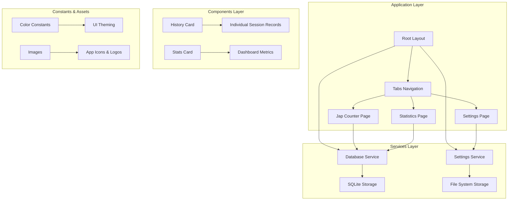
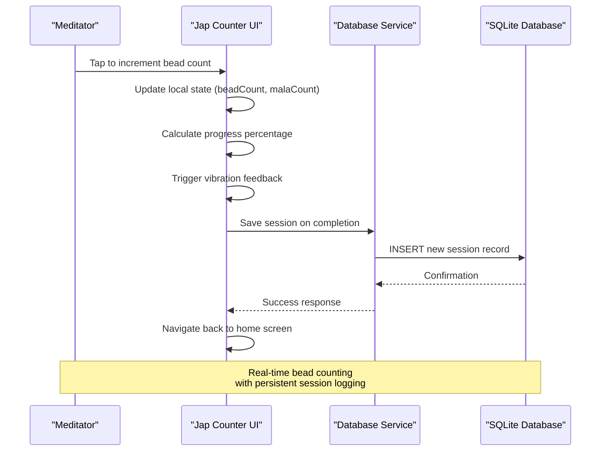
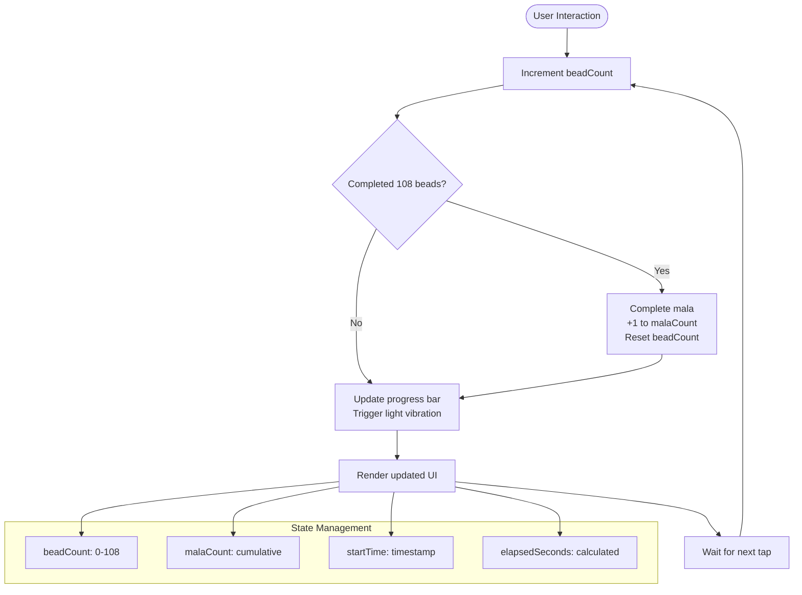
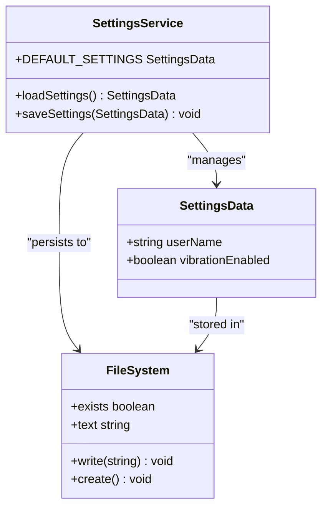
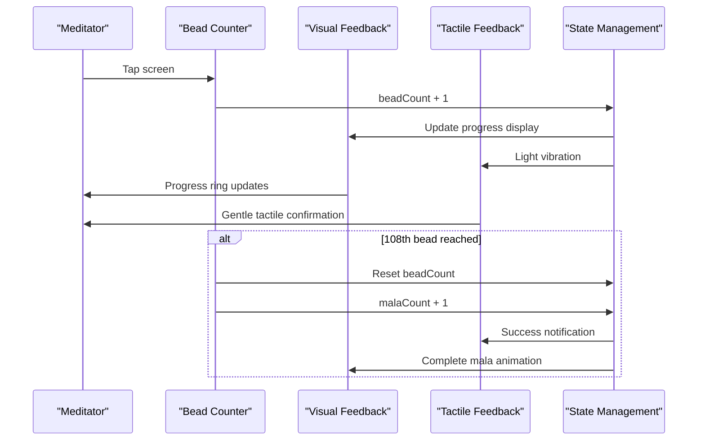

# Project Overview

<cite>
**Referenced Files in This Document**
- [README.md](file://README.md)
- [package.json](file://package.json)
- [app.json](file://app.json)
- [app/_layout.tsx](file://app/_layout.tsx)
- [app/japPage.tsx](file://app/japPage.tsx)
- [app/(tabs)/index.tsx](file://app/(tabs)/index.tsx)
- [app/(tabs)/statistics.tsx](file://app/(tabs)/statistics.tsx)
- [app/(tabs)/settings.tsx](file://app/(tabs)/settings.tsx)
- [services/database.ts](file://services/database.ts)
- [services/settings.ts](file://services/settings.ts)
- [components/HistoryCard.tsx](file://components/HistoryCard.tsx)
- [components/StatsCard.tsx](file://components/StatsCard.tsx)
- [constants/Colors.ts](file://constants/Colors.ts)
</cite>

## Table of Contents
1. [Introduction](#introduction)
2. [Project Structure](#project-structure)
3. [Core Components](#core-components)
4. [Architecture Overview](#architecture-overview)
5. [Detailed Component Analysis](#detailed-component-analysis)
6. [Technology Stack](#technology-stack)
7. [Target Audience](#target-audience)
8. [Digital Wellness Context](#digital-wellness-context)
9. [Feature Implementation](#feature-implementation)
10. [Performance Considerations](#performance-considerations)
11. [Conclusion](#conclusion)

## Introduction

SampleJapCounter is a meditation counter application designed specifically for tracking Jap mantra repetitions during meditation sessions. The application serves as a digital tool for spiritual practitioners and meditators who practice Japa meditation, a traditional Buddhist and Hindu practice involving the repetitive chanting or mental repetition of sacred mantras using prayer beads (malas).

The application focuses on providing a seamless, distraction-free meditation experience while maintaining accurate tracking of meditation metrics. It transforms traditional Japa practice into a modern, tech-enhanced spiritual discipline that combines ancient wisdom with contemporary mobile technology.

## Project Structure

The application follows a modern React Native architecture with Expo Router for navigation and file-based routing. The project structure is organized around feature-based components with clear separation of concerns:



**Diagram sources**
- [app/_layout.tsx](file://app/_layout.tsx#L1-L27)
- [app/japPage.tsx](file://app/japPage.tsx#L1-L289)
- [services/database.ts](file://services/database.ts#L1-L132)

**Section sources**
- [app/_layout.tsx](file://app/_layout.tsx#L1-L27)
- [app.json](file://app.json#L1-L55)

## Core Components

The application consists of several key components that work together to provide a comprehensive meditation tracking experience:

### Meditation Counter Interface
The primary meditation counter interface features a large circular progress indicator that visually represents mantra repetitions within a mala (108-bead prayer necklace). The interface provides immediate visual feedback through a golden progress ring that fills as the user completes bead repetitions.

### Statistics Dashboard
The statistics dashboard presents aggregated meditation data including daily totals and lifetime metrics. Users can track their spiritual progress over time through meaningful numerical representations of their practice commitment.

### Session History Management
The application maintains a comprehensive history of meditation sessions with detailed records including timestamps, bead counts, mala completions, and session durations. This historical data enables practitioners to reflect on their spiritual journey and maintain consistent practice habits.

### Settings Configuration
Users can customize their meditation experience through configurable preferences, including vibration feedback settings that provide tactile confirmation for each mantra repetition.

**Section sources**
- [app/japPage.tsx](file://app/japPage.tsx#L18-L221)
- [app/(tabs)/index.tsx](file://app/(tabs)/index.tsx#L8-L65)
- [app/(tabs)/statistics.tsx](file://app/(tabs)/statistics.tsx#L8-L88)

## Architecture Overview

The application employs a layered architecture that separates presentation logic, business logic, and data persistence:



**Diagram sources**
- [app/japPage.tsx](file://app/japPage.tsx#L102-L160)
- [services/database.ts](file://services/database.ts#L41-L64)

The architecture ensures that meditation sessions are automatically saved when users complete their practice, providing reliable data persistence without requiring manual intervention. The design emphasizes minimal cognitive load during meditation while maintaining comprehensive tracking capabilities.

**Section sources**
- [services/database.ts](file://services/database.ts#L12-L39)
- [app/japPage.tsx](file://app/japPage.tsx#L134-L156)

## Detailed Component Analysis

### Jap Counter Implementation

The meditation counter represents the heart of the application, featuring sophisticated state management and real-time feedback mechanisms:



**Diagram sources**
- [app/japPage.tsx](file://app/japPage.tsx#L102-L121)

The counter implements several sophisticated features:
- **Real-time bead counting**: Tracks individual mantra repetitions within a mala cycle
- **Mala completion detection**: Automatically resets bead counter after 108 repetitions
- **Progress visualization**: Circular progress indicator provides immediate visual feedback
- **Haptic feedback**: Vibration patterns distinguish between individual bead counts and mala completions
- **Session timing**: Automatic timer tracks meditation duration

### Database Architecture

The application utilizes SQLite for local data persistence, providing reliable storage for meditation session data:

```mermaid
erDiagram
JAP_SESSIONS {
INTEGER id PK
TEXT god_name
TEXT date
TEXT timestamp
INTEGER bead_count
INTEGER mala_count
INTEGER duration_sec
}
subgraph "Data Model"
A[Unique Identifier]
B[Sacred Name/Mantra]
C[Session Date]
D[Full Timestamp]
E[Bead Count]
F[Mala Completion Count]
G[Duration in Seconds]
end
JAP_SESSIONS ||--|| A : "Primary Key"
JAP_SESSIONS ||--|| B : "Mantra Focus"
JAP_SESSIONS ||--|| C : "Daily Tracking"
JAP_SESSIONS ||--|| D : "Precise Timing"
JAP_SESSIONS ||--|| E : "Repetition Count"
JAP_SESSIONS ||--|| F : "Cycle Completion"
JAP_SESSIONS ||--|| G : "Practice Duration"
```

**Diagram sources**
- [services/database.ts](file://services/database.ts#L17-L26)

The database schema supports comprehensive meditation tracking with features including:
- **Session granularity**: Individual meditation sessions captured with precise timestamps
- **Statistical aggregation**: Daily and lifetime statistics for meaningful progress tracking
- **Historical preservation**: Complete session history for reflection and analysis
- **Performance optimization**: Efficient querying patterns for dashboard rendering

**Section sources**
- [services/database.ts](file://services/database.ts#L12-L132)

### Settings Management

The settings system provides user customization while maintaining simplicity:



**Diagram sources**
- [services/settings.ts](file://services/settings.ts#L3-L47)

The settings architecture ensures:
- **Persistent configuration**: User preferences stored locally for future sessions
- **Schema evolution**: Automatic merging with default values for future feature additions
- **Minimal complexity**: Streamlined interface focused on meditation-specific preferences

**Section sources**
- [services/settings.ts](file://services/settings.ts#L16-L46)

## Technology Stack

SampleJapCounter leverages a modern, production-ready technology stack optimized for cross-platform mobile development and spiritual practice:

### Core Framework
- **React Native 0.81.5**: Cross-platform mobile framework enabling native performance on iOS and Android
- **Expo 54.0.33**: Development platform providing extensive APIs and simplified build processes
- **TypeScript 5.9.2**: Strongly-typed JavaScript for improved code reliability and developer experience

### Navigation & Routing
- **Expo Router**: File-based routing system eliminating complex navigation configuration
- **React Navigation**: Robust navigation library for tab-based interface and screen transitions

### Data Management
- **Expo SQLite 16.0.10**: Local database solution providing reliable session storage
- **Expo File System**: Persistent storage for user settings and configuration data

### UI & Graphics
- **React Native SVG 15.12.1**: Vector graphics support for custom progress indicators
- **React Native Reanimated 4.1.1**: Smooth animations and gesture handling
- **Expo Haptics**: Tactile feedback system for meditation practice confirmation

### Development Tools
- **ESLint**: Code quality and consistency enforcement
- **Expo Dev Client**: Development builds for testing without app store deployment
- **EAS Build**: Automated cloud building for production releases

**Section sources**
- [package.json](file://package.json#L13-L49)
- [app.json](file://app.json#L27-L46)

## Target Audience

SampleJapCounter serves a diverse community of spiritual practitioners and meditation enthusiasts:

### Primary Users
- **Traditional Japa Practitioners**: Individuals following established Buddhist and Hindu meditation traditions
- **Mindfulness Enthusiasts**: Modern practitioners incorporating meditation into daily spiritual routines
- **Devotional Spiritual Seekers**: Users focusing on mantra repetition as a form of prayer or devotion
- **Beginners to Meditation**: New practitioners seeking structured guidance for establishing consistent practice

### Demographic Characteristics
- **Age Range**: Primarily adults aged 25-65, though adaptable across age groups
- **Geographic Distribution**: Global reach with cultural sensitivity to various spiritual traditions
- **Tech Comfort Level**: Moderate to high comfort with mobile applications
- **Spiritual Commitment**: Varying levels of dedication to regular meditation practice

### Practice Context
The application accommodates different meditation contexts:
- **Formal Meditation Sessions**: Structured practice periods with dedicated time
- **Daily Reminders**: Brief practice moments integrated into daily routines
- **Retreat Participation**: Extended practice periods during spiritual retreats
- **Personal Reflection**: Private moments of contemplation and spiritual growth

## Digital Wellness Context

SampleJapCounter positions itself within the growing field of digital wellness and mindfulness technology:

### Mindfulness Technology Evolution
The application represents a convergence of traditional spiritual practices with modern digital tools, addressing the increasing demand for technology-assisted spiritual development. This approach acknowledges that digital wellness encompasses both traditional practices and contemporary technological solutions.

### Meditation App Ecosystem
Within the broader meditation app market, SampleJapCounter distinguishes itself through:
- **Cultural Authenticity**: Respectful representation of Japa traditions
- **Technical Precision**: Accurate tracking of mantra repetitions and timing
- **User Experience**: Minimal distraction interface supporting deep meditation states
- **Data Privacy**: Local-first approach protecting sensitive spiritual practice data

### Digital Detox Integration
The application supports digital wellness principles by:
- **Reducing Cognitive Load**: Simple interface minimizing mental effort during meditation
- **Encouraging Presence**: Features designed to enhance rather than distract from present-moment awareness
- **Balanced Technology Use**: Thoughtful integration of digital tools with traditional practices

## Feature Implementation

### Real-time Bead Counting
The application implements sophisticated real-time bead counting with immediate visual and haptic feedback:



**Diagram sources**
- [app/japPage.tsx](file://app/japPage.tsx#L102-L121)

### Session Logging System
Automatic session logging captures comprehensive meditation data:

- **Timestamp Precision**: Millisecond-level accuracy for precise timing
- **Duration Tracking**: Continuous session duration calculation
- **Completion Detection**: Automatic session termination upon mala completion
- **Data Integrity**: Reliable persistence ensuring no practice data loss

### Statistics Tracking
The application provides meaningful statistical insights:

- **Daily Totals**: Current day's meditation metrics
- **Lifetime Aggregation**: Cumulative practice statistics
- **Progress Visualization**: Dashboard cards displaying key metrics
- **Historical Analysis**: Session history for reflection and improvement

### Historical Record Management
Comprehensive session history management:

- **Pagination Support**: Efficient loading of large session histories
- **Filtering Capabilities**: Date-based and metric-based filtering
- **Export Potential**: Foundation for future data export functionality
- **Privacy Control**: Local storage ensuring data remains private

**Section sources**
- [app/japPage.tsx](file://app/japPage.tsx#L134-L160)
- [services/database.ts](file://services/database.ts#L118-L132)

## Performance Considerations

### Memory Management
The application implements efficient memory management strategies:
- **State Optimization**: Minimal state updates to reduce re-render cycles
- **Component Lifecycle**: Proper cleanup of intervals and event listeners
- **Image Loading**: Optimized asset management for app icons and logos

### Database Performance
SQLite optimization techniques include:
- **Connection Pooling**: Single database connection for reduced overhead
- **Query Optimization**: Efficient SELECT statements with appropriate indexing
- **Transaction Management**: Batch operations for improved write performance

### User Interface Responsiveness
Performance optimizations for meditation practice:
- **Smooth Animations**: Hardware-accelerated SVG rendering for progress indicators
- **Minimal Layout Shifts**: Predictable UI updates preventing user distraction
- **Fast Navigation**: Optimized route transitions between meditation sessions and statistics

## Conclusion

SampleJapCounter represents a thoughtful fusion of traditional meditation practices and modern mobile technology. The application successfully addresses the needs of spiritual practitioners seeking to enhance their Japa meditation practice through digital tools while maintaining the contemplative essence of traditional spiritual disciplines.

The comprehensive feature set, including real-time bead counting, session logging, statistics tracking, and historical record management, provides practitioners with valuable insights into their spiritual journey. The clean, distraction-free interface supports deep meditation states while offering meaningful data collection for personal growth and reflection.

Built on a robust technology foundation using React Native, Expo, and TypeScript, the application demonstrates how contemporary development practices can serve ancient spiritual traditions. The modular architecture ensures maintainability and extensibility for future enhancements while preserving the application's focus on user experience and spiritual practice support.

This project exemplifies how digital wellness applications can honor traditional practices while leveraging modern technology to create meaningful, accessible tools for spiritual development across diverse communities and cultural backgrounds.