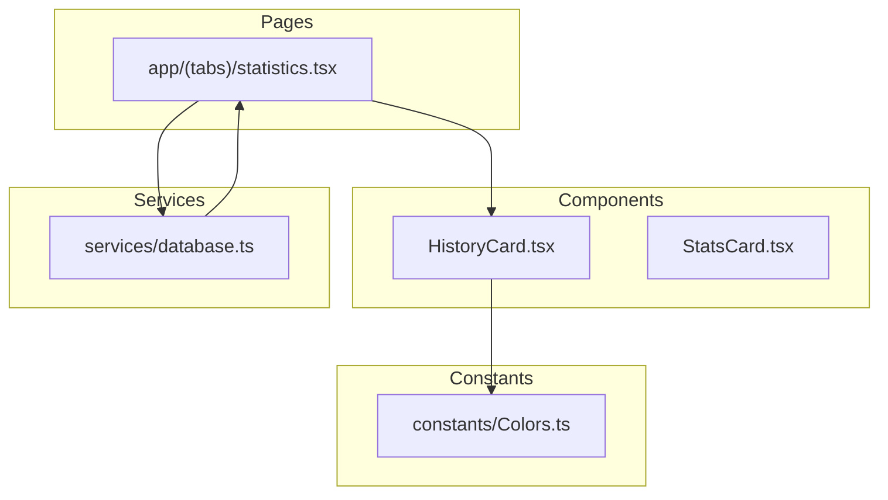
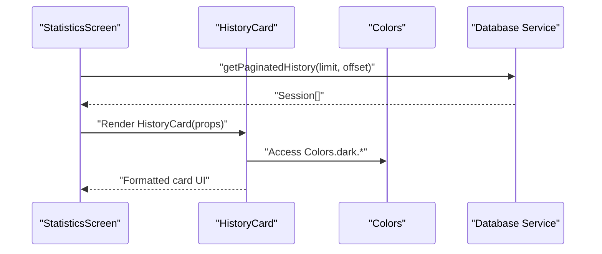
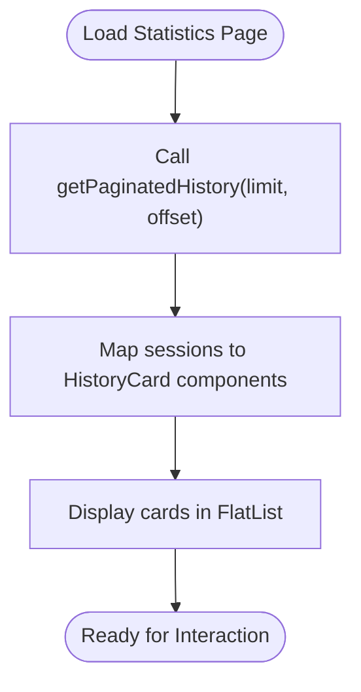
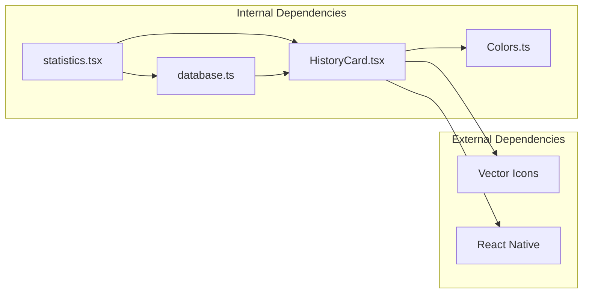

# HistoryCard Component

<cite>
**Referenced Files in This Document**
- [HistoryCard.tsx](file://components/HistoryCard.tsx)
- [statistics.tsx](file://app/(tabs)/statistics.tsx)
- [database.ts](file://services/database.ts)
- [Colors.ts](file://constants/Colors.ts)
</cite>

## Table of Contents
1. [Introduction](#introduction)
2. [Project Structure](#project-structure)
3. [Core Components](#core-components)
4. [Architecture Overview](#architecture-overview)
5. [Detailed Component Analysis](#detailed-component-analysis)
6. [Dependency Analysis](#dependency-analysis)
7. [Performance Considerations](#performance-considerations)
8. [Troubleshooting Guide](#troubleshooting-guide)
9. [Conclusion](#conclusion)
10. [Appendices](#appendices)

## Introduction
The HistoryCard component displays individual meditation session records in a clean, accessible card layout. It presents session metadata including date/time, total beads (calculated from mala count and bead count), and session statistics such as mala count and duration. The component integrates with the application's theme system and is designed for use within the statistics page's session history list.

## Project Structure
The HistoryCard component resides in the components directory and is consumed by the statistics page. The statistics page fetches paginated session data from the database service and renders HistoryCard instances for each session.

**Diagram sources**
- [HistoryCard.tsx](file://components/HistoryCard.tsx#L1-L134)
- [statistics.tsx](file://app/(tabs)/statistics.tsx#L1-L117)
- [database.ts](file://services/database.ts#L108-L131)
- [Colors.ts](file://constants/Colors.ts#L1-L19)

**Section sources**
- [HistoryCard.tsx](file://components/HistoryCard.tsx#L1-L134)
- [statistics.tsx](file://app/(tabs)/statistics.tsx#L1-L117)
- [database.ts](file://services/database.ts#L108-L131)
- [Colors.ts](file://constants/Colors.ts#L1-L19)

## Core Components
The HistoryCard component accepts four props representing session data:
- date: string | number (timestamp or ISO string)
- beadCount: number
- malaCount: number
- duration: number (in seconds)

The component renders:
1. A top header section displaying formatted date and time
2. A hero section showing the total bead count (malaCount × 108 + beadCount)
3. A divider for visual separation
4. A bottom stats row with malas count and duration

**Section sources**
- [HistoryCard.tsx](file://components/HistoryCard.tsx#L6-L11)
- [HistoryCard.tsx](file://components/HistoryCard.tsx#L34-L65)

## Architecture Overview
The HistoryCard integrates with the theme system and database service to present session data consistently across the application.

**Diagram sources**
- [statistics.tsx](file://app/(tabs)/statistics.tsx#L14-L60)
- [HistoryCard.tsx](file://components/HistoryCard.tsx#L1-L134)
- [database.ts](file://services/database.ts#L118-L131)
- [Colors.ts](file://constants/Colors.ts#L1-L19)

## Detailed Component Analysis

### Props Interface and Data Model
The HistoryCard expects a specific shape of session data:
- date: Supports both numeric timestamps and ISO date strings
- beadCount: Non-negative integer representing beads in the current mala
- malaCount: Non-negative integer representing completed malas
- duration: Number in seconds (fallback to 0 if undefined)

The component internally converts the date prop to a JavaScript Date object for formatting.

**Section sources**
- [HistoryCard.tsx](file://components/HistoryCard.tsx#L6-L11)
- [HistoryCard.tsx](file://components/HistoryCard.tsx#L13-L14)

### Date Formatting Implementation
The component formats dates using the browser's internationalization APIs:
- Date portion: Month abbreviation, day number, weekday abbreviated (e.g., "Feb 8, Sat")
- Time portion: Hour (12-hour format) and minute with leading zeros
- Combined format: "Month Day, Weekday • Hour:Minute AM/PM"

Duration formatting uses a simple calculation:
- Hours: Math.round(duration / 3600)
- Minutes: Math.round(duration / 60)
- Seconds: Math.round(duration % 60)

**Section sources**
- [HistoryCard.tsx](file://components/HistoryCard.tsx#L16-L26)
- [HistoryCard.tsx](file://components/HistoryCard.tsx#L28-L32)

### Card Layout and Visual Hierarchy
The component follows a three-section layout:
1. Header section (top):
   - Contains the formatted date text
   - Uses secondary text color and uppercase styling
   - Small vertical spacing below

2. Hero section (middle):
   - Displays total beads prominently
   - Large bold font with gold accent color
   - Subtle text shadow for depth
   - "Beads" label below the count

3. Divider section:
   - Thin horizontal line separating hero from stats
   - Subtle opacity for visual lightness

4. Stats row (bottom):
   - Two equal-width stat items
   - Icons for malas and duration
   - Secondary text color for counts

Spacing and typography choices:
- Container padding: 20px all sides
- Section gaps: 10-15px between major sections
- Hero value: 42pt font size
- Hero label: 14pt font size
- Stat items: 14pt font size with 8pt horizontal gap
- Header text: 12pt with letter spacing and uppercase transform

**Section sources**
- [HistoryCard.tsx](file://components/HistoryCard.tsx#L34-L65)
- [HistoryCard.tsx](file://components/HistoryCard.tsx#L68-L133)

### Styling Approach and Theme Integration
The component uses the global Colors constant for consistent theming:
- Surface color: dark surface (#1E1E1E)
- Text colors: primary (#FFFFFF) and secondary (#B3B3B3)
- Accent color: gold (#FFD700) for highlights and icons
- Border color: dark gray (#333333)
- Background: dark background (#121212) in parent container

Styling features:
- Rounded corners (16px radius)
- Subtle border with gold translucency
- Drop shadow for depth perception
- Responsive layout using flexDirection and justifyContent

**Section sources**
- [HistoryCard.tsx](file://components/HistoryCard.tsx#L68-L82)
- [HistoryCard.tsx](file://components/HistoryCard.tsx#L86-L92)
- [HistoryCard.tsx](file://components/HistoryCard.tsx#L98-L110)
- [HistoryCard.tsx](file://components/HistoryCard.tsx#L128-L132)
- [Colors.ts](file://constants/Colors.ts#L1-L19)

### Usage Examples

#### Integration with Statistics Page
The statistics page demonstrates HistoryCard usage within a FlatList:
- Fetches paginated session data using getPaginatedHistory
- Renders HistoryCard for each session with props mapping
- Handles loading states and infinite scrolling

**Diagram sources**
- [statistics.tsx](file://app/(tabs)/statistics.tsx#L14-L60)
- [database.ts](file://services/database.ts#L118-L131)

#### Integration with Session History List
The component is designed to be used within list-based layouts where:
- Each HistoryCard represents a single session record
- Props are passed from the parent component's data source
- Consistent styling maintains visual coherence across the list

**Section sources**
- [statistics.tsx](file://app/(tabs)/statistics.tsx#L53-L60)
- [database.ts](file://services/database.ts#L108-L116)

### Data Validation and Error Handling
The component performs basic validation:
- Date conversion: Creates a Date object from the provided date prop
- Fallback duration: Uses 0 when duration is undefined or null
- Numeric validation: Assumes beadCount and malaCount are numbers

Recommended validation patterns:
- Type checking for date prop (string vs number)
- Range validation for beadCount and malaCount
- Duration normalization to non-negative values
- Graceful handling of invalid date strings

**Section sources**
- [HistoryCard.tsx](file://components/HistoryCard.tsx#L13-L14)
- [HistoryCard.tsx](file://components/HistoryCard.tsx#L58-L59)

### Accessibility Considerations
Current implementation considerations:
- Text contrast: Uses high-contrast colors against dark backgrounds
- Font sizes: Legible sizes for readability
- Icon usage: Provides visual cues alongside text labels
- Focus states: No explicit focus management implemented

Accessibility enhancements could include:
- Screen reader announcements for card content
- Accessible labels for icon-based statistics
- Keyboard navigation support
- Dynamic font size adjustments

**Section sources**
- [HistoryCard.tsx](file://components/HistoryCard.tsx#L86-L92)
- [HistoryCard.tsx](file://components/HistoryCard.tsx#L128-L132)

## Dependency Analysis
The HistoryCard has minimal external dependencies and clear internal structure:

**Diagram sources**
- [HistoryCard.tsx](file://components/HistoryCard.tsx#L1-L4)
- [statistics.tsx](file://app/(tabs)/statistics.tsx#L1-L6)
- [database.ts](file://services/database.ts#L1-L6)

**Section sources**
- [HistoryCard.tsx](file://components/HistoryCard.tsx#L1-L4)
- [statistics.tsx](file://app/(tabs)/statistics.tsx#L1-L6)
- [database.ts](file://services/database.ts#L1-L6)

## Performance Considerations
- Rendering efficiency: Stateless functional component with minimal re-renders
- Memory usage: Lightweight component with small DOM tree
- Theme access: Single import of Colors constant
- Date formatting: Uses native Intl APIs for efficient formatting

Optimization suggestions:
- Memoize date formatting calculations if used frequently
- Consider virtualized lists for large session histories
- Debounce rendering updates if props change rapidly

## Troubleshooting Guide
Common issues and solutions:

### Date Formatting Problems
- Symptom: Incorrect date display or runtime errors
- Cause: Invalid date prop format
- Solution: Ensure date prop is a valid timestamp or ISO string

### Duration Display Issues
- Symptom: Unexpected duration values
- Cause: Non-numeric duration values
- Solution: Validate duration prop before passing to component

### Styling Inconsistencies
- Symptom: Colors or fonts not matching theme
- Cause: Theme changes not reflected
- Solution: Verify Colors constant updates and component imports

**Section sources**
- [HistoryCard.tsx](file://components/HistoryCard.tsx#L13-L14)
- [HistoryCard.tsx](file://components/HistoryCard.tsx#L30-L32)

## Conclusion
The HistoryCard component provides a focused, accessible solution for displaying individual meditation session records. Its clean layout, consistent theming, and straightforward props interface make it easy to integrate into larger application features. The component's design emphasizes readability and visual hierarchy while maintaining performance and accessibility considerations.

## Appendices

### Props Reference
- date: string | number (timestamp or ISO string)
- beadCount: number (non-negative)
- malaCount: number (non-negative)
- duration: number (seconds, defaults to 0)

### Styling Variables
- Container: dark surface with rounded corners and subtle border
- Text: Primary and secondary colors with appropriate contrast ratios
- Icons: Gold tint for visual consistency
- Spacing: Consistent padding and margins throughout