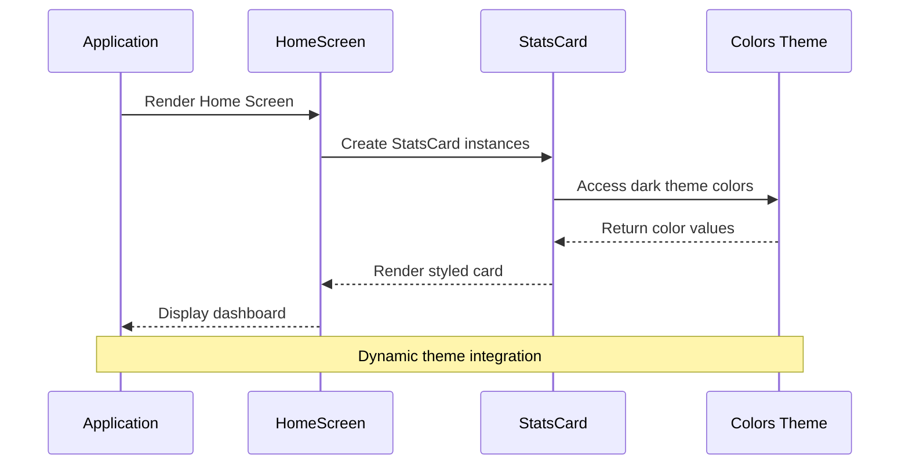
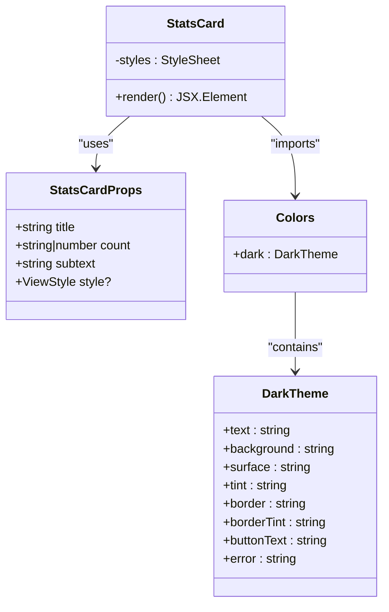
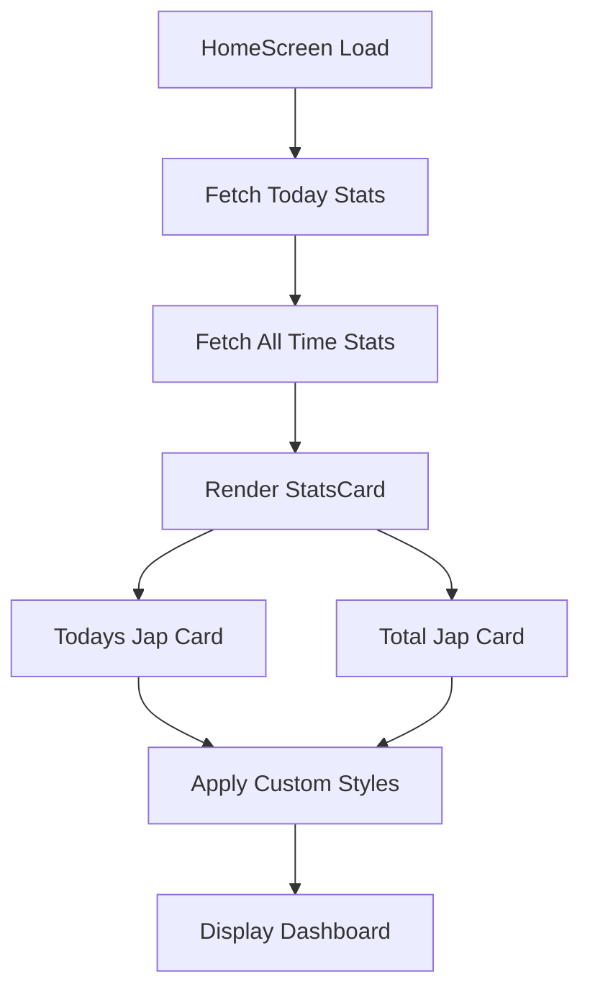
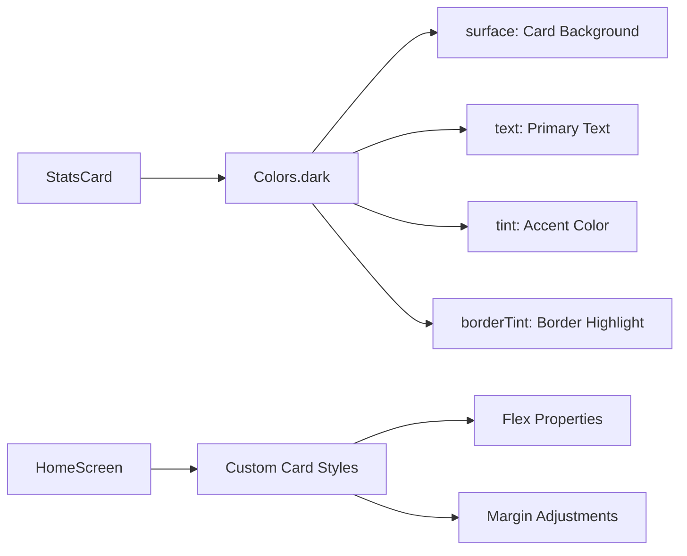
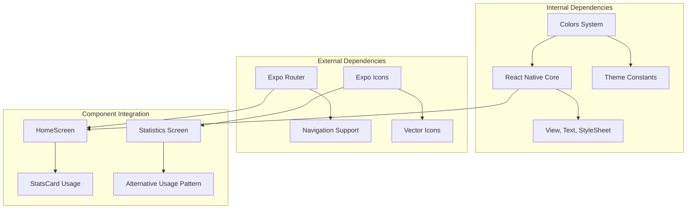

# StatsCard Component

<cite>
**Referenced Files in This Document**
- [StatsCard.tsx](file://components/StatsCard.tsx)
- [Colors.ts](file://constants/Colors.ts)
- [index.tsx](file://app/(tabs)/index.tsx)
- [HistoryCard.tsx](file://components/HistoryCard.tsx)
</cite>

## Table of Contents
1. [Introduction](#introduction)
2. [Project Structure](#project-structure)
3. [Core Components](#core-components)
4. [Architecture Overview](#architecture-overview)
5. [Detailed Component Analysis](#detailed-component-analysis)
6. [Dependency Analysis](#dependency-analysis)
7. [Performance Considerations](#performance-considerations)
8. [Troubleshooting Guide](#troubleshooting-guide)
9. [Conclusion](#conclusion)

## Introduction
The StatsCard component is a reusable UI element designed to present key statistics in a visually appealing card format. It serves as a central piece of the SampleJapCounter application's dashboard, displaying numerical metrics with supporting labels in a consistent, theme-aware design system.

## Project Structure
The StatsCard component follows a modular architecture within the SampleJapCounter application:

```mermaid
graph TB
subgraph "Application Structure"
A[components/] --> B[StatsCard.tsx]
A --> C[HistoryCard.tsx]
D[constants/] --> E[Colors.ts]
F[app/(tabs)/] --> G[index.tsx]
F --> H[statistics.tsx]
end
subgraph "Component Dependencies"
B --> E
G --> B
C --> E
end
```

**Diagram sources**
- [StatsCard.tsx](file://components/StatsCard.tsx#L1-L56)
- [Colors.ts](file://constants/Colors.ts#L1-L19)
- [index.tsx](file://app/(tabs)/index.tsx#L1-L120)

**Section sources**
- [StatsCard.tsx](file://components/StatsCard.tsx#L1-L56)
- [Colors.ts](file://constants/Colors.ts#L1-L19)
- [index.tsx](file://app/(tabs)/index.tsx#L1-L120)

## Core Components
The StatsCard component consists of four primary elements arranged in a vertical stack:

### Props Interface
The component accepts a strongly-typed interface with the following properties:
- `title`: String property for the main heading text
- `count`: Union type accepting both string and number values for the primary metric display
- `subtext`: String property for secondary descriptive text
- `style`: Optional ViewStyle property allowing external styling customization

### Visual Design Elements
The component implements a cohesive design system featuring:
- **Layout**: Centered content alignment with equal spacing distribution
- **Corners**: Rounded borders with 12px radius for modern appearance
- **Typography Hierarchy**: 
  - Count display: Large, bold font for primary metric emphasis
  - Title: Medium-weight text for headings
  - Subtext: Small, subdued text for supporting information
- **Theme Integration**: Dark theme adaptation through the Colors constant system

**Section sources**
- [StatsCard.tsx](file://components/StatsCard.tsx#L5-L20)
- [StatsCard.tsx](file://components/StatsCard.tsx#L22-L55)

## Architecture Overview
The StatsCard component integrates seamlessly with the application's theme system and usage patterns:



**Diagram sources**
- [index.tsx](file://app/(tabs)/index.tsx#L40-L51)
- [StatsCard.tsx](file://components/StatsCard.tsx#L1-L20)
- [Colors.ts](file://constants/Colors.ts#L3-L18)

## Detailed Component Analysis

### Component Implementation
The StatsCard component demonstrates clean separation of concerns through its modular structure:



**Diagram sources**
- [StatsCard.tsx](file://components/StatsCard.tsx#L5-L20)
- [StatsCard.tsx](file://components/StatsCard.tsx#L22-L55)
- [Colors.ts](file://constants/Colors.ts#L3-L18)

### Usage Patterns
The component is utilized in two primary contexts within the application:

#### Home Screen Integration
The StatsCard appears in the home screen's statistics dashboard, displaying both daily and lifetime statistics:



**Diagram sources**
- [index.tsx](file://app/(tabs)/index.tsx#L13-L25)
- [index.tsx](file://app/(tabs)/index.tsx#L40-L51)

#### Responsive Layout Behavior
The component adapts to different screen sizes through flexible styling:
- Minimum width constraint ensures readability across devices
- Flexible padding maintains proportional spacing
- Centered alignment works consistently in various layouts

**Section sources**
- [StatsCard.tsx](file://components/StatsCard.tsx#L37-L38)
- [index.tsx](file://app/(tabs)/index.tsx#L84-L93)

### Typography Hierarchy
The component establishes a clear visual hierarchy through strategic typographic choices:

| Element | Font Size | Weight | Color | Purpose |
|---------|-----------|--------|-------|---------|
| Count | 48px | Bold | Gold (#FFD700) | Primary metric emphasis |
| Title | 16px | Medium (600) | Light Gray (#FFFFFF) | Heading identification |
| Subtext | 12px | Regular | Medium Gray (#B3B3B3) | Supporting information |

**Section sources**
- [StatsCard.tsx](file://components/StatsCard.tsx#L45-L54)

### Theme System Integration
The component relies on the centralized Colors.ts system for consistent theming:



**Diagram sources**
- [StatsCard.tsx](file://components/StatsCard.tsx#L24-L28)
- [StatsCard.tsx](file://components/StatsCard.tsx#L42-L53)
- [Colors.ts](file://constants/Colors.ts#L4-L17)

**Section sources**
- [StatsCard.tsx](file://components/StatsCard.tsx#L1-L3)
- [Colors.ts](file://constants/Colors.ts#L1-L19)

## Dependency Analysis
The StatsCard component maintains minimal external dependencies while providing maximum flexibility:



**Diagram sources**
- [StatsCard.tsx](file://components/StatsCard.tsx#L1-L3)
- [index.tsx](file://app/(tabs)/index.tsx#L1-L6)
- [HistoryCard.tsx](file://components/HistoryCard.tsx#L1-L3)

### Prop Validation Guidelines
For robust component usage, implement the following validation patterns:

#### Type Safety Implementation
- Ensure count prop accepts both string and number types for flexibility
- Validate title and subtext as required string properties
- Use optional style prop with ViewStyle typing for extensibility

#### Runtime Validation
```typescript
// Example validation pattern
if (typeof count !== 'string' && typeof count !== 'number') {
    throw new Error('StatsCard count must be string or number');
}

if (typeof title !== 'string' || typeof subtext !== 'string') {
    throw new Error('StatsCard title and subtext must be strings');
}
```

**Section sources**
- [StatsCard.tsx](file://components/StatsCard.tsx#L5-L10)

## Performance Considerations
The component is optimized for efficient rendering:

### Rendering Efficiency
- Stateless functional component with minimal re-renders
- Static styles pre-computed during module initialization
- No unnecessary computed properties or heavy calculations

### Memory Management
- Lightweight component with minimal state requirements
- Efficient color access through centralized theme system
- Optimized layout with fixed dimensions for predictable rendering

## Troubleshooting Guide
Common issues and solutions when working with the StatsCard component:

### Styling Issues
**Problem**: Custom styles not applying correctly
**Solution**: Ensure style prop is properly merged using array syntax
- Verify style prop precedence in component implementation
- Check for conflicting parent container styles

### Theme Integration Problems
**Problem**: Colors not updating with theme changes
**Solution**: Confirm Colors.ts system is properly imported and accessible
- Verify dark theme constants are correctly defined
- Ensure component re-renders when theme context changes

### Content Display Issues
**Problem**: Numbers not displaying correctly
**Solution**: Convert numeric values to strings when needed
- Handle both string and number types for count prop
- Validate input data from external sources

**Section sources**
- [StatsCard.tsx](file://components/StatsCard.tsx#L12-L20)
- [StatsCard.tsx](file://components/StatsCard.tsx#L45-L50)

## Conclusion
The StatsCard component exemplifies clean, reusable React Native architecture within the SampleJapCounter application. Its thoughtful design balances visual appeal with functional flexibility, providing a consistent foundation for displaying key statistics across different screens and contexts. The component's integration with the centralized theme system ensures maintainable, scalable design patterns that adapt seamlessly to the application's dark theme implementation.

Through its modular structure, comprehensive prop interface, and strategic use of the Colors system, the StatsCard component serves as both a functional UI element and a demonstration of best practices for component design in cross-platform mobile applications.