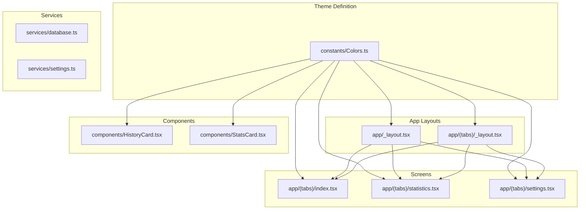
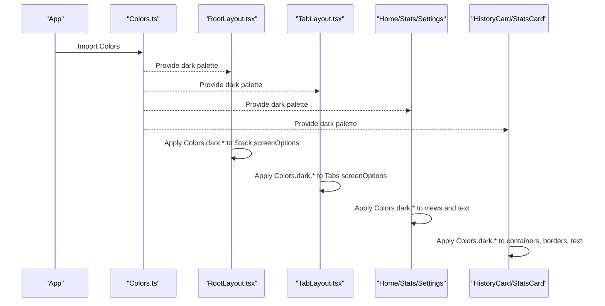
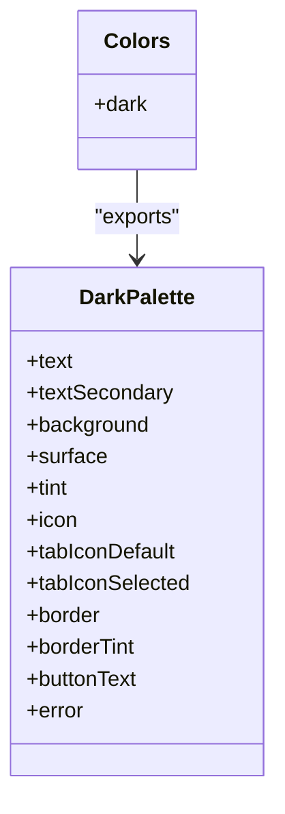
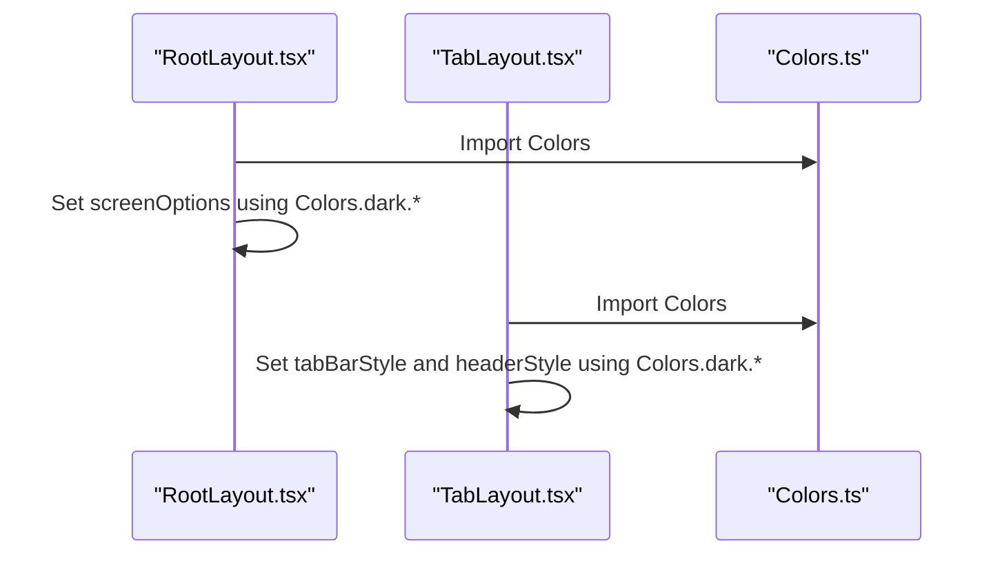
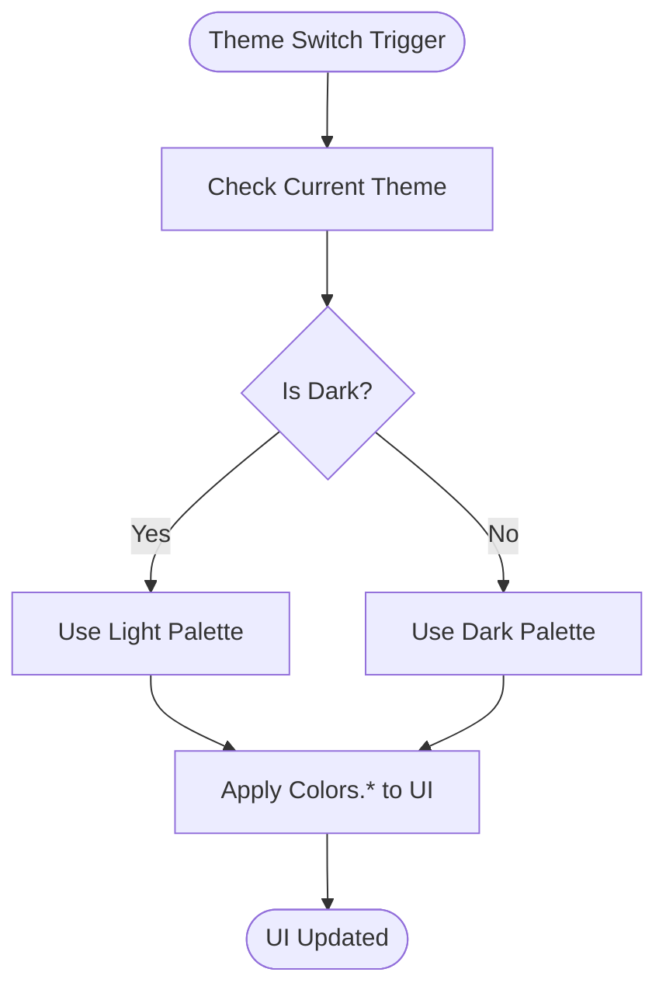
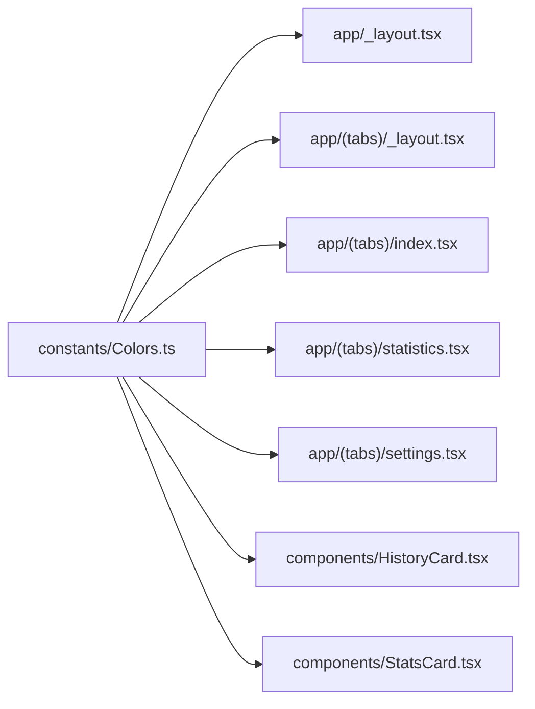

# Theme System and Colors

<cite>
**Referenced Files in This Document**
- [Colors.ts](file://constants/Colors.ts)
- [RootLayout.tsx](file://app/_layout.tsx)
- [TabLayout.tsx](file://app/(tabs)/_layout.tsx)
- [HomeScreen.tsx](file://app/(tabs)/index.tsx)
- [StatisticsScreen.tsx](file://app/(tabs)/statistics.tsx)
- [SettingsScreen.tsx](file://app/(tabs)/settings.tsx)
- [HistoryCard.tsx](file://components/HistoryCard.tsx)
- [StatsCard.tsx](file://components/StatsCard.tsx)
- [database.ts](file://services/database.ts)
- [settings.ts](file://services/settings.ts)
</cite>

## Table of Contents
1. [Introduction](#introduction)
2. [Project Structure](#project-structure)
3. [Core Components](#core-components)
4. [Architecture Overview](#architecture-overview)
5. [Detailed Component Analysis](#detailed-component-analysis)
6. [Dependency Analysis](#dependency-analysis)
7. [Performance Considerations](#performance-considerations)
8. [Troubleshooting Guide](#troubleshooting-guide)
9. [Conclusion](#conclusion)
10. [Appendices](#appendices)

## Introduction
This document explains the SampleJapCounter theme system and color management. It focuses on the centralized color palette definition, how colors are organized into categories (surface, text, tint, border), and how the theme is applied consistently across screens and components. It also covers usage examples for backgrounds, text, borders, and accents; the current theme behavior (dark mode only); accessibility considerations; and guidelines for extending the theme system.

## Project Structure
The theme system is implemented as a single, centralized color definition module and consumed by layout files and components across the application.

**Diagram sources**
- [Colors.ts](file://constants/Colors.ts#L1-L19)
- [RootLayout.tsx](file://app/_layout.tsx#L1-L27)
- [TabLayout.tsx](file://app/(tabs)/_layout.tsx#L1-L58)
- [HomeScreen.tsx](file://app/(tabs)/index.tsx#L1-L120)
- [StatisticsScreen.tsx](file://app/(tabs)/statistics.tsx#L1-L117)
- [SettingsScreen.tsx](file://app/(tabs)/settings.tsx#L1-L192)
- [HistoryCard.tsx](file://components/HistoryCard.tsx#L1-L134)
- [StatsCard.tsx](file://components/StatsCard.tsx#L1-L56)

**Section sources**
- [Colors.ts](file://constants/Colors.ts#L1-L19)
- [RootLayout.tsx](file://app/_layout.tsx#L1-L27)
- [TabLayout.tsx](file://app/(tabs)/_layout.tsx#L1-L58)

## Core Components
- Centralized color palette: A single export defines a dark theme palette with named tokens for text, surfaces, tints, icons, borders, and errors.
- Application-wide theme application: The root layout sets global screen options using the dark palette for backgrounds, headers, and status bar style.
- Component-level usage: Components apply colors for backgrounds, borders, text, icons, and interactive elements.

Key observations:
- Only a dark theme palette is currently defined and used.
- Tint color is used for highlights, active states, and accents.
- Surface color is used for cards and elevated surfaces.
- Border color is used for dividers and borders.
- Secondary text color is used for muted labels and placeholders.

**Section sources**
- [Colors.ts](file://constants/Colors.ts#L1-L19)
- [RootLayout.tsx](file://app/_layout.tsx#L12-L24)
- [TabLayout.tsx](file://app/(tabs)/_layout.tsx#L10-L26)

## Architecture Overview
The theme system follows a unidirectional data flow:
- Colors.ts defines the palette.
- Layouts consume the palette to configure navigation and global screen options.
- Screens and components consume the palette to style UI elements.

**Diagram sources**
- [Colors.ts](file://constants/Colors.ts#L1-L19)
- [RootLayout.tsx](file://app/_layout.tsx#L12-L24)
- [TabLayout.tsx](file://app/(tabs)/_layout.tsx#L10-L26)
- [HomeScreen.tsx](file://app/(tabs)/index.tsx#L67-L120)
- [StatisticsScreen.tsx](file://app/(tabs)/statistics.tsx#L90-L117)
- [SettingsScreen.tsx](file://app/(tabs)/settings.tsx#L98-L192)
- [HistoryCard.tsx](file://components/HistoryCard.tsx#L68-L134)
- [StatsCard.tsx](file://components/StatsCard.tsx#L22-L56)

## Detailed Component Analysis

### Color Palette Organization
The palette organizes colors into distinct categories:
- Text colors: primary and secondary text for readability.
- Background and surface: base background and elevated/surface containers.
- Tint: accent color for highlights, active states, and buttons.
- Icons: default and selected tab icons.
- Borders: dividers and borders for separation.
- Button text: contrasting text color for tinted buttons.
- Error: dedicated color for error states.

**Diagram sources**
- [Colors.ts](file://constants/Colors.ts#L3-L18)

**Section sources**
- [Colors.ts](file://constants/Colors.ts#L1-L19)

### Theme Application in Layouts
- Root layout applies the dark palette to Stack screen options for consistent background and header styling.
- Tab layout applies the dark palette to navigation tabs, headers, and borders.

**Diagram sources**
- [RootLayout.tsx](file://app/_layout.tsx#L12-L24)
- [TabLayout.tsx](file://app/(tabs)/_layout.tsx#L10-L26)
- [Colors.ts](file://constants/Colors.ts#L1-L19)

**Section sources**
- [RootLayout.tsx](file://app/_layout.tsx#L12-L24)
- [TabLayout.tsx](file://app/(tabs)/_layout.tsx#L10-L26)

### Component Styling with Colors
- Backgrounds: Views use the background color for base pages.
- Surfaces: Cards and elevated containers use the surface color.
- Borders: Dividers and borders use the border color.
- Text: Primary and secondary text colors are used for labels and values.
- Accents: Tint color is used for highlights, icons, and buttons.
- Interactive elements: Switch tracks and thumb colors use border and tint for contrast.

Examples across components:
- HistoryCard: surface background, secondary text, tint for icons and hero value, border for divider.
- StatsCard: surface background, borderTint for border, tint for counts, text for titles.
- HomeScreen: background for page, tint for button, tint for shadow, tint for button icon tint, buttonText for text.
- SettingsScreen: background, surface for cards, border for inputs, tint for headers/buttons, tint for switch track, text and secondary text for labels.
- StatisticsScreen: background, tint for header, tint for activity indicator.

**Section sources**
- [HistoryCard.tsx](file://components/HistoryCard.tsx#L68-L134)
- [StatsCard.tsx](file://components/StatsCard.tsx#L22-L56)
- [HomeScreen.tsx](file://app/(tabs)/index.tsx#L67-L120)
- [SettingsScreen.tsx](file://app/(tabs)/settings.tsx#L98-L192)
- [StatisticsScreen.tsx](file://app/(tabs)/statistics.tsx#L90-L117)

### Theme Switching Mechanism
- Current state: Only a dark theme palette is defined and used.
- No explicit theme switching logic is present in the codebase.
- To add a light theme, define a complementary palette and toggle between dark and light in a central theme context or provider.

[No sources needed since this diagram shows conceptual workflow, not actual code structure]

### Color Accessibility and Contrast
- Primary text vs background: The dark palette uses white for primary text on a dark background, which generally provides good contrast.
- Secondary text: Gray is used for less prominent text, aiding readability.
- Button contrast: The tint color is used for button backgrounds, with a contrasting button text color for legibility.
- Icons: Tint is used for active icons; inactive icons use a muted gray.
- Borders: Dark borders help separate content areas while maintaining contrast.

Recommendations:
- Verify contrast ratios for all text and interactive elements against their backgrounds.
- Ensure sufficient contrast for disabled states and error messages.
- Consider dynamic contrast adjustments for accessibility.

[No sources needed since this section provides general guidance]

### Extending the Theme System
Guidelines for adding a light theme and maintaining consistency:
- Define a light palette alongside the dark palette in Colors.ts.
- Introduce a theme selector (context/provider) to manage current theme.
- Apply theme-aware colors in layouts and components.
- Maintain consistent naming conventions for color roles (text, surface, tint, border).
- Add tests or manual checks to verify contrast and readability.

[No sources needed since this section provides general guidance]

## Dependency Analysis
The theme system exhibits low coupling and high cohesion:
- Colors.ts is the single source of truth for color tokens.
- Layouts and components depend on Colors.ts for consistent theming.
- There are no circular dependencies involving the theme.

**Diagram sources**
- [Colors.ts](file://constants/Colors.ts#L1-L19)
- [RootLayout.tsx](file://app/_layout.tsx#L1-L27)
- [TabLayout.tsx](file://app/(tabs)/_layout.tsx#L1-L58)
- [HomeScreen.tsx](file://app/(tabs)/index.tsx#L1-L120)
- [StatisticsScreen.tsx](file://app/(tabs)/statistics.tsx#L1-L117)
- [SettingsScreen.tsx](file://app/(tabs)/settings.tsx#L1-L192)
- [HistoryCard.tsx](file://components/HistoryCard.tsx#L1-L134)
- [StatsCard.tsx](file://components/StatsCard.tsx#L1-L56)

**Section sources**
- [Colors.ts](file://constants/Colors.ts#L1-L19)
- [RootLayout.tsx](file://app/_layout.tsx#L1-L27)
- [TabLayout.tsx](file://app/(tabs)/_layout.tsx#L1-L58)

## Performance Considerations
- Centralized color definitions minimize repeated color literals and reduce bundle size.
- Using a single palette improves consistency and reduces maintenance overhead.
- Avoid recalculating or deriving colors in hot rendering paths.

[No sources needed since this section provides general guidance]

## Troubleshooting Guide
Common issues and resolutions:
- Mismatched colors on components: Ensure components import Colors and use the intended palette role (e.g., surface vs background).
- Low contrast text: Adjust text or background colors to meet accessibility standards.
- Inconsistent tint usage: Standardize tint for highlights and active states across components.
- Navigation styling inconsistencies: Verify that screenOptions in layouts apply Colors.dark.* uniformly.

**Section sources**
- [Colors.ts](file://constants/Colors.ts#L1-L19)
- [RootLayout.tsx](file://app/_layout.tsx#L12-L24)
- [TabLayout.tsx](file://app/(tabs)/_layout.tsx#L10-L26)
- [HomeScreen.tsx](file://app/(tabs)/index.tsx#L67-L120)
- [SettingsScreen.tsx](file://app/(tabs)/settings.tsx#L98-L192)
- [StatisticsScreen.tsx](file://app/(tabs)/statistics.tsx#L90-L117)
- [HistoryCard.tsx](file://components/HistoryCard.tsx#L68-L134)
- [StatsCard.tsx](file://components/StatsCard.tsx#L22-L56)

## Conclusion
The SampleJapCounter theme system centers around a single, well-defined dark palette. Layouts and components consistently apply these colors to achieve a cohesive look and feel. While the current implementation is limited to dark mode, the architecture is straightforward to extend with a light theme and additional color variants. Maintaining consistent color roles and verifying contrast ratios ensures a high-quality user experience.

## Appendices

### Color Roles Reference
- Background: Base page background.
- Surface: Elevated containers and cards.
- Text: Primary labels and headings.
- TextSecondary: Subtle labels and placeholders.
- Tint: Highlights, active icons, and buttons.
- Icon: Inactive icons.
- TabIconDefault: Default tab bar icon color.
- TabIconSelected: Selected tab bar icon color.
- Border: Dividers and borders.
- BorderTint: Tinted borders for emphasis.
- ButtonText: Text color for tinted buttons.
- Error: Error state color.

**Section sources**
- [Colors.ts](file://constants/Colors.ts#L1-L19)