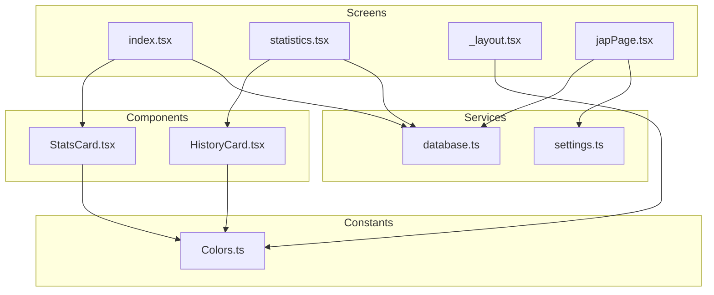
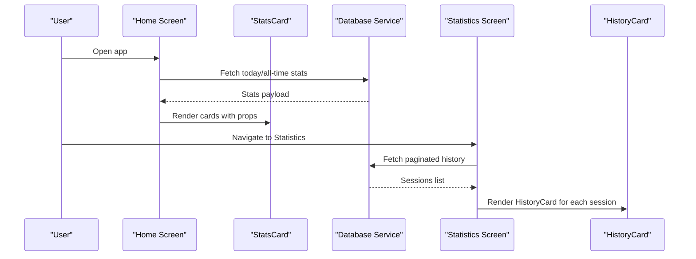
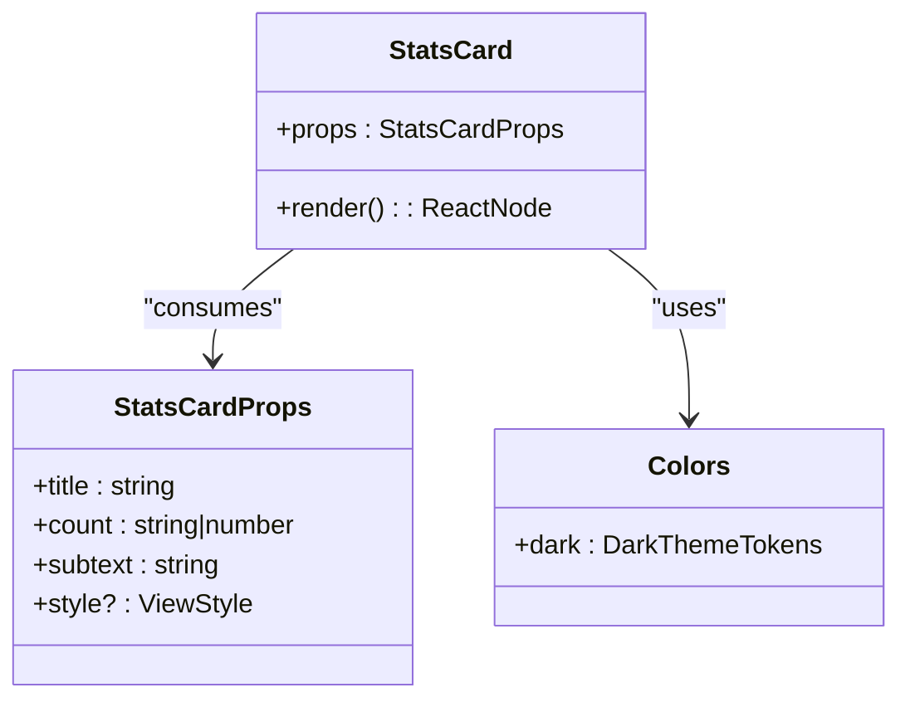
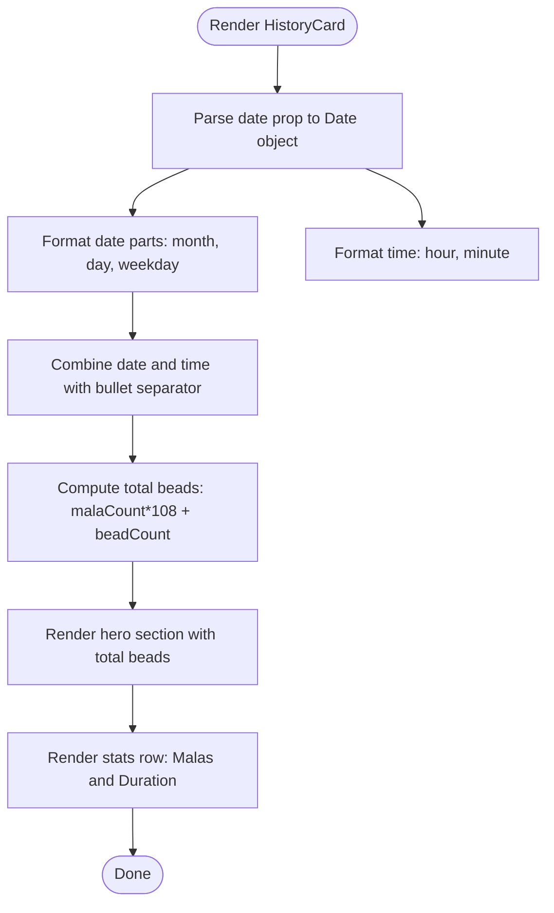
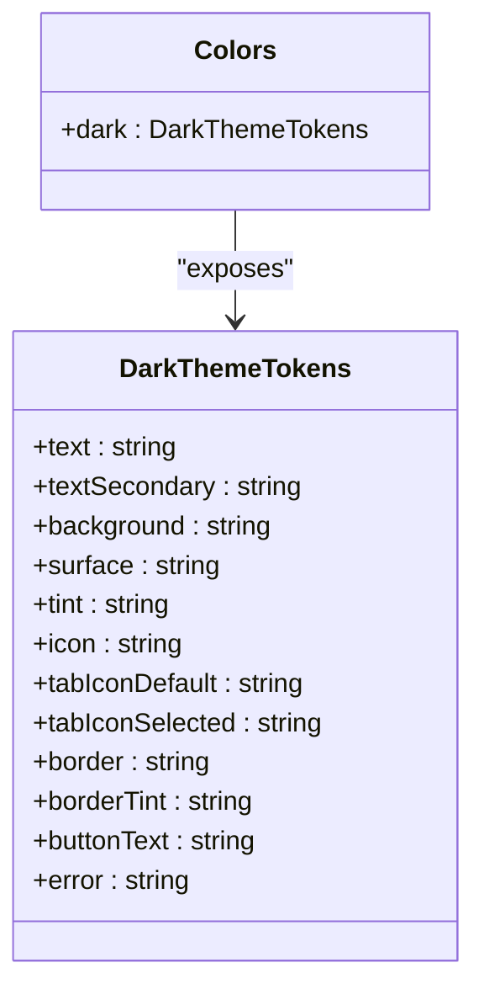
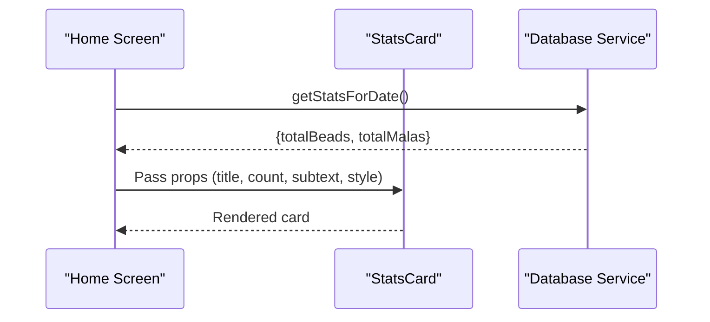
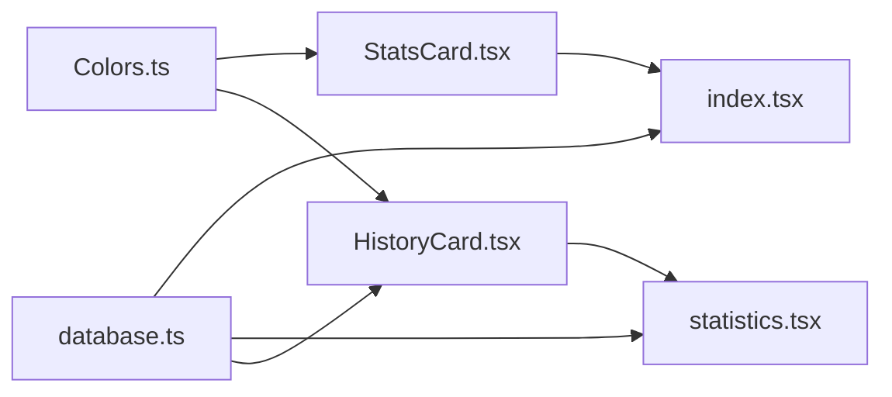

# UI Components

<cite>
**Referenced Files in This Document**
- [StatsCard.tsx](file://components/StatsCard.tsx)
- [HistoryCard.tsx](file://components/HistoryCard.tsx)
- [Colors.ts](file://constants/Colors.ts)
- [database.ts](file://services/database.ts)
- [settings.ts](file://services/settings.ts)
- [index.tsx](file://app/(tabs)/index.tsx)
- [statistics.tsx](file://app/(tabs)/statistics.tsx)
- [_layout.tsx](file://app/_layout.tsx)
- [japPage.tsx](file://app/japPage.tsx)
</cite>

## Table of Contents
1. [Introduction](#introduction)
2. [Project Structure](#project-structure)
3. [Core Components](#core-components)
4. [Architecture Overview](#architecture-overview)
5. [Detailed Component Analysis](#detailed-component-analysis)
6. [Dependency Analysis](#dependency-analysis)
7. [Performance Considerations](#performance-considerations)
8. [Accessibility and Responsive Design](#accessibility-and-responsive-design)
9. [Troubleshooting Guide](#troubleshooting-guide)
10. [Conclusion](#conclusion)

## Introduction
This document provides comprehensive documentation for SampleJapCounter’s reusable UI components, focusing on StatsCard and HistoryCard, and the theme system implemented via Colors.ts. It explains component props, styling, usage patterns, data presentation, and integration with the application architecture. It also covers accessibility considerations, responsive design patterns, and customization options.

## Project Structure
The UI components live under the components directory and are consumed by screens in the app directory. Styling relies on a centralized Colors.ts constant that defines dark-mode color tokens. Data flows from services/database.ts to screens and components, enabling dynamic rendering of statistics and session history.

**Diagram sources**
- [StatsCard.tsx](file://components/StatsCard.tsx#L1-L56)
- [HistoryCard.tsx](file://components/HistoryCard.tsx#L1-L134)
- [Colors.ts](file://constants/Colors.ts#L1-L19)
- [database.ts](file://services/database.ts#L1-L132)
- [settings.ts](file://services/settings.ts#L1-L47)
- [index.tsx](file://app/(tabs)/index.tsx#L1-L120)
- [statistics.tsx](file://app/(tabs)/statistics.tsx#L1-L117)
- [_layout.tsx](file://app/_layout.tsx#L1-L27)
- [japPage.tsx](file://app/japPage.tsx#L1-L289)

**Section sources**
- [StatsCard.tsx](file://components/StatsCard.tsx#L1-L56)
- [HistoryCard.tsx](file://components/HistoryCard.tsx#L1-L134)
- [Colors.ts](file://constants/Colors.ts#L1-L19)
- [database.ts](file://services/database.ts#L1-L132)
- [index.tsx](file://app/(tabs)/index.tsx#L1-L120)
- [statistics.tsx](file://app/(tabs)/statistics.tsx#L1-L117)
- [_layout.tsx](file://app/_layout.tsx#L1-L27)
- [japPage.tsx](file://app/japPage.tsx#L1-L289)

## Core Components
This section documents the two primary reusable UI components and their roles in the application.

- StatsCard: A compact card component designed to display a title, a prominent count, and a subtext. It is commonly used in dashboards to show daily and lifetime statistics.
- HistoryCard: A detailed card for displaying a single session’s metadata, including formatted date/time, total beads, mala count, and duration.

Both components rely on Colors.ts for consistent theming and are integrated into the home and statistics screens respectively.

**Section sources**
- [StatsCard.tsx](file://components/StatsCard.tsx#L5-L20)
- [HistoryCard.tsx](file://components/HistoryCard.tsx#L6-L66)
- [Colors.ts](file://constants/Colors.ts#L3-L18)

## Architecture Overview
The components are part of a layered architecture:
- Presentation Layer: Components (StatsCard, HistoryCard) and Screens (Home, Statistics, Jap Page).
- Styling Layer: Centralized theme tokens via Colors.ts.
- Data Layer: Services (database.ts) and settings (settings.ts) manage persistence and preferences.
- Routing Layer: Expo Router manages navigation between screens.

**Diagram sources**
- [index.tsx](file://app/(tabs)/index.tsx#L8-L25)
- [StatsCard.tsx](file://components/StatsCard.tsx#L12-L20)
- [database.ts](file://services/database.ts#L66-L106)
- [statistics.tsx](file://app/(tabs)/statistics.tsx#L8-L51)
- [HistoryCard.tsx](file://components/HistoryCard.tsx#L13-L66)

## Detailed Component Analysis

### StatsCard Component
StatsCard is a lightweight, reusable card component that renders a title, a large count, and a subtext. It accepts props and merges an optional style override with built-in styles.

- Props
  - title: string — Card label text.
  - count: string | number — Primary numeric value to display prominently.
  - subtext: string — Supporting text below the count.
  - style?: ViewStyle — Optional style override for layout customization.

- Styling and Theme
  - Uses Colors.dark tokens for text, background, borders, and highlights.
  - Responsive sizing via minWidth and consistent paddings.
  - Elevation and shadows for depth on supported platforms.

- Usage Patterns
  - Integrated in the Home screen to display Today’s Jap and Total Jap statistics.
  - Supports flexible layout via props and style overrides.

- Accessibility and Responsiveness
  - Text sizes and weights are chosen for readability.
  - No explicit accessibility attributes are set; consider adding accessibilityLabel and adjustsFontSizeToFit for dynamic counts.

**Diagram sources**
- [StatsCard.tsx](file://components/StatsCard.tsx#L5-L20)
- [Colors.ts](file://constants/Colors.ts#L3-L18)

**Section sources**
- [StatsCard.tsx](file://components/StatsCard.tsx#L5-L20)
- [StatsCard.tsx](file://components/StatsCard.tsx#L22-L55)
- [index.tsx](file://app/(tabs)/index.tsx#L38-L52)

### HistoryCard Component
HistoryCard displays a single session’s data with a clean, structured layout. It formats date/time, computes total beads, and presents malas and duration.

- Props
  - date: string | number — Timestamp or ISO string used to derive display date/time.
  - beadCount: number — Number of loose beads.
  - malaCount: number — Number of completed malas.
  - duration: number — Session duration in seconds.

- Data Presentation
  - Date/Time: Short month, day, weekday, and 12-hour time separated by a bullet.
  - Total Beads: Computed as (malaCount × 108) + beadCount.
  - Duration: Formatted as hours:minutes:seconds.

- Styling and Theme
  - Uses Colors.dark tokens for backgrounds, borders, text, and highlights.
  - Includes subtle gold accent styling for visual emphasis.

- Usage Patterns
  - Consumed by the Statistics screen within a FlatList to render paginated history entries.

- Accessibility and Responsiveness
  - Uses flexDirection and spacing for responsive layouts.
  - Consider adding accessibilityLabel for screen readers and ensuring sufficient touch target sizes.

**Diagram sources**
- [HistoryCard.tsx](file://components/HistoryCard.tsx#L13-L66)

**Section sources**
- [HistoryCard.tsx](file://components/HistoryCard.tsx#L6-L66)
- [HistoryCard.tsx](file://components/HistoryCard.tsx#L68-L133)
- [statistics.tsx](file://app/(tabs)/statistics.tsx#L53-L60)

### Theme System via Colors.ts
The theme system centralizes color tokens for dark mode. Components consume these tokens to maintain consistent visuals across the app.

- Tokens
  - Text colors: primary and secondary text.
  - Surface/background colors for cards and containers.
  - Tint color for highlights and active elements.
  - Borders and border tints.
  - Tab icons and button text colors.
  - Error color.

- Integration
  - Components import Colors and apply tokens to styles.
  - Root layout applies global background and header styling using Colors.dark.

- Extensibility
  - To add light mode, define a separate theme object and switch logic based on user preference or system setting.
  - Consider exporting a theme hook or context provider for dynamic theme switching.

**Diagram sources**
- [Colors.ts](file://constants/Colors.ts#L3-L18)

**Section sources**
- [Colors.ts](file://constants/Colors.ts#L1-L19)
- [_layout.tsx](file://app/_layout.tsx#L14-L24)
- [StatsCard.tsx](file://components/StatsCard.tsx#L22-L55)
- [HistoryCard.tsx](file://components/HistoryCard.tsx#L68-L133)

### Component Composition Patterns
- StatsCard is composed within the Home screen to present aggregated statistics. It receives props from data fetched via database services and supports style overrides for layout flexibility.
- HistoryCard is composed within the Statistics screen as part of a FlatList, receiving props from paginated history data. It encapsulates date formatting and data computation internally.

**Diagram sources**
- [index.tsx](file://app/(tabs)/index.tsx#L13-L25)
- [database.ts](file://services/database.ts#L66-L85)
- [StatsCard.tsx](file://components/StatsCard.tsx#L12-L20)

**Section sources**
- [index.tsx](file://app/(tabs)/index.tsx#L38-L52)
- [statistics.tsx](file://app/(tabs)/statistics.tsx#L53-L60)
- [database.ts](file://services/database.ts#L118-L131)

## Dependency Analysis
The components depend on Colors.ts for styling and on services/database.ts for data. The Statistics screen composes HistoryCard for each session, while the Home screen composes StatsCard for dashboard metrics.

**Diagram sources**
- [Colors.ts](file://constants/Colors.ts#L1-L19)
- [StatsCard.tsx](file://components/StatsCard.tsx#L1-L3)
- [HistoryCard.tsx](file://components/HistoryCard.tsx#L1-L4)
- [database.ts](file://services/database.ts#L1-L132)
- [index.tsx](file://app/(tabs)/index.tsx#L1-L6)
- [statistics.tsx](file://app/(tabs)/statistics.tsx#L1-L6)

**Section sources**
- [StatsCard.tsx](file://components/StatsCard.tsx#L1-L3)
- [HistoryCard.tsx](file://components/HistoryCard.tsx#L1-L4)
- [database.ts](file://services/database.ts#L1-L132)
- [index.tsx](file://app/(tabs)/index.tsx#L1-L6)
- [statistics.tsx](file://app/(tabs)/statistics.tsx#L1-L6)

## Performance Considerations
- StatsCard: Lightweight rendering with minimal re-renders; props are simple primitives. Consider memoization if props are computed dynamically.
- HistoryCard: Renders static text and icons; keep items small and avoid heavy computations in render. The Statistics screen uses FlatList with pagination to limit memory usage.
- Colors.ts: Centralized tokens reduce style recomputation and enable efficient theme switching if expanded.

[No sources needed since this section provides general guidance]

## Accessibility and Responsive Design
- Accessibility
  - Add accessibilityLabel to both components to provide meaningful labels for screen readers.
  - Ensure sufficient color contrast for text and highlights against surfaces.
  - Consider adjusting font sizes and weights for dynamic content to maintain readability.
- Responsive Design
  - Both components use relative paddings and minWidth to adapt to varying widths.
  - HistoryCard uses flexDirection and justifyContent to distribute content responsively.
  - Consider using Dimensions or Flexbox utilities for adaptive layouts on larger screens.

[No sources needed since this section provides general guidance]

## Troubleshooting Guide
- StatsCard not rendering correctly
  - Verify props are passed correctly from the Home screen and that style overrides do not conflict with internal styles.
  - Confirm Colors.dark tokens are accessible and not undefined.
- HistoryCard date formatting issues
  - Ensure the date prop is a valid timestamp or ISO string; invalid inputs will cause formatting errors.
  - Duration formatting uses hours/minutes/seconds; confirm duration is a non-negative number.
- Database integration problems
  - Check that database initialization completes successfully and that queries return expected results.
  - Paginated history may be empty initially; verify offset and limit logic.

**Section sources**
- [StatsCard.tsx](file://components/StatsCard.tsx#L12-L20)
- [HistoryCard.tsx](file://components/HistoryCard.tsx#L13-L66)
- [database.ts](file://services/database.ts#L12-L39)
- [statistics.tsx](file://app/(tabs)/statistics.tsx#L14-L45)

## Conclusion
StatsCard and HistoryCard provide a cohesive, theme-consistent UI foundation for displaying statistics and session history. Their props and styling are intentionally minimal, enabling easy composition and customization. The centralized Colors.ts ensures consistent theming, while services/database.ts and services/settings.ts provide robust data and preference management. Extending the theme system to support light mode and enhancing accessibility will further improve the components’ usability and maintainability.